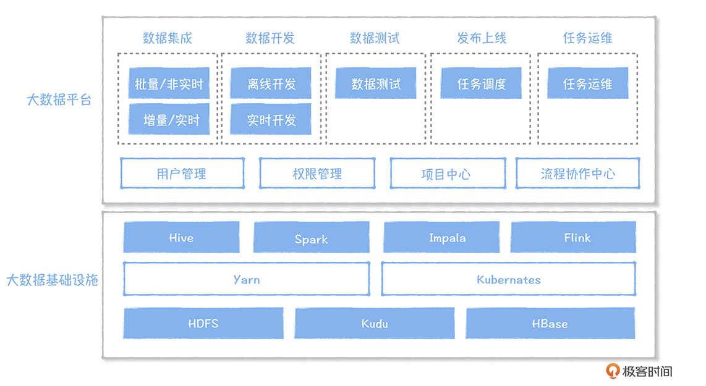
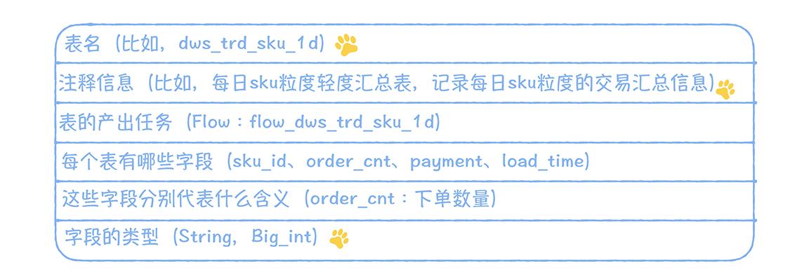
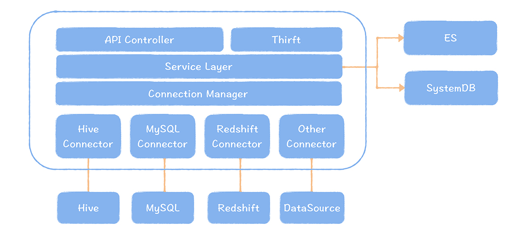
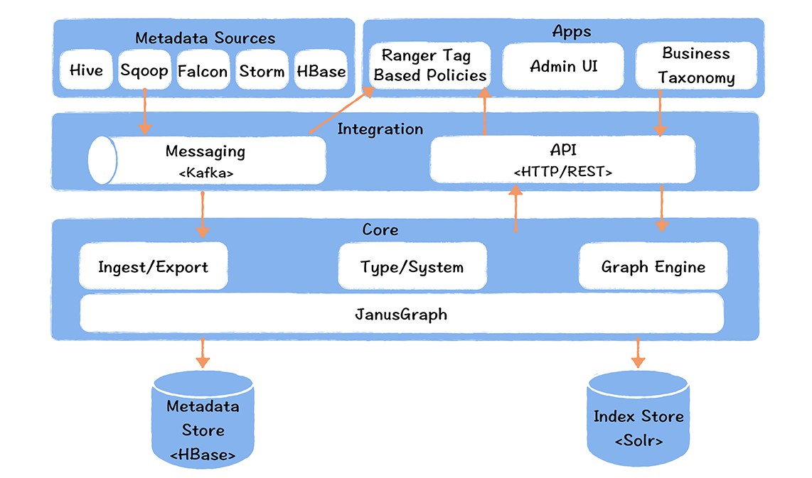
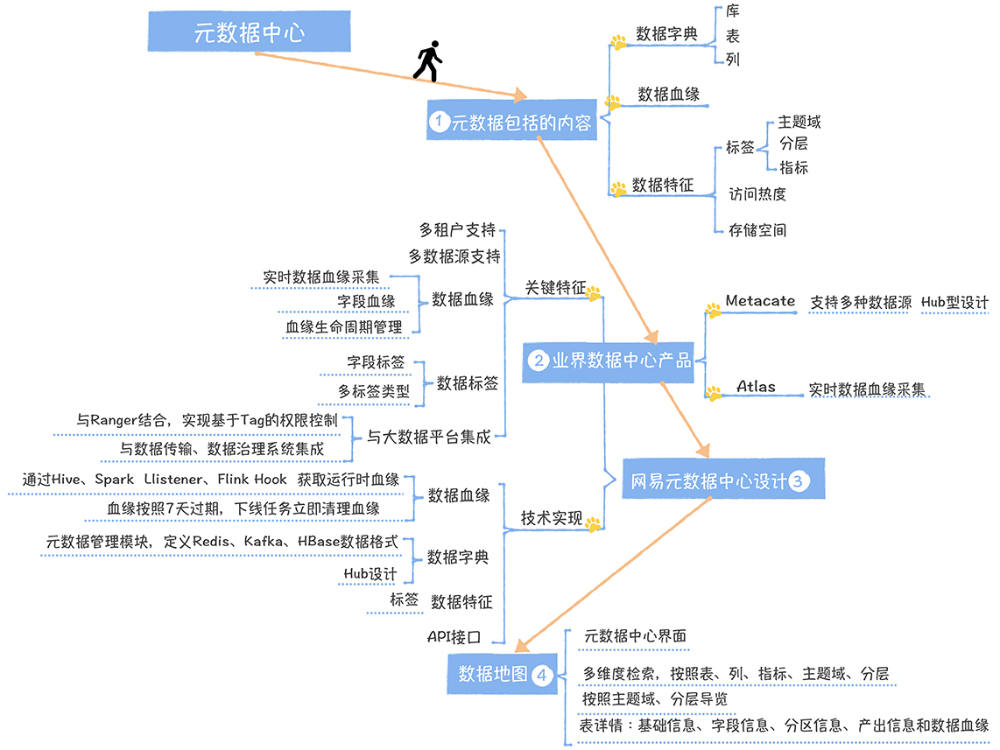

# 数据中台实战课 #

开篇词

## 开篇词 | 数据中台，是陷阱？还是金钥匙？ ##

* 在原理篇中，我会告诉你数据中台的来龙去脉，数据仓库、数据湖、大数据平台以及数据中台的区别，以及它们有什么样的内在联系，然后会跟你讨论什么样的企业适合建数据中台。最后，我会从全局的视角出发，讲解数据中台如何在企业落地。
	* 什么是数据中台
	* 数据中台解决了什么问题
	* 如何来规划数据中台的建设。
* 实现篇是我讲解的重点，我会基于数据中台支撑技术的整体架构，逐一讲解每个模块的具体实现。
* 应用篇，基于数据中台之上的通用数据应用（包括自助取数、可视化分析等）。在这个过程中，我会以电商场景为例，通过大量的案例，帮助你理解这些问题以及问题的解决过程。

### 精选留言 ###

原先大数据平台，应该说就能够支撑数据研发链路的覆盖。数据中台更加关注在数据研发的效率、质量和成本三个方面。
其次，数据其中，产生更大的价值，更少的接口，更快的数据服务。
这个观点是正确的，数据的复用，提高了数据研发的效率。数据通过接口化的方式，提高了数据的接入效率和接入后数据的管理效率。

**Q**

郭老师，我理解数据中台是这样的，您看对不对啊。
就是把不同系统的数据，全部汇总到一个大的数据仓库。然后在数据仓库里各种数据的清洗 转化 装载 集成等工作，最后数据建模，把业务数据可视化的展现出来。
老师您看哪里理解的不对或有遗漏。

**A**

你说的这个过程，在我看来，只能叫数据仓库。
数据中台的核心并不是要建数据仓库，他的核心在于“OneData”数据的复用和共享，所以强调数据只加工一次，这样才能高效的支撑前台的需求。这才是数据中台的精髓。
别急，你可以接着往后看，尤其是看看第一讲，我会详细的介绍数据中台、数据平台、数据仓库的区别，你就会明白了。至于“OneData”，你可以看第3讲，我会展开详细的介绍，包括方法论、支撑技术以及组织架构上的支持。

原理篇

## 01 | 前因后果：为什么说数据中台是大数据的下一站？ ##

与你深入大数据的发展历史，先从数据仓库的出现讲起，途径数据湖，再到大数据平台

### 启蒙时代：数据仓库的出现 ###

数据分析需要聚合多个业务系统的数据，比如需要集成交易系统的数据，需要集成仓储系统的数据等等，同时需要保存历史数据，进行大数据量的范围查询。传统数据库面向单一业务系统，主要实现的是面向事务的增删改查，已经不能满足数据分析的场景，**这促使数据仓库概念的出现。**

数据仓库是在其他管理和决策中面向主题的、集成的、与时间相关的，不可修改的数据集合。

主题域是业务过程的一个高层次的抽象，像商品、交易、用户、流量都能作为一个主题域，**你可以把它理解为数据仓库的一个目录**。

* 恩门建模方法自顶向下这里的顶是指数据的来源，在传统数据仓库中，就是各个业务数据库），基于业务中各个实体以及实体之间的关系，构建数据仓库。
* 金博尔建模自底向上，从数据分析的需求触发，拆分维度和事实
* 恩门建模因为是从数据源开始构建，构建成本比较高，适用于应用场景比较固定的业务，比如金融领域，冗余数据少是它的优势。
* 比如金融领域，冗余数据少是它的优势。金博尔建模由于是从分析场景出发，适用于变化速度比较快的业务，比如互联网业务。

### 技术革命：从 Hadoop 到数据湖 ###

进入互联网时代，有两个最重要的变化。

* 数据规模前所未有，传统数据仓库难于扩展，根本无法承载如此规模的海量数据。
* 数据类型变得异构化，联网时代的数据除了来自业务数据库的结构化数据，还有来自 App、Web 的前端埋点数据，或者业务服务器的后端埋点日志，这些数据一般都是半结构化，甚至无结构的。传统数据仓库对数据模型有严格的要求，在数据导入到数据仓库前，数据模型就必须事先定义好，数据必须按照模型设计存储。

Hadoop 相比传统数据仓库主要有两个优势：

1. 完全分布式，易于扩展，可以使用价格低廉的机器堆出一个计算、存储能力很强的集群，满足海量数据的处理要求；
2. 弱化数据格式，数据被集成到 Hadoop 之后，可以不保留任何数据格式，数据模型与数据存储分离，数据在被使用的时候，可以按照不同的模型读取，满足异构数据灵活分析的需求。

数据湖（Data Lake）是一个以原始格式存储苏火炬的存储库或系统。

缺陷：
数据湖拉开了 Hadoop 商用化的大幕，但是一个商用的 Hadoop 包含 20 多种计算引擎， 数据研发涉及流程非常多，技术门槛限制了 Hadoop 的商用化进程。那么如何让数据的加工像工厂一样，直接在设备流水线上完成呢？

### 数据工厂时代：大数据平台兴起 ###

大数据平台是面向数据研发场景的，覆盖数据研发的完整链路的数据工作台

大数据平台按照使用场景，分为数据集成、数据开发、数据测试……任务运维，大数据平台的使用对象是数据开发。大数据平台的底层是以 Hadoop 为代表的基础设施，分为计算、资源调度和存储。

Hive、Spark、Flink、Impala 提供了大数据计算引擎：

* Hive、Spark 主要解决离线数据清洗、加工的场景，目前，Spark 用得越来越多，性能要比 Hive 高不少；
* Flink 主要是解决实时计算的场景；
* Impala 主要是解决交互式查询的场景。

**调度工具**

* Yarn：这些计算引擎统一运行在一个称为 Yarn 的资源调度管理框架内，由 Yarn 来分配计算资源。
* Kubernetes，实现在线和离线的资源混合部署，节省机器成本。

**数据存储**

数据存储在 HDFS、Kudu 和 HBase 系统内：

* HDFS 不可更新，主要存全量数据
* HBase 提供了一个可更新的 KV，主要存一些维度表
* Kudu 提供了实时更新的能力，一般用在实时数仓的构建场景中

### 数据价值时代：数据中台崛起 ###

* 不同业务线，甚至相同业务线的不同应用之间，数据都是割裂的
	* 导致的后果，两个数据应用的相同指标，展示的结果不一致，导致运营对数据的信任度下降。
	* 大量的重复计算、开发，导致的研发效率的浪费，计算、存储资源的浪费，大数据的应用成本越来越高。

数据中台的核心，是避免数据的重复计算，通过数据服务化，提高数据的共享能力，赋能数据应用。

### 课堂总结 ###

为什么说数据中台是大数据的下一站？

1. 数据中台构建于数据湖之上，具备数据湖异构数据统一计算、存储的能力，同时让数据湖中杂乱的数据通过规范化的方式管理起来。
2. 数据中台需要依赖大数据平台，大数据平台完成了数据研发的全流程覆盖，数据中台增加了数据治理和数据服务化的内容。
3. 数据中台借鉴了传统数据仓库面向主题域的数据组织模式，基于维度建模的理论，构建统一的数据公共层。

### 思考时间 ###

如果说数据中台是大数据的下一站，那数据中台的下一站是什么？

## 02 | 关键抉择：到底什么样的企业应该建数据中台？ ##

### 建设中台前，我们面临的挑战 ###

大量数据产品的出现，在不断提高企业运营效率的同时，也暴露出很多尖锐的问题，在我看来，主要有五点。

1. 指标口径不一致
2. 数据重复建设，需求响应时间长。
3. 取数效率低，数据开发大部分的时间都被临时取数的需求占据，根本无法专注在数仓模型的构建和集市层数据的建设，最终形成了一个恶性循环，一方面是数据不完善，另一方面是数据开发忙于各种临时取数需求。
4. 数据质量差
5. 数据成本线性增长

### 为什么数据中台可以解决这些问题？ ###

**指标口径不一致**

指标口径不一致，可能原因包括三种：

* 业务口径不一致
* 计算逻辑不一致
* 数据来源不一致

*综合看来，要实现一致，就务必确保对同一个指标，只有一个业务口径，只加工一次，数据来源必须相同。*

**数据需求响应慢**在于烟囱式的开发模式，导致了大量重复逻辑代码的研发：

*所以，要解决数据需求响应慢，就必须解决数据复用的问题，要确保相同数据只加工一次，实现数据的共享。*

**取数效率低**一方面原因是找不到数据，另一方面原因可能是取不到数据。

* 找不到数据：就必须要构建一个全局的企业数据资产目录，实现数据地图的功能，快速找到数据
* 取不到数据：提供可视化的查询平台，通过勾选一些参数，才更容易使用

**数据质量差**其实是数据问题很难被发现。我们经常是等到使用数据的人反馈投诉，才知道数据有问题。一个指针上游的所有链路加起来有100多个节点，然后再重跑这个任务以及所有下游链路上的每个任务，最终导致故障恢复的效率很低，时间很长。

*所以，要解决数据质量差，就要及时发现然后快速恢复数据问题。*

**大数据成本问题**成本问题背后也是数据重复建设的问题。

数据中台到底是怎么一回事儿呢？*在我看来，数据中台是企业构建的标准的、安全的、统一的、共享的数据组织，通过数据服务化的方式支撑前端数据应用。*

### 数据中台是如何解决这些问题的？ ###

1. 管好指标：在数据中台，必须有一个团队统一负责指标口径的管控。
2. 指标体系化管理：在指标系统中，我们会明确每个指标的业务口径，数据来源和计算逻辑，同时会按照类似数仓主题域的方式进行管理。
3. 确保所有的数据产品、报表都引用指标系统的口径定义。

*那么数据中台是怎么实现所有数据只加工一次的呢？*对于数仓数据，我们要求相同粒度的度量或者指标只加工一次，构建全局一致的公共维表。要实现上述目标，需要两个工具产品：

* 数仓设计中心，在模型设计阶段，强制相同聚合粒度的模型，度量不能重复。
* 数据地图，方便数据开发能够快速地理解一张表的准确含义

* **数据中台通过服务化的方式，提高了数据应用接入和管理的效率**。原先数仓提供给应用的访问方式是直接提供表，应用开发自己把数据导出到一个查询引擎上，然后去访问查询引擎。在数据中台中，数仓的数据是通过 API 接口的方式提供给数据应用，数据应用不用关心底层不同的查询引擎访问方式的差异。
* **对于非技术人员，数据中台提供了可视化的取数平台**。只需要选取指标、通过获取指标系统中每个指标的可分析维度，然后勾选，添加筛选过滤条件，点击查询，就可以获取数据。 
* **数据中台由于数据只能加工一次，强调数据的复用性，这就对数据的质量提出了更高的要求。**全链路的数据质量稽核监控，对一个指标的产出上游链路中涉及的每个表，都实现了数据一致性、完整性、正确性和及时性的监控，确保在第一时间发现、恢复、通知数据问题。
* **最后一个是成本问题。**研发了一个数据成本治理系统，从应用维度、表维度、任务的维度、文件的维度进行全面的治理。 
	* 从应用的维度，如果一个报表 30 天内没有访问，这个报表的产出价值就是低的
	* 结合这个报表产出的所有上游表以及上游表的产出任务，我们可以计算加工这张表的成本
	* 有了价值和成本，我们就能计算 ROI
	* 根据 ROI 就可以实现将低价值的报表下线的功能 

### 什么样的企业适合建数据中台？ ###

数据中台的建设，需要结合企业的现状，根据需要进行选择。我认为企业在选择数据中台的时候，应该考虑这样几个因素。

1. 企业是否有大量的数据应用场景： 数据中台本身并不能直接产生业务价值，数据中台的本质是支撑快速地孵化数据应用。所以当你的企业有较多数据应用的场景时（一般有 3 个以上就可以考虑），就像我在课程开始时提到电商中有各种各样的数据应用场景，此时你要考虑构建一个数据中台。
2. 经过了快速的信息化建设，企业存在较多的业务数据的孤岛，需要整合各个业务系统的数据，进行关联的分析。比如在我们做电商的初期，仓储、供应链、市场运营都是独立的数据仓库，当时数据分析的时候，往往跨了很多数据系统，为了消除这些数据孤岛，就必须要构建一个数据中台。
3. 当你的团队正在面临效率、质量和成本的苦恼时，面对大量的开发，却不知道如何提高效能，数据经常出问题而束手无策，老板还要求你控制数据的成本，这个时候，数据中台可以帮助你。当你所在的企业面临经营困难，需要通过数据实现精益运营，提高企业的运营效率的时候，你需要构建一个数据中台，同时结合可视化的 BI 数据产品，实现数据从应用到中台的完整构建，在我的接触中，这种类型往往出现在传统企业中。
4. 企业规模也是必须要考虑的一个因素，数据中台因为投入大，收益偏长线，所以更适合业务相对稳定的大公司，并不适合初创型的小公司。

### 课堂总结 ###

* 效率、质量和成本是决定数据能否支撑好业务的关键，构建数据中台的目标就是要实现高效率、高质量、低成本。
* 数据只加工一次是建设数据中台的核心，本质上是要实现公共计算逻辑的下沉和复用。
* 如果你的企业拥有 3 个以上的数据应用场景，数据产品还在不断研发和更新，你必须要认真考虑建设数据中台。

### 思考时间 ###

留给你一道思考题，一个企业是不是只能建设一个数据中台？

## 03 | 数据中台建设三板斧：方法论、组织和技术 ##

实现篇

## 04 | 元数据中心的关键目标和技术实现方案 ##

所以你必须要掌握元数据的管理，才能构建一个数据中台。

### 元数据包括哪些？ ###

元数据划为三类：数据字典、数据血缘和数据特征。

* 数据字典描述的是数据的结构信息
* 数据血缘是指一个表是直接通过哪些表加工而来，做影响分析和故障溯源。
* 数据特征主要是指数据的属性信息

-----

数据字典描述

-----

数据血缘

dws_trd_sku_1d 是通过 dwd_trd_order_df 的数据计算而来，所以，dwd_trd_order_df 是 dws_trd_sku_1d 的上游表。

-----

数据特征

### 业界元数据中心产品 ###

业界的比较有影响力的产品：

* 开源的有 Netflix 的 Metacat、Apache Atlas；
	* Metacat：擅长于管理数据字典
	* Apache Atlas：管理数据血缘
* 商业化的产品有 Cloudera Navigator。

#### Metacat 多数据源集成型架构设计 ####

Metacat没有单独再保存一份元数据，而是采取直连数据源拉的方式，这种方式的优点：

1. 不存在保存两份元数据一致性的问题
2. 轻量化，每个数据源只要实现一个连接实现类即可，扩展成本很低

#### Apache Atlas 实时数据血缘采集 ####

* 通过静态解析SQL，获得输入表和输出表；如果任务没有执行，将面临正确性的问题。
* 通过实时抓取正在执行的SQL，解析执行计划，获取输入表和输出表；
* 通过任务日志解析的方式，获取执行后的SQL输入表和输出表。需要分析大量的任务日志数据。

### 网易元数据中心设计 ###

元数据中心必须实现的5个关键目标：

**其一，多业务线、多租户支持。**

有多个不同的业务线，同一个业务线内也分为算法、数仓、风控等多个租户

**其二，多数据源的支持**

元数据中心必需要能够支持不同类型的数据源（比如 MySQL、Hive、Kudu 等），同时还要支持相同数据源的多个集群。还需要考虑将半结构化的 KV 也纳入元数据中心的管理（比如 Kafka、Redis、HBase 等）

需要能够在元数据中心里定义 Kafka 每个 Topic 的每条记录 JSON 中的格式，每个字段代表什么含义。

**其三，数据血缘**

* 元数据中心需要支持数据血缘的实时采集和高性能的查询。同时，还必须支持字段级别的血缘。
* 数据血缘还必须要支持生命周期管理（已经下线的任务应该立即清理血缘，血缘要保留一段时间，如果没有继续被调度，过期的血缘关系应该予以清理。）

字段血缘在做溯源的时候非常有用，因为大数据加工链路的下游是集市层，为了方便使用者使用，一般都是一些很宽的表（列很多的表，避免 Join 带来的性能损耗），这个表的上游可能是有几十个表产生的，如果不通过字段血缘限定溯源范围，就会导致搜索范围变得很大，无法快速地精准定位到有问题的表。

**其四，与大数据平台集成。**

* 权限：
* 统一接口

权限：元数据中心需要与 Ranger 集成，实现基于 tag 的权限管理方式。在元数据中心中可以为表定义一组标签，Ranger 可以基于这个标签，对拥有某一个标签的一组表按照相同的权限授权。

**其五，数据标签。**

元数据中心必须要支持对表和表中的字段打标签，通过丰富的不同类型的标签，可以完善数据中台数据的特征。

比如指标可以作为一种类型的标签打在表上，主题域、分层信息都可以作为不同类型的标签关联到表。

* 数据血缘由采集端、消息中间件、消费端以及血缘清理模块组成，基于 Hive Hook，Spark Listener，Flink Hook ，可以获取任务执行时输入表和输出表，推送给统一的消息中间件（Kafka），然后消费端负责将血缘关系沉淀到图数据库中。
* 图数据库选择 Neo4j，主要考虑是性能快、部署轻量化、依赖模块少，当然，开源的 Neo4j 没有高可用方案，并且不支持水平扩展，但是因为单个业务活跃的表规模基本也就在几万的规模，所以单机也够用，高可用可以通过双写的方式实现。
* 血缘还有一个清理的模块，主要负责定时清理过期的血缘，一般我们把血缘的生命周期设置为 7 天。
* 数据字典部分，我们参考了 Metacat 实现，我们由一个统一的 Connector Mananger 负责管理到各个数据源的连接。对于 Hive、MySQL，元数据中心并不会保存系统元数据，而是直接连数据源实时获取。对于 Kafka、HBase、Redis 等 KV，我们在元数据中心里内置了一个元数据管理模块，可以在这个模块中定义 Value 的 schema 信息。
* 数据特征主要是标签的管理以及数据的访问热度信息。元数据中心内置了不同类型的标签，同时允许用户自定义扩展标签类型。指标、分层信息、主题域信息都是以标签的形式存储在元数据中心的系统库里，同时元数据中心允许用户基于标签类型和标签搜索表和字段。
* 元数据中心统一对外提供了 API 访问接口，数据传输、数据地图、数据服务等其他的子系统都可以通过 API 接口获取元数据。另外 Ranger 可以基于元数据中心提供的 API 接口，获取标签对应的表，然后根据标签更新表对应的权限，实现基于标签的权限控制。

### 数据地图：元数据中心的界面 ###

数据地图是基于元数据中心构建的一站式企业数据资产目录，可以看作是元数据中心的界面。

数据地图提供了多维度的检索功能，使用者可以按照表名、列名、注释、主题域、分层、指标进行检索，结果按照匹配相关度进行排序。考虑到数据中台中有一些表是数仓维护的表，有一些表数仓已经不再维护，在结果排序的时候，增加了数仓维护的表优先展示的规则。同时数据地图还提供了按照主题域、业务过程导览，可以帮助使用者快速了解当前有哪些表可以使用。

### 课程总结 ###

元数据应该包括数据字典、数据血缘和数据特征，然后通过分析两个业界比较有影响力的元数据中心产品（metacat和apache atlas），结合我在网易数据中台实践，给出了元数据中心设计的 5 个关键特性和技术实现架构，最后介绍了基于元数据中心之上的数据地图产品。我想在最后强调几个关键点：

* 元数据中心设计上必须注意扩展性，能够支持多个数据源，所以宜采用集成型的设计方式。
* 数据血缘需要支持字段级别的血缘，否则会影响溯源的范围和准确性。
* 数据地图提供了一站式的数据发现服务，解决了检索数据，理解数据的“找数据的需求”。

元数据中心是数据中台的基石，它提供了我们做数据治理的必须的数据支撑。

### 课程思考 ###

介绍了血缘采集的三种方式，并且推荐了通过实时采集的方式，但是其实静态解析血缘也有它的优势应用场景

## 05 | 如何统一管理纷繁杂乱的数据指标？ ##

元数据在指标管理、模型设计、数据质量和成本治理四个领域都发挥着作用，而这些领域构成了数据中台 OneData 数据体系。

指标管理，指标是一种特定类型的元数据，它是业务和数据的交汇点。

*标口径不一致*

### 指标混乱现状 ###

## 06 | 数据模型无法复用，归根结底还是设计问题 ##

结束语

## 结束语 | 数据中台从哪里来，要到哪里去？ ##

### 数据中台从哪里来？ ###

### 数据中台到哪里去？ ###

数据中台和业务的关系，就是鱼和水的meta关系，谁也离不开谁