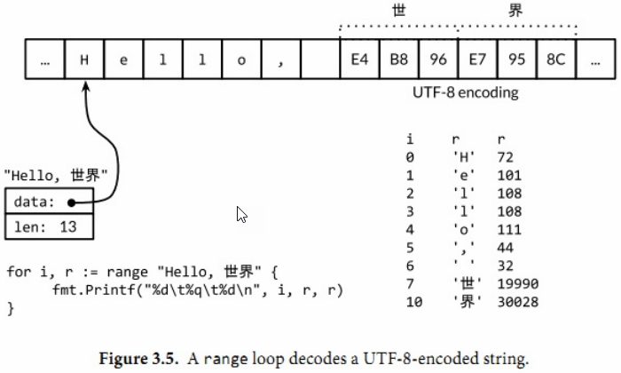

# Go圣经 #

## 前言 ##

## 第1章 入门 ##

### 1.1. Hello，World ###

Go语言的代码通过包（package）组织，包类似于其他语言里的库（libraries）或者模块（modules）。一个包由位于单个目录下的一个或多个.go源代码文件组成，目录定义包的作用。

每个源文件都以一条`package`声明语句开始，这个例子里就是package main，表示该文件属于哪个包，紧跟着一系列导入（import）的包，折后是存储在这个文件里的程序语句。

main包定义了一个独立可执行的程序，而不是一个库。在`main`里`main`函数也很特殊，它是整个程序执行的入口。

`import`声明必须跟在文件的`package`声明之后。则是组成程序的函数、变量、常量、类型的声明语句（分别由关键字func，var，const，type定义）。

一个函数䣌声明由`func`关键字、函数名、参数列表、返回值列表以及包含在大括号里的函数体组成。

### 1.2. 命令行参数 ###

os包以跨平台的方式，提供了一些与操作系统交互的函数和变量。程序的命令行参数可从os包的Args变量获取；os包外部使用os.Args访问该变量。

os.Args变量是一个字符串（string）的切片（slice）

os.Args的第一个元素，os.Args[0]，是命令本身	的名字；其他的元素则是程序启动时传给它的参数。s[m:n]形式的切片表达式，产生从第m个元素到第n-1个元素的切片。

#### 练习 1.3 ####

等1.6回来再看

### 1.3. 查找重复的行 ###

灵感来自unix的`uniq`命令

map存储了键/值（key/value）的集合，`Go`的`map`类似于`Java`语言中的`HashMap`，Python语言中的`dict`，`Lua`语言中的 `table`，通常使用`hash`实现。

	%d 十进制整数
	%x, %o, %b 十六进制，八进制，二进制这个农户
	%f，%g，%e 浮点数：3.141593 3.141592653589793 3.141593e+00
	%t 布尔：true或false
	%c 字符（rune）(Unicode码点)
	%s 字符串
	%q 带双引号的字符串“abc”或带单引号的字符'c'
	%v 变量的自然形式（natural format）
	%T 变量的类型
	%% 字面上的百分号标志（无操作数）

### 1.4. GIF动画 ###

image package

### 1.5. 获取URL ###

net/http和io/ioutil包

http.Get函数是创建HTTP请求的函数，如果获取过程没有出错，那么会在resp这个结构体中得到访问的请求结果。resp的Body字段包括一个可读的的服务器响应流。

ioutil.ReadAll函数从response中读取全部内容。

练习 1.7 1.8 1.9

## 第2章 程序结构 ##

### 2.1 命名 ###

Go语言中的函数名、变量名、常量名、类型名、语句标号和包名等所有的命名，都遵循一个简单的命名规则：一个名字必须以一个字母（Unicode字母）或下划线开头，后面可以跟任意数量的字母、数字或下划线。大写字母和小写字母是不同的：heapSort和Heapsort是两个不同的名字。

Go语言中类似if和switch的关键字有25个：关键字不能用于自定义名字，只能在特定语法结构中使用。

	s := "" //只能用在函数内部，而不能用于包变量
	var s string //依赖于字符串的默认初始化零值机制，被初始化为""
	var s = "" //用的极少，除非同时声明多个变量
	var s string = "" 显式地标明变量的类型，当变量类型与初值类型相同时，类型冗余，但如果两者类型不同，变量类型就必须了。

### 2.2 声明 ###

* var 变量
* const 常量
* type 类型
* func 函数

### 2.3 变量 ###

var声明语句可以创建一个特定类型的变量，然后给变量附加一个名字，并且设置变量的初始值。

	var 变量名字 类型 = 表达式

#### 2.3.1 简短变量声明 ####

#### 2.3.2 指针 ####

一个变量对应一个保存了变量对应类型值的内存空间。普通比那辆在声明语句创建时被绑定到一个变量名，比如叫x的变量。

	x := 1
	p := &x	// p, of type * int, points to x
	fmt.Println(*p) // "1"
	*p = 2	// equivalent to x =2
	fmt.Println(x) // "2"

### 2.4 赋值 ###

使用赋值语句可以更新一个变量的值，最简单的赋值语句是将要被赋值的变量放在=的左边，新值的表达式放在=的右边。

	x = 1 // 命名变量的赋值
	*p = true // 通过指针间接赋值
	person.name = "bob" // 结构体字段赋值
	count[x] = count[x] * scale // 数组、slice或map的元素赋值

----

	count[x] *= scale

#### 2.4.1 元祖赋值 ####

元祖赋值是另一种形式的赋值语句，它允许同时更新多个变量的值。

	x, y = y, x
	a[i], a[j] = a[j], a[i]

	f, err = os.Open("foo.txt") // function call return s two values

#### 2.4.2 可赋值性 ####

赋值语句是显式的赋值形式，但是程序中没有很多地方会发生隐式的赋值行为。

### 2.5 类型 ###

### 2.6 包和文件 ###

### 2.7 作用域 ###

一个声明语句将程序中的实体和一个名字关联。

## 第3章 基础数据类型 ##

Go语言数据类型分为四类：基础类型、符合类型、引用类型和接口类型。

### 3.1 整型 ###

Go语言的数值类型包括几种不同大小的整形数、浮点数和复数。

### 3.2 浮点数 ###

Go语言提供了两种精度的浮点数，float32和float64。

常量math.MaxFloat32标识float32能标识的最大数值，大约是3.4e38;对应的math.MaxFloat64常量大约是1.8e308。

### 3.3 复数 ###

complex64和complex128分别对应float32和float64

	var x complex128 = complex(1, 2) // 1+2i
	var y complex128 = complex(3, 4) // 1+2i
	fmt.Println(x*y) // "(-5+10i)"
	fmt.Println(real(x*y)) // "-5"
	fmt.Println(imag(x*y)) // "10"

### 3.4 布尔型 ###

### 3.5 字符型 ###

一个字符串是一个不可改变的字节序列。字符串可以包含任意的数据，包括byte值0。

	s := "hello, world"
	fmt.Println(len(s))
	fmt.Println(s[0], s[7])
	c := s[len(s)] // pansic: index out of range
	fmt.Println(s[0:5]) // "hello"
	fmt.Println(s[:5]) // "hello"
	fmt.Println(s[7:]) // "world"
	fmt.Println(s[:]) // "hello,world"
	fmt.Println("goodbye" + s[5:]) // "goodbye, world"

字符串的值是不可变的

	s[0] = 'L' // compile error: cannot assign to s[0]

#### 3.5.1 字符串面值 ####

	\a 响铃
	\b 退格
	\f 换页
	\n 换行
	\r 回车
	\t 制表符
	\v 垂直制表符
	\' 单引号
	\" 双引号
	\\ 反斜杠

#### 3.5.2. Unicode ####

#### 3.5.3. UTF-8 ####

字符串包含13个字节，以UTF8形式编码，但是只对应9个Unicode字符：

	import "unicode/utf8"
	s := "Hello, 世界"
	fmt.Println(len(s)) // "13"
	fmt.Println(utf8.RuneCountInString(s)) // "9"

----

	for i, r := range "Hello, 世界" {
		fmt.Printf("%d\t%q\t%d\n", i, r, r)
	}

	n := 0
	for _, _ = range s {
		n++
	}

### 3.6 常量 ###

常量表达式的值在编译期计算，而不是在运行期。每种常量的潜在类型都是基础类型：boolean、string或数字。

	const pi = 3.14159 //

和变量声明一样，可以批量的声明多个常量；

	const (
		e = 
		pi
	)

常量间的所有算术运算、逻辑运算和比较运算的结果也是常量，对常量的类型转换操作以下函数调用都是返回常量结果：len、cap、real、imag、complex和unsafe.Sizeof()

	const IPv4Len = 4
	
	// parseIPv4 parses an IPv4 address (d.d.d.d).
	func parseIPv4(s string) IP {
		var p [IPv4Len]byte
		// ...
	}

#### 3.6.1. iota常量生成器 ####

	type Weekday int
	
	const (
		Sunday Weekday = iota
		Monday 
		Tuesday
		Wednesday
		Thursday
		Friday
		Saturday
	)

## 第4章 复合数据 ##

数组、slice、map和结构体

数组和结构体是聚合类型；它们的值由许多元素或成员字段的值组成。数组是由同构的元素组成——每个数组元素都是完全相同的类型——结构体则是由异构的元素组成的。数组和结构体都是有固定内存大小的数据结构。相比之下，slice和map则是动态的数据结构，它们将根据需要动态增长。

### 4.1 数组 ###

数组是一个由固定长度的特定类型元素组成的序列，一个数组可以由零个或多个元素组成。

数组的每个元素可以通过索引下标来访问，索引下标的范围是从0开始到数组长度减1的位置。内置的len函数将返回数组中元素的个数。

	var a [3]int // array of 3 integers
	fmt.Println(a[0]) // print the first element
	fmt.Println(a[len(a)-1]) // print the last element, a[2]
	
	// Print the indices and elements.
	for i, v := range a {
		fmt.Printf("%d %d\n", i, v)
	}
	// Print the elements only.
	for _, v := range a {
		fmt.Printf("%d\n", v)
	}

默认情况下，数组的每个元素都被初始化为元素类型对应的零值，对于数字类型来说就是0。

	var q [3]int = [3]int{1, 2, 3}
	var r [3]int = [3]int{1, 2}
	fmt.Println(r[2]) // "0"

在数组字面值中，如果在数组的长度位置出现的是“...”省略号，则表示数组的长度是根据初始化值的个数来计算。

	q := [...]int{1, 2, 3}
	fmt.Printf("%T\n", q) // "[3]int"

数组的长度是数组类型的一个组成部分，因此[3]int和[4]int是两种不同的数组类型。数组的长度必须是常量表达式，因为数组的长度需要在编译阶段确定。

	q := [3]int{1, 2, 3}
	q = [4]int{1, 2, 3, 4} // compile error: cannot assign [4]int to [3]int

### 4.2 Slice ###

Slice（切片）代表变长的序列，序列中每个元素都有相同的类型。一个slice类型一般写作[]T，其中T代表slice中元素的类型；slice的语法和数组最像，只是没有固定长度而已。

数组和slice，一个slice是一个轻量级的数量结构，提供了访问数组子序列（或者全部）元素的功能，而且slice的底层确实引用一个数组对象。

## 第5章 函数 ##

### 5.1 函数声明 ###

函数声明包含函数名、形式参数列表、返回值列表以及函数体。

	func add(x int, y int) int {return x + y}
	func sub(x ,y int) (z int) {z = x - y; return}
	func first(x int, _ int) int {return x}
	func zero(int, int) int {return 0}
	fmt.Printf("%T\n", add)
	fmt.Printf("%T\n", sub)
	fmt.Printf("%T\n", first)
	fmt.Printf("%T\n", zero)

函数的类型被称为函数的标识符。如果两个函数形式参数列表和返回值列表中的变量类型一一对应，那么这两个函数被认为有相同的类型和标识符。

	package math

	func Sin(x float64) float // implemented in assembly language

### 5.2 递归 ###

