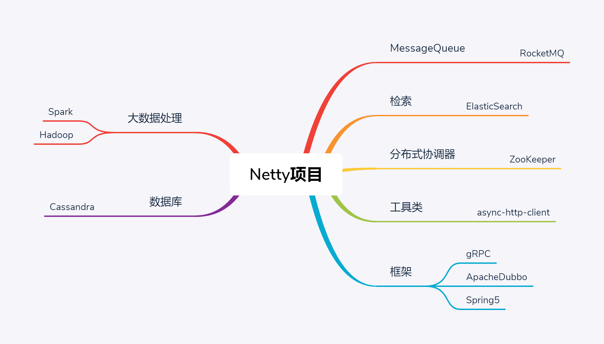

# Netty源码剖析与实战 #

## 01 | 课程介绍 ##

* 网络知识：《TCP/IP详解》、《图解TCP/IP》、《Wireshark网络分析就这么简单》
* Java 网络编程：《Java 网络编程》、《Java TCP/IP Socket编程》
* Netty 相关:《Netty权威指南》《Netty实战》（译自《Netty in action》: Norman Maurer）《Netty进阶之路：跟着案例学Netty》 

## 02 | 内容综述 ##

## 03 | 揭开Netty面纱 ##

## 04 | 为什么舍近求远：不直接使用JDK NIO ##

## 05 | 为什么孤注一掷：独选Netty？ ##

## 06 | Netty的前尘往事 ##

## 07 | Netty的现状与趋势 ##

## 一 介绍Netty是什么 ##

## 08 | Netty怎么切换三种I/O模式 ##

### 什么是经典的三种I/O模式 ###

* BIO（阻塞I/O）
* NIO（非阻塞I/O）
* AIO（异步I/O）

NIO

* COMMON
	* NioEventLoopGroup
	* NioEventLoop
	* NioServerSocketChannel
	* NioSocketChannel 
* Linux
	* EpollEventLoopGroup
	* EpollEventLoop
	* EpollServerSocketChannel
	* EpollSocketChannel
* macOS/BSD
	* KQueueEventLoopGroup
	* KQueueEventLoop
	* KQueueServerSocketChannel
	* KQueueSocketChannel

### 解读Netty怎么切换I/O模式的？ ###

* EventLoopGroup切换开发模式
* 切换channel：对应的IO模式

---

* 原理是什么？
* 为什么服务器开发并不需要切换客户端对应Socket？

## 09 | 源码剖析：Netty对I/O模式的支持 ##

原理是什么？

泛型+反射+工厂

* NioEventLoop：run 死循环监听处理事件
* NioServerSocketChannel：接受新连接

## 10 | Netty如何支持三种Reactor ##

* 什么是Reactor及三种版本
* 如何在Netty中使用Reactor模式
* 解析Netty对Reactor模式支持的常见疑问

|BIO|NIO|AIO|
|--|--|--|
|Thread-Per-Connection|Reactor|Proactor|

Reactor是一种开发模式，模式的核心流程：

注册感兴趣的事件->扫描是否有感兴趣的事件发生->事件发生后做出相应的处理。

## 11 | TCP粘包/半包Netty全搞定 ##

# 第三章 Netty源码：从“线”（请求处理）的角度剖析 #

## 21 | Netty代码编译与总览 ##

## 22 | 源码剖析：启动服务 ##

