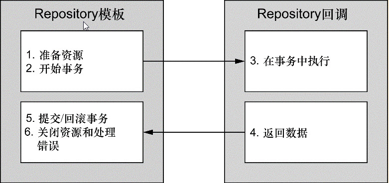

# 第三部分 #

第10章 JDBC

第11章 “通过对象-关系映射持久化数据”

# 第10章 通过Spring和JDBC征服数据库 #

## 10.1 Spring的数据访问哲学 ##
数据访问的功能都放到一个或多个专注于此项任务的组件中。（data access object，DAO）或Repository

#### 1. 展现了设计数据访问层的合理方式 ####

服务对象本身并不会处理数据访问，而是将数据访问委托给Repository。Repository接口确保其与服务对象的松耦合。

### 10.1.1 了解Spring的数据访问异常体系 ###

### 10.1.2 数据访问模板化 ###
Spring将数据访问过程中固定和可变的部分明确划分位两个不同的类：模板（template）和回调（callback）。

模板管理过程中固定的部分，而回调处理自定义的数据访问代码。

针对不同的持久化平台，Spring提供了多个可选的模板。如果直接使用JDBC，那你可以选择JdbcTemplate。如果你希望使用对象关系映射框架，那HibernateTemplate或JpaTempalte

* jca.cci.core.CciTemplate
JCA CCI连接
* jdbc.core.JdbcTemplate
JDBC连接
* jdbc.core.namedparam.NamedParameterJdbcTemplate 支持命名参数的JDBC连接
* orm.hibernate3.HibernateTemplate Hibernate3.x以上的Session
* orm.ibatis.SqlMapClientTemplate SqlMap客户端
* JpaTemplate Java数据对象（Java Data Object）实现
* JdoTemplate Java持久化API的实体管理器

## 10.2 配置数据源 ##
