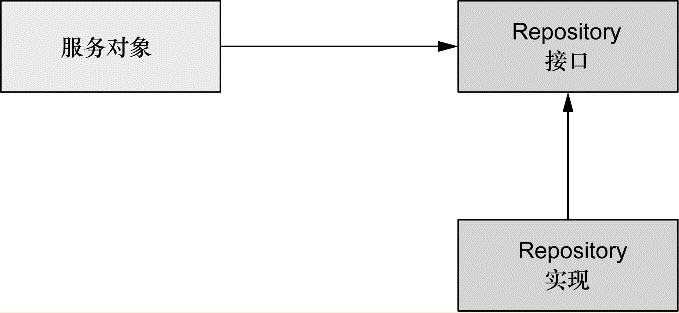

# 第10章 通过Spring和JDBC征服数据库 #

## 10.1 Spring的数据访问哲学 ##
数据访问的功能都放到一个或多个专注于此项任务的组件中。（data access object，DAO）或Repository

#### 1. 展现了设计数据访问层的合理方式 ####

服务对象本身并不会处理数据访问，而是将数据访问委托给Repository。Repository接口确保其与服务对象的松耦合。

### 10.1.1 了解Spring的数据访问异常体系 ###

### 10.1.2 数据访问模板化 ###
Spring将数据访问过程中固定和可变的部分明确划分位两个不同的类：模板（template）和回调（callback）。

模板管理过程中固定的部分，而回调处理自定义的数据访问代码。

针对不同的持久化平台，Spring提供了多个可选的模板。如果直接使用JDBC，那你可以选择JdbcTemplate。如果你希望使用对象关系映射框架，那HibernateTemplate或JpaTempalte

* jca.cci.core.CciTemplate
JCA CCI连接
* jdbc.core.JdbcTemplate
JDBC连接
* jdbc.core.namedparam.NamedParameterJdbcTemplate 支持命名参数的JDBC连接
* orm.hibernate3.HibernateTemplate Hibernate3.x以上的Session
* orm.ibatis.SqlMapClientTemplate SqlMap客户端
* JpaTemplate Java数据对象（Java Data Object）实现
* JdoTemplate Java持久化API的实体管理器

## 10.2 配置数据源 ##

### 10.2.1 使用JNDI数据源 ###

### 10.2.2 使用数据源连接池 ###

## 10.3 在Spring中使用JDBC ##
和Ado.net
### 10.3.1 应对失控的JDBC代码 ###
大量的JDBC代码就是用于创建连接和语句以及异常处理的样板代码。但实际上，这些样板代码是非常重要的。清理资源和处理错误确保了数据访问的健壮性。
### 10.3.2 使用JDBC模板 ###
Spring的JDBC框架承担了资源管理和异常处理的工作。

Spring为JDBC提供了三个模板类供选择：
JdbcTemplate:最基本的Spring

#### 使用JdbcTemplate来插入数据 ####
需要设置DataSource

	@Bean
	public JdbcTemplate jdbcTemplate(DataSource dataSource){
		return new JdbcTemplate(dataSource);
	}
通过构造器参数注入进来

	@Repository
	public class JdbcSpitterRepository implements SpitterRepository {
		private JdbcOperations jdbcOperations;
		@Inject
		public JdbcSpitterRepository(JdbcOperations jdbcOperations) {
			this.jdbcOperations = jdbcOperations;
		}
	}
@Repository注解，这表明它将会在组件扫描的时候自动创建。它的构造器上使用了@Inject注解，因此在创建的时候，会自动获得一个JdbcTemplate所实现的操作。通过注入JdbcOperations，而不是具体的JdbcTemplate，能过保证JdbcSpitterRepository通过JdbcOperations接口达到与JdbcTemplate保持松耦合。

#### 使用JdbcTemplate来读取数据 ####

#### 在JdbcTemplate中使用Java 8的Lambda表达式 ####

#### 使用命名参数 ####

## 10.4 小结 ##
按照规范，JDBC过于笨重，Spring能够接触使用JDBC的大多数痛苦，包括消除样板式代码、简化JDBC异常处理。
