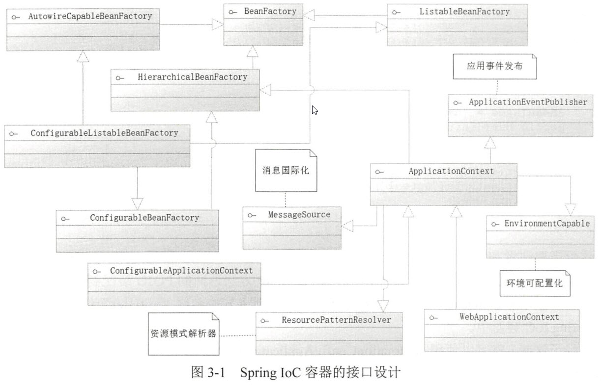
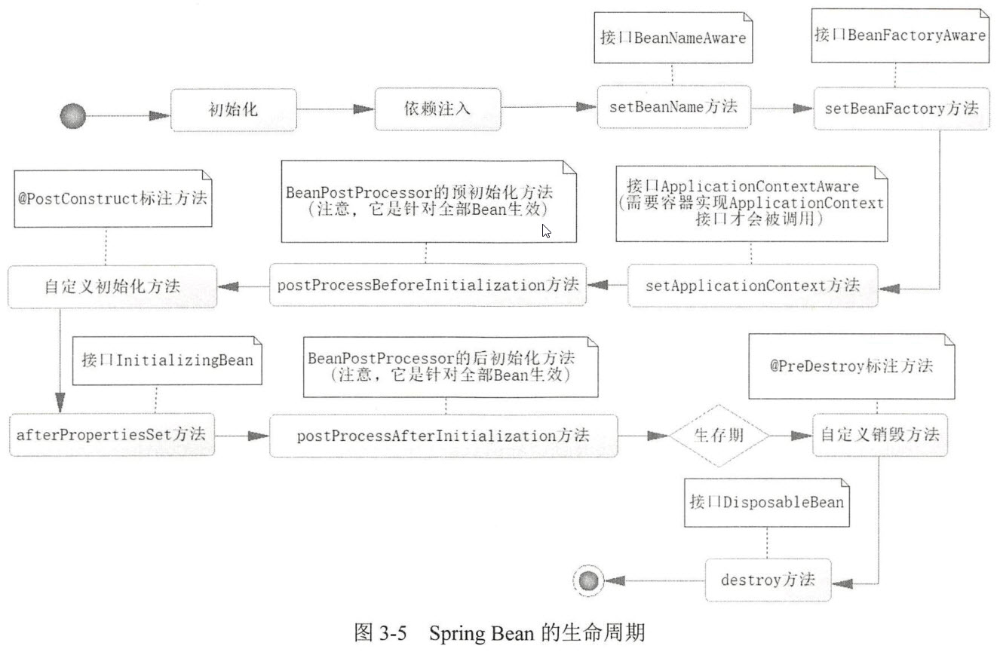
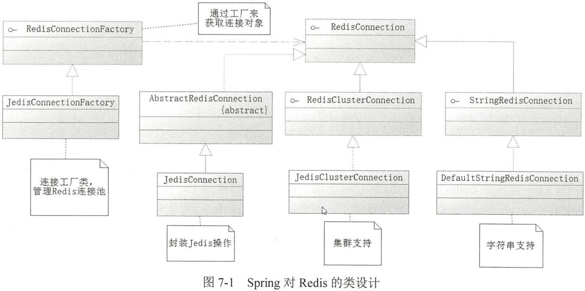
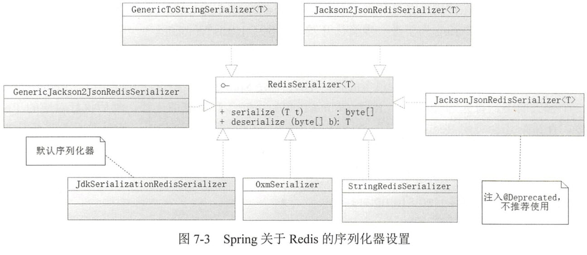
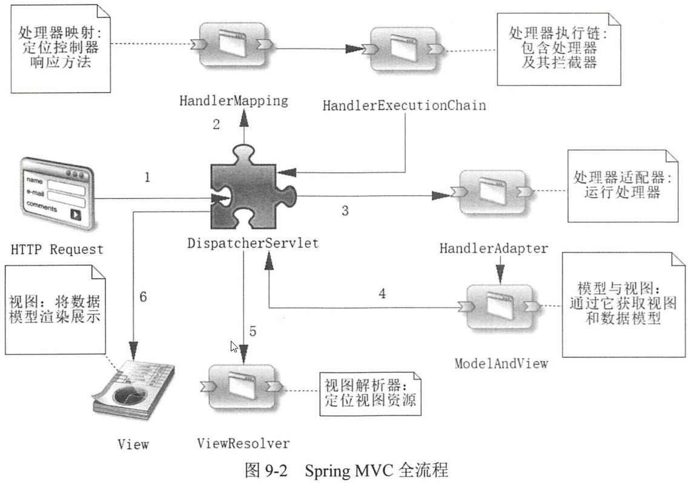
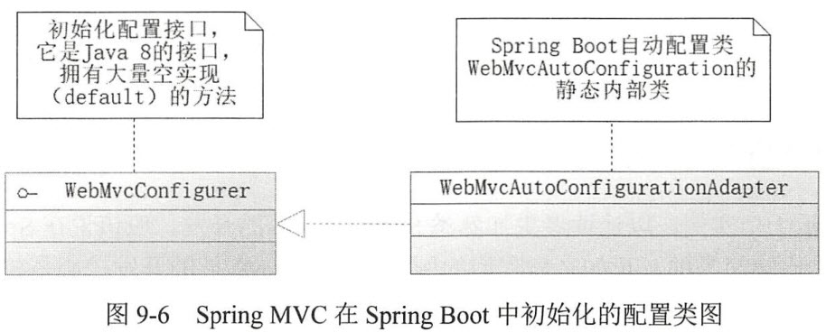
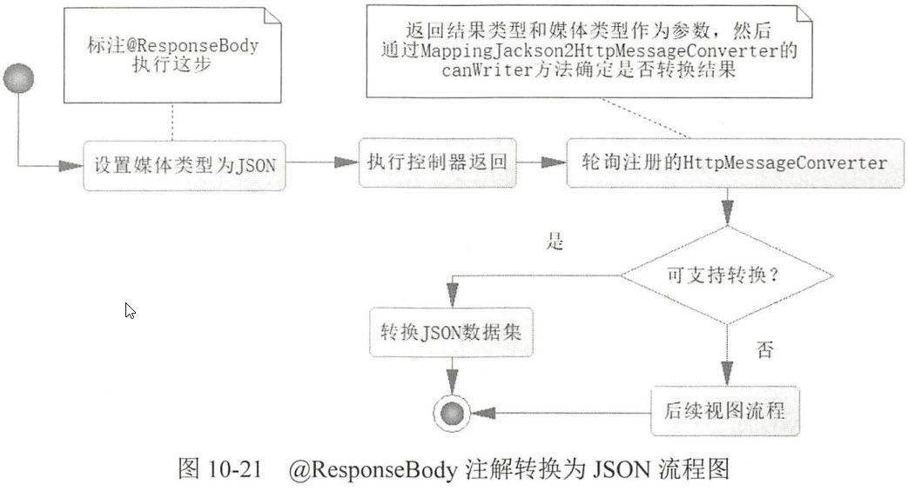

# 深入浅出Spring Boot 2.x #

# 第1章 Spring Boot来临 #

## 1.1 Spring的历史 ##

# 第3章 全注解下的Spring IoC #

Spring Boot并不建议使用XML，而是通过注解的描述生成的对象。

* 通过描述管理Bean，包括发布和获取Bean；
* 通过描述完成Bean之间的依赖关系

## 3.1 IoC容器简介 ##

BeanFactory

从IoC容器获取Bean

多个getBean方法中

1. 按照类型（by type）获取Bean的
2. 按照名称（by name）获取Bean的

---

* isSingleton方法则判断Bean是否在Spring IoC中为单例
* isPrototype，返回true，使用getBean方法获取Bean的时候， Spring IoC就会创建一个新的Bean返回给调用者。

由于BeanFactory不够强大，Spring在BeanFactory的基础上，设计了更高级的接口ApplicationContext，它是BeanFactory的子接口之一。在Spring的体系中BeanFactory和ApplicationContext是最为重要的接口设计。

ApplicationContext接口通过继承上级接口，进而继承BeanFactory接口，但是在BeanFactory的基础上，扩展了消息国际化接口（MessageSource）、环境可配置接口（EnvironmentCapable）、应用事件发布接口（ApplicationEventPublisher）和资源模式解析接口（ResourcePatternResolver）。

在Spring Boot当中主要是通过注解来装配Bean到Spring IoC容器中，基于注解的IoC容器，就是AnnotationConfigApplicationContext，基于注解的IoC容器，SpringBoot装配和获取Bean的方法如出一辙。

## 3.2 装配你的Bean ##

通过XML或者Java配置文件装配Bean

### 3.2.1 通过扫描装配你的Bean ###

* @Component，标明哪个类被扫描进入Spring IoC容器
* @ComponentScan，标明采用何种策略去扫描装配Bean

#### ComponentScan的源码 ####

	// 定义扫描的包
	@AliasFor("basePackages")
	String[] value() default {};
	
	// 定义扫描的包
	@AliasFor("value")
	String[] basePackagets() default {};

	// 定义扫描的类
	Class<?>[] basePackageClasses() defaule {};

	// 当满足过滤器的条件时扫描
	Filter[] includeFilters() default {};
	
	// 当不满足过滤器的条件时扫描
	Filter[] excludeFilters() default {};

	// 是否延迟初始化
	boolean lazyInit() default false;

1. 通过配置项basePackages定义扫描的包名，在没有定义的情况下，只会扫描当前包和其子包下的路径
2. 通过basePackageClasses定义的扫描的类
3. includeFilters和excluedeFilters，includeFilters是定义满足过滤器（Filter）条件的Bean才去扫描，excludeFilters则是排除过滤器条件的Bean，都需要通过一个注解@Filter去定义。classes定义注解类，patter定义正则式类。

	@ComponentScan("com.springboot.chapter3.*")
	或
	@ComponentScan(basePackages = {"com.springboot.chapter3.pojo"})
	或
	@ComponentScan(basePackageClasses = {User.class})
	
----

	@Target(ElementType.TYPE)
	@Retention(RetentionPolicy.RUNTIME)
	@Documented
	@Inherited
	@SpringBootConfiguration
	@EnableAutoConfiguration
	// 自定义排除的扫描类
	@ComponentScan(excludeFilter = {
		@Filter(type = FilterType.CUSTOM, classes=TypeExecludeFilter.class),
		@Filter(type = FilterType.CUSTOME,classes = AutoConfigurationExcludeFilter.class)})
	public interface SpringBootApplication

### 3.2.2 自定义第三方Bean ###

	/**
     * 通过Bean定义了配置项name为“dataSource”，那么Spring就会返回的对象用户名称为
     * “dataSource”保存到IoC容器中
     */
    @Bean(name = "dataSource")
    public DataSource getDataSource(){
        Properties properties = new Properties();
        properties.setProperty("driver", "com.mysql.jdbc.Driver");
        properties.setProperty("url", "jdbc:mysql://120.55.56.16/groupon");
        properties.setProperty("username", "root");
        properties.setProperty("password", "12345678");
        DataSource dataSource = null;
        try {
            dataSource = BasicDataSourceFactory.createDataSource(properties);
        } catch (Exception e) {
            e.printStackTrace();
        }
        return dataSource;
    }

## 3.3 依赖注入 ##

@Autowired，根据属性的类型（by type）找到对应的Bean进行注入。

### 3.3.1 注解@Autowired ###

@Autowired

#### getBean ####

* 根据类型（by type）
* 根据名字（by name）

### 3.3.2 消除歧义性——@Primary和@Quelifier ###

* @Primary 多个同样类型的Bean时，优先使用
* @Quelifier Quelifier的配置项value需要一个字符串去定义

### 3.3.3 带有参数的构造方法类的装配 ###

    public BusinessPerson(@Autowired @Qualifier("dog") Animal animal){
        this.animal = animal;
    }

## 3.4 生命周期 ##

1. Bean定义
2. Bean的初始化
3. Bean的生存期
4. Bean的销毁

* Spring通过我们的配置，如@ComponentScan定义的扫描路径去找到带有@Component的累，这个过程就是一个资源定位的过程
* 一旦找到了资源，那么它就开始解析，并且将定义的信息保存起来。注意，此时还没有初始化Bean，也就没有Bean的实例，它有的仅仅时Bean的定义。
* 然后就会把Bean定义发布到Spring IoC容器中。此时，IoC容器也只有Bean的定义，还是没有Bean的实例生成。

ComponentScan中还有一个配置项lazyInit，只可以配置Boolean值，且默认值为false，也就是默认不进行延迟初始化。

#### lazyInit ####

	@ComponentScan(basePackages = "com.springboot.chapter3.*", lazyInit = true)

* 定义了ApplicationContextAware接口，但有时候并不会调用，根据你的IoC容器来决定，Spring IoC容器最低的要求是实现BeanFactory接口，而不是实现ApplicationContext接口，但对于那些没有实现ApplicationContext接口的容器，在生命周期对应的ApplicationContextAware定义的方法也是不会被调用的，只有实现了ApplicationContext接口的容器，才会在生命周期调用ApplicationContextAware所定义的setApplicationContext方法。

这个Bean就实现了生命周期中单个Bean可以实现的所有接口，并且通过注解@PostConstruct定义了初始化方法，通过注解@PreDestroy定义了销毁方法。

## 3.5 使用属性文件 ##

在Spring Boot中使用属性文件，可以采用其默认为application.properties，也可以使用自定义的配置文件。

	<dependency>
		<groupId>org.springframework.boot</groupId>
		<artifactId>spring-boot-configuration-processor</artifactId>
		<optional>true</optional>
	</dependency>

通过@Value注解，使用${...}占位符读取配置在属性文件的内容。

* value可以配置多个配置文件。使用classpath前缀，意味着去类文件路径下找到属性文件；
* ignoreResourceNotFound的默认值为false，也就是没有找到属性文件就会报错，否则不会报错

## 3.6 条件装配Bean ##

@Conditional注解，并且配置了类DatabaseConditional，那么这个类就必须实现Condition接口。对于Condition接口要求实现matches方法。

#### matches方法 ####

1. 读取其上下文
2. 判定是否已经配置了对应的数据库信息
3. 返回true，则会装配数据库连接池的Bean，否则是不装配

## 3.7 Bean的作用域 ##

* isSingleton
* isPrototype

Web容器：

1. 页面（page）
2. 请求（request）
3. 会话（session）
4. 应用（application）

|作用域类型|使用范围|作用域描述|
|--|--|--|
|**singleton**|所有Spring应用|默认值，IoC容器只存在单例|
|**prototype**|所有Spring应用|每当从IoC容器中取出一个Bean，则创建一个新的Bean|
|**session**|Spring Web 应用|HTTP会话|
|**application**|Spring Web 应用|Web工程生命周期|
|request|Spring Web 应用|Web工程单次请求（request）|
|globalSession|Spring Web 应用|在一个全新的HTTP Session中，一个Bean定义对应一个实例。实践中基本不使用|

## 3.8 使用@Profile ##

使用Profile机制在开发环境、测试环境、准生产环境和生产环境中进行切换。

	application-{profile}.properties

---

	@Profile("dev")

## 3.9 引入XML配置Bean ##

	@ImportResource

通过它可以引入对应的XML文件，用来加载Bean。有时候有些框架（如Dubbo）是基于Spring的XML方式进行开发的。

	<bean id="squirrel" class="com.springboot.other.pojo.Squirrel" />

---

	@Configuration
	@ComponentScan(backPackage = "com.springboot.chapter3.*")
	@ImportResource(value = {"classpath:spring-other.xml"})
	public class AppConfig
引入对应的XML，从而将XML定义的Bean也装配到IoC容器中。

## 3.10 使用Spring EL ##

表达式语言Spring EL。

	@Value("${database.driverName}")
	String driver
	@Value("#{T(System).currentTimeMillis()}")
	private Long initTime = null;

* #{...}代表启用Spring表达式，具有运算的功能；
* T(...)代表的是引入类；

System是java.lang.*包的类，这是Java默认加载的包，因此可以不必写全限定的名，如果是其他的包，则需要写出全限定名才能引用类。

	// 赋值字符串
	@Value("#{'使用Spring EL赋值字符串'}")
	private String str = null;
	// 科学计数法赋值
	@Value("#{9.3E3}")
	private double d;
	// 赋值浮点数
	@Value("#{3.14}")
	private float pi;
	// 获取其他Spring Bean的属性来给当前的Bean属性赋值
	@Value("#{beanName.str}")
	private String otherBeanProp = null;
	还可以大学，赋值

	# 数字运算
	
	private int run;

# 第4章 开始约定编程——Spring AOP #

## 4.1 约定编程 ##

### 4.1.1 约定 ###

Spring AOP的本质，提供一个类——ProxyBean

静态的（static）方法：

	public static Object getProxyBean(Object target, Interceptor interceptor)

* 要求参数target对象存在接口，而interceptor对象则是接口对象；
* 那么它将返回一个对象，把返回的对象记为proxy，可以使用target对象实现的接口类型对它进行强制转换。

	HelloService helloSerivce = new HelloServiceImpl();
	HelloService proxy = (HelloService) ProxyBean.getProxyBean(helloService, new MyInterceptor());

### 4.1.2 ProxyBean的实现 ###

在JDK中，提供了类Proxy的静态方法——newProxyInstance

	public static Object newProxyInstance(ClassLoader classloader, Class<?>[] interfaces, InvocationHandler invocationHandler) throws IllegalArgumentException

生成一个代理对象（proxy），它有3个参数：

* classLoader——类加载器；
* interfaces——绑定的接口，也就是把代理对象绑定到哪些接口下，可以是多个；
* invocationHandler——绑定代理对象逻辑实现。

1. ProxyBean实现了接口InvocationHandler，定义invoke方法。在getBean方法中，生成了一个代理方法，然后创建了一个ProxyBean实例保存对象（target）和拦截器（interceptor）
2. 生成了一个代理对象，而这个代理对象挂在target实现的接口之下，可以用target对象实现的接口对这个代理对象实现强制转换，把这个代理对象的逻辑挂在ProxyBean实例之下。
3. 目标对象（target）和代理对象（proxy）

### 4.1.3 总结 ###

## 4.2 AOP的概念 ##

注解`@AspectJ`

### 4.2.1 为什么使用AOP ###

AOP最为典型的应用实际就是数据库事务的管控。

### 4.2.2 AOP术语和流程 ###

* 连接点**（join point）**：对应的是具体被拦截的对象，因为Spring只能支持方法，所以被拦截的对象往往就是指特定的方法。
* 切点**（point cut）**：切面不单单应用于单个方法，也可能是多个类的不同方法。
* 通知**（advice）**：按照约定的流程下的方法，分为前置通知(before advice)、后置通知（after advice）、环绕通知（around advice）、事后返回通知（afterReturning advice）和异常通知（afterThrowing advice）
* 目标对象**（target）**：即被代理对象，例如，约定编程中的HelloSerivceImpl实例就是一个目标对象，被代理。
* 引入**（introduction）**：指引入新的类和其方法，增强现有Bean的功能。
* 织入**（weaving）**：通过动态代理技术，为原有服务对象生成代理对象，然后将与切点定义匹配的连接点拦截，并按照约定将各类通知织入约定流程的过程。
* 切面**（aspect）**：是一个可以定义切点、各类通知和引入和内容，Spring AOP将通过它的信息来增强Bean的功能或者将对应的方法织入流程。

## 4.3 AOP开发详解 ##

@AspectJ

### 4.3.1 确定连接点 ###

任何AOP编程

在什么地方需要AOP，需要确定连接点

### 4.3.2 开发切面 ###

1. Spring是以@Aspect作为切面生命的，当以@Aspect作为注解时，Spring就知道这是一个切面，通过各类注解来定义各类的通知。
2. @Before、@After、@AfterReturning和@AfterThrowing等注解。

### 4.3.3 切点定义 ###

切点的作用就是向Spring描述哪些类的哪些方法需要启用AOP编程。

使用注解@Pointcut来定义切点，标注再方法pointCut上，则在后面的通知注解种就可以使用方法名称来定义。

	@Pointcut("execution(* com.xjsaber.learn.spring.springboot.service.impl.UserServiceImpl.printUser(..))")

* execution表示在执行的方法，拦截里面的正则匹配的方法；
* 表示任意返回类型的方法；
* com.springboot.chapter4.aspect.service.impl.UserServiceImpl指定目标对象的全限定名称；
* printUser指定目标对象的方法；
* （..）表示任意参数进行匹配。

AspectJ关于Spring AOP切点的指示器

|项目类型|描述|
|--|--|
|arg()|限定连接点方法参数|
|@args()|通过连接点方法参数上的注解进行限定|
|execution()|用于陪陪是连接点的执行方法|
|this()|限制连接点匹配AOP代理Bean引用为指定的类型|
|target|目标对象（即被代理对象）|
|@target()|限制目标对象的配置了指定的注解|
|with|限制连接点匹配指定的类型|
|@within()|限制连接点带有匹配注解类型|
|@annotation()|限定带有指定注解的连接点|

	execution(* com.springboot.chapter4.*.*.*.*. printUser(..) && bean('userServiceImpl')) 表示中的&&代表“并且的”的意思，而bean种定义的字符串代表对Spring Bean名称的限定。

### 4.3.4 测试AOP ###

### 4.3.5 环绕通知 ###

环绕通知是一个取代原有目标对象方法的通知，当然它也提供了回调原有目标对象方法的能力。

ProceedingJoinPoint，有一个proceed方法，通过这个方法可以回调原有目标对象的方法。可以在

	jp.proceed();

这行代码加入断点进行调试。

环绕通知的参数（jp），是一个被Spring封装过的对象，带有原有目标对象的信息，通过proceed方法回调原有目标对象的方法。

在没有必要时，应尽量不要使用环绕通知，很强大，但很危险

### 4.3.6 引入 ###

@DeclareParents，引入新的类来增强服务，必须配置的属性value和defaultImpl

* value：指向你要增强功能的目标对象，增强UserServiceImpl对象，因此可以看到配置为com.springboot.chapter4.aspect.service.impl.UserServiceImpl+。
* defaultImpl：引入增强功能的类，这里配置为UserValidatorImpl，用来提供校验用户是否为空的功能。

### 4.3.7 通知获取参数 ###

	@Before("pointCut() && args(user)")
	public void beforeParam(JoinPoint point, User user) {
		Object[] args = point.getArgs();
		System.out.println("before ......");
	}

### 4.3.8 织入 ###

织入是一个生成动态代理对象并且将切面和目标对象方法编织成为约定流程的过程。

接口+实现类的模式（Spring推荐的方式）

但对于是否拥有接口则不是Spring AOP的强制要求，对于动态代理也有多种实现方式。

业界比较流行的有CGLIB、Javassist、ASM等。

Spring采用了JDK和CGLIB，对于JDK而言，它是要求被代理的目标对象必须拥有接口，而对于CGLIB则不做要求。

## 4.4 多个切面 ##

# 第5章 访问数据库 #

## 5.1 配置数据源 ##

在依赖于Spring Boot的spring-boot-starter-data-jpa后，它就会默认为你配置数据源。

### 5.1.1 启动默认数据源 ###

	<dependency>
		<groupId>org.springframework.boot</groupId>
		<aftifactId>spring-boot-starter-data-jpa</aftifactId>
	</dependency>
	<dependency>
		<groupId>com.h2databaset</groupId>
		<aftifactId>h2</aftifactId>
		<scope>runtime</scope>
	</dependency>

引入JPA的依赖，对JPA来说，在SpringBoot中是依赖Hibernate去实现的。

### 5.1.2 配置自定义数据源 ###

	<dependency>
		<groupId>mysql</groupId>
		<aftifactId>mysql-connector-java</aftifactId>
	</dependency>
	<dependency>
		<groupId>org.springframework.boot</groupId>
		<aftifactId>mysql-connector-java</aftifactId>	
	</dependency>

	this.applicationContext = applicationContext;
    DataSource dataSource = this.applicationContext.getBean(DataSource.class);
    System.out.println("----------------------------------------------------");
    System.out.println(dataSource.getClass().getName());
    System.out.println("----------------------------------------------------");

实现了接口 ApplicationContextAware的方法 setApplicationContext()，依照 Spring Bean生命周期的规则，在其初始化的时候该方法就会被调用，从而获取 Spring IoC容器的上下文 (applicationContext),这时通过getBean方法就可以获取数据库连接池，然后打印出数据连接池的全限定名，从而得知用的是哪个数据库连接池。

## 5.2 使用JdbcTemplate操作数据源 ##

通过spring.datasource.type属性指定了数据库连接池的类型，然后再使用spring.datasource.dbcp2.*去配置数据库连接池的属性。

对JdbcTemplate的映射关系是需要开发者自己实现RowMapper的接口的，可以完成数据库数据到POJO（Plain Ordinary Java Object）对象的映射了

通过StatementCallback或者ConnectionCallback接口实现回调，从而在一条数据库连接中执行多条SQL。

## 5.3 使用JPA（Hibernate）操作数据 ##

JPA(Java Persistence API，Java持久化API)，是定义了对象关系映射（ORM）以及实体对象持久化的标准接口。

### 5.3.1 概述 ###

在Spring Boot中JPA是依靠Hibernate才得以实现的，Hibernate在3.2版本中已经对JPA实现了完全的支持。

JPA所维护的核心是实体（Entity Bean），而它是通过一个持久化上下文（Persistence Context）来使用的。持久化上下文包含已下3个部分：

* 对象关系映射（Object Relational Mapping，简称ORM，或O/RM，或O/R映射）描述，JPA支持注解或XML两种形式的描述，在Spring Boot中主要通过注解实现；
* 实体操作APi，通过规范可以实现实体的CRUD操作，来完成对象的持久化和查询；
* 查询语言，约定了面向对象的查询语言JPQL（Java Persistance Query Language）。

### 5.3.2 开发JPA ###

spring-boot-starter-data-jpa

* `@Entity`使用注解标明是一个实体类
* `@Table`配置的属性name指出它映射数据库的表，
* `@Id`标注属性为表的主键
* `@GeneratedValue`则是可以配置采用何种策略生成主键
	* GenerationType.IDENTITY，这是一种依赖于数据库递增的策略
* `@Column`进行标注，因为属性名称（userName）和数据库列名（user_name）不一致，而其他属性的名称和数据库列名保持一致，这样就能与数据库的表的字段一一对应起来。

JPA最顶级的接口是Repository，定义方法的是它的子接口 CrudRepository，其定义实体最基本的增删该的操作，PagingAndSortingRepository则继承了它并且提供了分页和排序的功能，最后JpaRepository扩展了PagingAndSortingRepository，而且扩展了QueryByExampleExecutor接口。

使用控制器来测试JpaUserRepository接口，而对于这个接口还需要制定Spring Boot扫描路径，才能将接口扫描到Spring IoC容器中。

还需要将实体（Entity Bean）注册给JPA才能测试这个控制器。为了方便注册JPA的信息，Spring提供了两个注解用来扫描对应的JPA接口和实体类，它们是@EnableJpaRepositories和@EntityScan。

* @EnableJpaRepositories代表启用JPA编程，启用JPA和制定扫描的包，
* @EntityScan则是对实体Bean的扫描，通过扫描装载JPA的实体类。

## 5.4 整合MyBatis框架 ##

### 5.4.1 Mybatis简介 ###

MyBatis是支持定制化SQL、存储过程以及高级映射的优秀的持久层框架。MyBatis可以对配置和原生Map使用简单的XML和注解，将接口和Java的POJO（Plain Old Java Object，普通的Java对象）映射成数据库中的记录。

MyBatis的配置文件包含

1. 基础配置文件
2. 映射文件

在MyBatis中也可以使用注解来实现映射，只是由于功能和可读性的限制，在实际的企业中使用得比较少。

### 5.4.2 MyBatis的配置 ###

MyBatis是一个基于SqlSessionFactory构建的框架。对于SqlSessionFactory而言，*它的作用是生成SqlSession接口对象*，这个接口对象是MyBatis操作的核心，而在MyBatis-Spring的结合中甚至可以“擦除”这个对象，使其在代码中“消失”。

因为SqlSession是一个功能性的代码。

因为SqlSessionFactory的作用是单一的，只是为了创建核心接口SqlSession，所以在MyBatis应用的生命周期中理当只存在一个SqlSessionFactory对象，并且往往会使用单例模式。

* properties(属性)：属性文件在实际应用中一般采用Spring进行配置，而不是MyBatis。
* settings(设置)：它的配置将改变MyBatis的底层行为，可以配置映射规则，如自动映射和驼峰映射、执行器（Executor）类型、缓存等内容。
* typeAliases(类型别名)：因为使用类全限定名会比较长，所以MyBatis会对常用的类提供默认的别名
* typeHandlers(类型处理器)：这是MyBatis的重要配置之一，在Mybatis写入和读取数据库的过程中对于不同类型的数据（对于Java是JavaType，对于数据库则是JdbcType）进行自定义转换，在大部分的情况
* objectFactory（对象工厂）：在Mybatis生成返回的POJO时调用的工厂类。一般使用MyBatis默认提供的对象工厂类（DefaultObjectFactory）就可泄了，而不需要任何配置。
* plugins（插件）：通过动态代理和责任链模式来完成，修改MyBatis底层的实现功能。
* environments（数据库环境）：可以配置数据库连接内容和事务
* databaseIdProvider（数据库厂商标识）：允许MyBatis配置多类型数据库支持。
* mapper（映射器）：是MyBatis最核心的组建，它提供SQL和POJO映射关系，是Mybatis开发的核心。

在MyBatis中对于typeHandler的要求是实现TypeHandler<T>接口，而它自身为了更加方便也通过抽象类BaseTypeHandler<T>实现了TypeHandler<T>接口，所以这里直接继承抽象类BaseTypeHandler<T>。

* 注解@MappedJdbcTypes声明JdbcType为数据库的整形
* @MappedTypes声明JavaType为SexEnum

	\<mapper namespace="com.springboot.chapter5.dao.MyBatisUserDao"\>
		\<select id="getUser" parameterType="long" resultType="user"\>
			select id, user_name as userName, sex, note from t_user where id = #{id}
		\</select\>
	\</mapper\>

* \<mapper\>元素的namespace属性，指定一个接口
* \<select\>元素，代表着一个查询语句，id属性指代这条SQL，parameterType属性配置未long，则表示是一个长整形（Long）参数，resultType指定返回值类型。

	# Mybatis映射文件通配
	mybatis.mapper-locations=classpath://mappers/*.xml
	# Mybatis扫描别名包，和注解@Alias联用
	mybatis.type-aliases-package=com.xjsaber.learn.spring.springboot.pojo
	# 配置typeHandler的扫描包
	mybatis.type-handlers-package=com.xjsaber.learn.spring.springboot.mybatis

### 5.4.3 Spring Boot整合MyBatis ###

Mapper是一个接口，是不可以使用new为其生成对象实例的。

MapperFactoryBean和MapperScannerConfigure。

* MapperFactoryBean是针对一个接口配置
* MapperScannerConfigurer则是扫描装配，也就是提供扫描装配MyBatis的接口到Spring IoC容器中。
* @MapperScan，能够将Mybatis所需的对应接口扫描装配到Spring IoC容器中。

@MapperScan，也能够将Mybatis所需的对应接口扫描装配到Spring IoC容器中。

#### MapperFactoryBean ####

	@Autowired
	SqlSessionFactory sqlSessionFactory = null;
	// 定义一个MyBatis的Mapper的接口
	@Bean
	public MapperFactoryBean(MyBatisUserDao) initMyBatisUserDao() {
		MapperFactoryBean<MyBatisUserDao> bean = new MapperFactoryBean<>();
		bean.setMapperInterface(MyBatisUserDao.class);
		bean.setSqlSessionFactory(sqlSessionFactory);
		return bean;
	}

#### MapperScannerConfigure ####

	/**
     * 配置Mybatis接口扫描
     * @return 返回扫描器
     */
    @Bean
    public MapperScannerConfigurer mapperScannerConfigurer(){

        // 定义扫描器实例
        MapperScannerConfigurer mapperScannerConfigurer = new MapperScannerConfigurer();
        // 加载SqlSessionFactory，Spring Boot会自动生产，SqlSessionFactory实例
        mapperScannerConfigurer.setSqlSessionFactoryBeanName("sqlSessionFactory");
        // 定义扫描的包
        mapperScannerConfigurer.setBasePackage("com.xjsaber.learn.spring.springboot.mybatis.*");
        // 限定被标注@Repository的接口才被扫描
        mapperScannerConfigurer.setAnnotationClass(Repository.class);
        // 通过继承某个接口限制扫描，一般使用不多
        // mapperScannerConfigurer.setMarkerInterface(......);
        return mapperScannerConfigurer;
    }

#### @MapperScan ####

	@MapperScan(
			// 指定扫描包
			basePackages = "com.xjsaber.learn.spring.springboot.*",
			// 指定 sqlSessionFactory，如果sqlSessionTemplate则指定，废弃
			sqlSessionFactoryRef = "sqlSessionFactory",
			// 指定 sqlSessionTemplate，将忽略sqlSessionFactory的配置
			sqlSessionTemplateRef = "sqlSessionTemplate",
			// marketInterface = Class.class, //限定扫描接口，不常用
			annotationClass = Repository.class
	)

@mapperScan允许通过扫描加载MyBatis的Mapper，如果你的SpringBoot项目中不存在多个SqlSessionFacotry(或者 SqlSessionTemplate)，那么可以不配置sqlSessionFactoryRef（或者sqlSessionTemplateRef）。sqlSessionTemplateRef的优先权是大于sqlSessionFactoryRef，制定了扫描的包和注解限定，选择接口限定，选择使用注解@Repository作为限定，对持久层的注解，而MyBatis也提供了一个对Mapper的注解@Mapper，通常更喜欢@Repository。

### 5.4.4 MyBatis的其他配置 ###

# TODO MyBatis org.apache.ibatis.binding.BindingException: Invalid bound statement (not found): com.xjsaber.learn.spring.springboot.mybatis.MyBatisUserRepository.getUser #

MyBatis常用的配置

	# 定义Mapper的XML路径
	mybatis.mapper-location=......
	# 定义别名扫描的包，需要与@Alias联合使用
	mybatis.type-aliases-package=......
	# MyBatis配置文件，当你的配置比较复杂的时候，可以使用它
	mybatis.config-location=......
	# 配置MyBatis插件（拦截器）
	mybatis.configuration.interceptors=......
	# 具体类需要与@MappedJdbcTypes联合使用
	mybatis.type-handlers-package=......
	# 级联延迟加载属性配置
	mybatis.configuration.aggressive-lazy-loading=......
	# 执行器（Executor），可以配置SIMPLE，REUSE，BATCH，默认为SIMPLE
	mybatis.executor-type=......

如果遇到比较复杂的配置，可以直接通过mybatis.config-location去指定MyBatis本身的配置文件。

SqlSessionFactory对象由Spring Boot自动配置得到的，接着采用注解@PostConstruct自定义了初始化后的initMyBatis方法。在该方法中，就可以配置插件了，在增加插件前，调用了插件的setProperties，然后把插件放入到MyBatis的机制中。

# 第6章 聊聊数据库事务处理 #

在Spring中，数据库事务是通过AOP技术来提供服务的。在JDBC中存在着大量的 try...catch...finally...语句，也同时存在着大量的冗余代码，如那些打开和关闭数据库连接的代码以及事务回滚的代码。

在Spring数据库事务中可以使用编程式事务，也可以使用声明式事务。

## 6.1 JDBC的数据库事务 ##

## 6.2 Spring声明式事务的使用 ##

### 6.2.1 Spring声明式数据库事务约定 ###

对于声明式事务，是使用@Transactional进行标注。标注在类或者方法上，当它标注在类上时，代表这个类所有公共（public）非静态的方法都将启用事务功能。

当Spring的上下文呢开始调用被@Transactional标注的类或者方法时，Spring就会产生AOP的功能。

1. 根据传播行为去确定的策略。
2. 隔离级别、超过时间、只读等内容的设置。

### 6.2.2 @Transactional的配置项 ###

### 6.2.3 Spring事务管理器 ###

### 6.2.4 测试数据库事务 ###

## 6.3 隔离级别 ##

### 6.3.1 数据库事务的知识 ###

数据库事务具有以下4个基本特征，也就是著名的ACID。

* Atomic(原子性)：事务中包含的操作被看作一个整体的业务单元，这个业务单元中的操作要么全部成功，要么全部失败，不会出现部分失败、部分成功的场景。
* Consistency（一致性）：事务在完成时，必须使所有的数据都保持一致状态，在数据库中所有的修改都基于事务，保证了数据的完整性。
* Isolation（隔离性）：核心内容。正如上述，可能多个应用程序线程同时访问同一数据，这样数据库同样的数据就会在各个不同的事务中被访问，这样会产生丢失更新。为了压制丢失更新的发生。因为互联网的应用常常面对高并发的场景，所以隔离性是需要掌握的重点内容。
* Durability（持久性）：事务结束后，所有的数据会固化到一个地方，如保存到磁盘当中，即使断电重启后也可以提供给应用程序访问。

### 6.3.2 详解隔离级别 ###

这4类隔离级别是未提交读、读写提交、可重复读和串行化，它们会在不同的程度上压制丢失更新的情景。

1. 数据的一致性
2. 性能

#### 1. 未提交读 ####

未提交读（read uncommitted）是最低的隔离级别，其含义是允许一个事务读取另一个事务没有提交的数据。

未提交读是一个危险的隔离级别。

## 6.4 传播行为 ##

## 6.5 @Transactional自调用失效问题 ##

@Transactional在某些场景下会失效。

# 第7章 使用性能利器——Redis #

在Redis中Lua语言的执行是原子性的，也就是在Redis执行Lua时，不会被其他命令所打断，这样能够保证在高并发场景下的一致性。

在默认的情况下，spring-boot-starter-data-redis（版本2.x）会依赖Lettuce的Redis客户端驱动，而在一般的项目中，会使用Jedis，所以在代码中使用了<exclusions>元素将其依赖排除了。

## 7.1 spring-data-redis项目简介 ##

Redis是一种键值数据库，而且是以字符串类型为中心的，当前它能够支持多种数据类型，包括字符串、散列、列表（链表）、集合、有序集合、基数和地理位置等。

### 7.1.1 spring-data-redis项目的设计 ###

* Lettuce
* Jedis

Spring提供了一个RedisConnectionFactory接口，通过生成一个RedisConnection接口对象，而RedisConnection接口对象是对Redis底层接口的封装。

Spring就会提供RedisConnection接口的实现类JedisConnection去封装原有的Jedis（redis.clients.jedis.Jedis）对象。

在Spring中是通过RedisConnection接口操作Redis的，而RedisConnection则对原生的Jedis进行封装。要获取RedisConnection接口对象，是通过RedisConnectionFactory接口去生成的，所以第一步要配置的便是这个工厂了，而配置这个工厂主要是配置Redis的连接池，对于连接池可以限定其最大连接数、超过时间等属性。

	@Bean(name = "RedisConnectionFactory")
    public RedisConnectionFactory initRedisConnectionFactory(){
        if (this.connectionFactory != null){
            return this.connectionFactory;
        }
        JedisPoolConfig poolConfig = new JedisPoolConfig();
        // 最大空闲数
        poolConfig.setMaxIdle(30);
        // 最大连接数
        poolConfig.setMaxTotal(50);
        // 最大等待毫秒数
        poolConfig.setMaxWaitMillis(2000);
        // 创建Jedis连接工厂
        JedisConnectionFactory connectionFactory = new JedisConnectionFactory(poolConfig);
        // 单机
        RedisStandaloneConfiguration rsCfg = connectionFactory.getStandaloneConfiguration();
        connectionFactory.setHostName("localhost");
        connectionFactory.setPort(6379);
        connectionFactory.setPassword("123456");
        this.connectionFactory = connectionFactory;
        return connectionFactory;
    }

通过一个连接池的配置创建了RedisConnectionFactory，通过它能够创建RedisConnection接口对象。但是我们在使用一条连接时，要先从RedisConnectionFactory工厂获取，然后在使用完成后还要自己关闭它。

### 7.1.2 RedisTemplate ###

RedisTemplate

1. 自动从RedisConnectionFactory工厂中获取连接
2. 执行对应的Redis命令
3. 关闭Redis的连接

Redis是一种基于字符串存储的NoSQL，而Java是基于对象的语言，对象是无法存储到Redis中的，不过Java提供了序列化机制，只要类实现了java.io.Serializable接口，就代表类的对象能够进行序列化，通过将类对象进行序列化就能够得到二进制字符串。

Spring提供了RedisSerializer接口

1. serialize，能把那些序列化的对象转化为二进制字符串；
2. deserialize，能够通过反序列化把二进制字符串转换为Java对象。

|属性|描述|备注|
|--|--|--|
|defaultSerializer|默认序列化器|如果没有设置，则使用JdkSerializationRedisSerializer|
|keySerializer|Redis键序列化器|如果没有设置，则使用默认序列化器|
|valueSerializer|Redis值序列化器|如果没有设置，则使用JdkSerializationRedisSerializer|
|hashKeySerializer|Redis散列结构field序列化器|如果没有设置，则使用默认序列化器|
|hashValueSerializer|Redis散列结构value序列化器|如果没有设置，则使用默认序列化器|
|stringSerializer|字符串序列化器|如果没有设置，则使用JdkSerializationRedisSerializer|

	redisTemplate.opsForValue().set("key1", "value1");
	redisTemplate.opsForHash().put("hash", "field", "hvalue");

1. 在操作key1时，redisTemplate会先从连接工厂（RedisConnectionFactory）中获取一个连接，然后执行对应的Redis命令，再关闭这条连接
2. 在操作hash时，从连接工厂中获取另一条连接，然后执行命令，再关闭该连接。

一条连接操作多个动作，使用RedisCallback和SessionCallback

StringRedisTemplate类，继承RedisTemplate，提供了字符串的操作。

### 7.1.3 Spring对Redis数据类型操作的封装 ###

Redis能够支持7种类型的数据结构，这7种类型是字符串、散列、列表（链表）、集合、有序集合、基数和地理位置。

|操作接口|功能|备注|
|--|--|--|
|GeoOperations|地理位置操作接口||
|HashOperations|散列操作接口||
|HyperLogLogOperations|基数操作接口||
|ListOperations|列表（链表）操作接口||
|SetOperations|集合操作接口||
|ValueOperations|字符串操作接口||
|ZSetOperations|有序集合操作接口||

	获取Redis数据类型操作接口

	// 获取地理位置操作接口
	redisTemplate.opsForGeo();
	// 获取散列操作接口
	redisTemplate.opsForHash();
	// 获取基数操作接口
	redisTemplate.opsForHyperLogLog(); 
	// 获取列表操作接口
	redisTemplate.opsForList();
	// 获取集合操作接口
	redisTemplate.opsForSet();
	// 获取字符串操作接口
	redisTemplate.opsForValue();
	// 获取有序集合操作接口
	redisTemplate.opsForZSet();

|接口|说明|
|--|--|
|BoundGeoOperations|绑定一个地理位置数据类型的键操作|
|BoundHashOperations|绑定一个散列数据类型的键操作|
|BoundListOperations|绑定一个列表（链表）数据类型的键操作|
|BoundSetOperations|绑定一个集合数据类型的键操作|
|BoundValueOperations|绑定一个字符串集合数据类型的键操作|
|BoundZSetOperations|绑定一个有序集合数据类型的键操作|

	// 获取地理位置绑定键操作接口
	redisTemplate.boundGeoOps("geo");
	// 获取散列绑定键操作接口
	redisTemplate.boundHashOps("hash");
	// 获取列表（链表）绑定键操作接口
	redisTemplate.boundListOps("list");
	// 获取集合绑定键操作接口
	redisTemplate.boundSetOps("set");
	// 获取字符串绑定键操作接口
	redisTemplate.boundValueOps("string");
	// 获取有序集合绑定键操作接口
	redisTemplate.boundZSetOps("zset");

### 7.1.4 SessionCallback和RedisCallback接口 ###

让RedisTemplate进行回调，通过他们在同一条连接下进行多个redis指令

* SessionCallback 较高的封装，对于开发者比较友好
* RedisCallback 较底层，需要处理的内容比较多，可读性较差

## 7.2 在SpringBoot中配置和使用Redis ##

spring-data-redis

### 7.2.1 在SpringBoot中配置Redis ###

配置了连接池和服务器的属性，用以连接Redis服务器，SpringBoot的自动装配机制就会读取这些配置来生成有关Redis的操作对象。自动生成`RedisConnectionFactory`、`RedisTemplate`、`StringRedisTemplate`等常用的Redis对象。

RedisTemplate会默认使用JdkSerializationRedisSerializer进行序列化键值，这样便能够存储到Redis服务器中。如果我们在Redis只是使用字符串，那么使用其自动生成的StringRedisTemplate即可，但是这样只能支持字符串了，并不能支持Java对象的存储。

	// 定义自定义后初始化方法
	@PostConstruct
	public void init() {
		initRedisTemplate();
	}

# TODO #

1. 首先通过@Autowired注入由Spring Boot根据配置生成的RedisTemplate对象。
2. 利用Spring Bean生命周期的特性使用注解@PostConstruct自定义后初始化方法。

在RedisTemplate中会默认地定义了一个StringRedisSerializer对象，所以我们并没有自己创建一个新的StringRedisSerializer对象，而是从RedisTemplate中获取。然后把RedisTemplate关于键和其散列数据类型的field都修改为了使用StringRedisSerializer进行序列化，这样在Redis服务器上得到的键和散列的field这都可以字符串存储了。

### 7.2.2 操作Redis数据类型 ###

Redis数据类型（如字符串、散列、列表、集合和有序集合）的操作，但是主要是从RedisTemplate的角度，而不是从SessionCallback和RedisCallback接口的角度

首先操作字符串和散列，这是Redis最为常用的数据类型。

	redisTemplate.opsForValue().set("key1", "value1");

存入了一个“key1”的数据

	redisTemplate.opsForValue().set("int_key1", "1"); 

然后是“int_key”，但是“int_key”存入到Redis服务器中，因为采用了JDK序列化器，所以在Redis服务器中它不是整数，而是一个被JDK序列化器序列化后的二进制字符串，是没有办法使用Redis命令进行运算。

	stringRedisTemplate.opsForValue().set("int", "1");

## 7.3 Redis的一些特殊用法 ##

考虑使用Redis事务或者利用Redis执行Lua的原子性达到数据一致性的目的。

### 7.3.1 使用Redis事务 ###

1. 

## 7.4 使用Spring缓存注解操作Redis ##

Spring提供了缓存注解

### 7.4.1 缓存管理器和缓存的启用 ###

Spring在使用缓存注解前，需要配置缓存管理器，缓存管理器将提供一些重要的信息，如缓存类型、超过时间等。

Spring可以支持多种缓存的使用，因此它存在多种缓存处理器，并提供了缓存处理器的接口CacheManager和与之相关的类。

CacheManager

缓存管理器配置

	# SPRING CACHE(CacheProperties)
	spring.cache.cache-name = # 如果由底层的缓存管理器支持创建，以逗号分隔的列表来缓存名称
	spring.cache.caffeine.spec = # caffeine 缓存配置细节
	spring.cache

	spring.cache.type=REDIS

配置的缓存类型，为Redis，SpringBoot会自动生成RedisCacheManager对象

	spring.cache.cache-names=redisCache

配置缓存名称，多个名称可以使用逗号分隔，以便于缓存注解的引用

	@EnableCaching 

驱动Spring缓存机制工作

### 7.4.2 开发缓存注解 ###

	

# 第8章 文档数据库——MongoDB #

MongoDB，C++语言编写的一种NoSQL，是一个基于分布式文件存储的开源数据库系统。在负载高时可以添加更多的节点，以保证服务器性能，MongoDB的目的时为了Web应用提供可扩展的高性能数据存储解决方案。

	<dependency>
		<groupId>org.springframework.boot</groupId>
		<artifactId>spring-boot-starter-data-mongodb</artifactId>
	</dependency>
	<dependency>
		<groupId>com.alibaba</groupId>
		<artifactId>fastjson</artifactId>
		<version>1.2.49</version>
	</dependency>

## 8.1 配置MongoDB ##

|Bean类型|描述| 
|--|--|
|MongoClient|MongoDB客户端|
|MongoProperties|Spring Boot关于MongoDB的自动配置属性|
|MongoDataAutoConfiguration|Spring Boot关于MongoDB的自动配置类|
|SimpleMongoDbFactory|简单地MongoDB的工厂，由它生成的MongoDB的会话，可通过属性spring.data.mongodb.grid-fs-database的配置转变为GridFsMongoDbFactory|
|MongoTemplate|MongoDB关于Java实体的映射内容配置|
|MappingMongoConverter||
|CustomConversions|自定义类型转换器|
|MongoRepositoriesAutoConfiguration|MongoDB关于仓库的自动配置|
|GeoJsonConfiguration|MongoDB关于地理位置JSON配置|

## 8.2 使用MongoTemplate实例 ##

Spring Data MongoDB主要是通过MongoTemplate进行操作数据的。

### 8.2.1 搭建开发环境 ###

* @Document 将它作为MongoDB的文档存在。
* @id将对应的字段设置为主键（数据库的规范采用下划线分隔，而Java一般采用驼峰式命名）
* @Field 进行设置，将属性userName就与MongoDB的user_name属性对应起来。
* @DBRef标注，将一个角色列表（属性roles），保存其引用。

### 8.2.2 使用MongoTemplate操作文档 ###

    Criteria criteria = Criteria.where("userName").regex(userName).and("note").regex(note);

这里的where方法的参数设置为"userName"，这个字符串代表的是类User的属性userName；regex方法代表正则匹配，即执行模糊查询；and方法代表连接字，代表同时满足。然后通过

    Query query = Query.query(criteria).limit(limit).skip(skip);

构建查询条件

* limit 返回至多条记录。
* skip 代表跳过多少条记录。

    return mongoTemplate.find(query, MongoUser.class);

更新对象，通过主键确认对应的文档。然后再定义一个更新对象（Update），在创建它的时候，使用构造方法设置了对用户名的更新，然后使用set方法设置了备注的更新，对声明我们只是对这两个属性进行更新，其他属性并不更新。相当于MongoDB使用了“$set”设置。

构造好了Query对象和Update对象后，就可以使用MongoTemplate执行更新，而updateMulti方法则是多个满足Query对象限定的文档。

执行更新方法后，会返回一个UpdateResult对象，它有3个属性，分别是matchedCount、modifiedCount和upsertId。

* matchedCount代表与Query对象匹配的文档数
* modifiedCount代表被更新的文档数
* upsertedId表示如果存在因为更新而插入文档的情况会返回插入文档的信息

## 8.3 使用JPA ##

### 8.3.1 基本用法 ###

	public interface MongoUserRepository extends MongoRepository<MongoUser, Long> 

接口扩展了MongoRepository接口，指定了两个类型，一个是实体类型，这个实体类型要求标注@Document，另一个是其主键的类型，这个类型要标注@Id。

|项目类型|描述|
|--|--|
|long count()| 统计文档总数|

### 8.3.2 使用自定义查询 ###

    MongoUser find(Long id, String userName);

这里的find方法并不符合JPA的规范，但是我们采用注解@Query标注了方法，并且配置了一个字符串JSON参数，这个参数中带有?0和?1这样的占位符，其中?0代表方法的第一个参数id，?1代表方法的第二个参数userName。

# 第9章 初识Spring MVC #

展示给用户的视图(View)、控制器返回的数据模型（Model）、定位视图的视图解析器（ViewResolver）和处理器适配器（HandlerAdapter）

## 9.1 Spring MVC框架的设计 ##

## 9.2 Spring MVC流程 ##

Spring MVC中DispatcherServlet就是其最重要的内容。

1. 在Web服务器启动的过程中，如果在Spring Boot机制下启用Spring MVC，它就开始初始化一些重要的组件，如DispactherServlet、HandlerAdapter的实现类RequestMappingHandlerAdapter等组件对象。
2. 关于这些组件的初始化，看到spring-webmvc-xxx.jar包的属性文件DispatcherServlet.properties，她定义的对象都是在Spring MVC开始时就初始化，并且存放在Spring IoC容器中。

* @Controller表明这是一个控制器
* @RequestMapping代表请求路径和控制器（或其方法）的映射关系，会在Web服务器启动Spring MVC时，就被扫描到HandlerMapping的机制中存储，之后在用户发起请求被DispatcherServlet拦截后，通过URI和其他的条件，通过HandlerMapping机制就能找到对应的控制器（或其方法）进行响应。只是通过HandlerMapping返回的是一个HandlerExecutionChain对象。

	HandlerExecutionChain {
		// 日志
		private stateic final Log logger = logFactory.getLog(HandlerExecutionChain.class);
		// 处理器
		private final Object handler;
		// 拦截器数组
		private HandlerInterceptor[] interceptors;
		// 拦截器列表
		private List<HandlerInterceptor> interceptorList;
		// 拦截器当前下标
		private int interceptorIndex = -1;
	}

HandlerExecutionChain对象包含一个处理器（handler）。这里的处理器时对控制器（controller）的包装，因为我们的控制器方法可能存在参数，那么处理器就可以读入HTTP和上下文的相关参数，然后再传递给传递器方法。而在控制器执行完成返回后，处理器又可以通过配置信息对控制器的返回结果进行处理。

# TODO #

## 9.3 定制Spring MVC的初始化 ##

在Servlet3.0规范中，web.xml再也不是一个必需的配置文件。为了适应这个规范，Spring MVC从3.1版本开始也进行了支持，也就是我们已经不再需要通过任何的XML去配置Spring MVC的运行环境。

正如Spring Boot的宗旨，消除XML的繁杂配置。为了支持对于Spring VMC的配置，Spring提供了接口WebMvcConfigurer，这是一个基于Java 8的接口，大部分方法都是支持default类型的。但是它们都是空实现，开发者只需要实现这个接口，重写需要自定义的方法即可。

在Spring Boot中，自定义是通过配置类WebMvcAutoConfiguration定义的，有一个静态的内部类WebMvcAutoConfigurationAdapter，通过它的Spring Boot就自动配置了Spring MVC的初始化。

在WebMvcAutoConfigurationAdapter类中，读入Spring配置Spring MVC的属性来初始化对应组件

## 9.4 Spring MVC实例 ##

Spring MVC的开发核心时控制器的开发，

1. 定义请求分发，让Spring MVC能够产生HandlerMapping
2. 接收请求获取参数
3. 处理业务逻辑获取数据模型
4. 绑定视图和数据模型。

### 9.4.1 开发控制器 ###

当方法被标注后，也可以定义部分URL，这样就能让请求的URL找到对应的路径。配置了扫描路径之后，Spring MVC扫描机制就可以将其扫描，并且装载为HandlerMapping，以备后面使用。
 
### 9.4.2 视图和视图渲染 ###

# 第10章 深入Spring MVC开发 #

## 10.1 处理器映射 ##

1. 启动阶段就会将注解`@RequestMapping`所配置的内容保存到处理器映射（HandlerMapping）机制中去
2. 等待请求的到来
3. 通过拦截请求信息和HandlerMapping进行匹配
4. 找到对应的处理器（它包含控制器的逻辑）
5. 将处理器及其拦截器保存到HandlerExecutionChain对象中
6. 返回给DispatcherServlet
7. DispathcerServlet就可以运行他们

	public @interface RequestMapping {
		// 配置请求映射名称
	    String name() default "";
		
		// 通过路径映射
	    @AliasFor("path")
	    String[] value() default {};
	
		// 通过路径映射回path配置项
	    @AliasFor("value")
	    String[] path() default {};
		
		// 限定只响应HTTP请求类型，如GET、POST、HEAD、OPTIONS、PUT、TRACE等
	    RequestMethod[] method() default {};
		
		// 当存在对应的HTTP参数时才响应请求
	    String[] params() default {};
		
		// 限定请求头存在对应的参数时才响应
	    String[] headers() default {};
	
		// 限定HTTP请求体提交类型，如"application/json"、"text/html"
	    String[] consumes() default {};
		
		// 限定返回内容类型，仅当HTTP请求头中的（Accept）类型中包含该指定类型时才返回
	    String[] produces() default {};
	}

## 10.2 获取控制器参数 ##

处理器是对控制器的包装，在处理器运行的过程中会调度控制器的方法，只是它在进入控制器方法之前对HTTP的参数和上下文进行解析，将它们转化为控制器所需的参数。

### 10.2.1 在无注解下获取参数 ###

    @GetMapping("/no/annotation")
    @ResponseBody
    public Map<String, Object> noAnnotation(Integer intVal, Long longVal, String str){
        Map<String, Object> paramsMap = new HashMap<>(8);
        paramsMap.put("intVal", intVal);
        paramsMap.put("longVal", longVal);
        paramsMap.put("str", str);
        return paramsMap;
    }

	http://localhost:8080/my/no/annotation?intVal=10&longVal=200

### 10.2.2 使用@RequestParam获取参数 ###

@RequestParam，其目的是指定HTTP参数和方法参数的映射关系，这样处理器就会按照其配置的映射关系来得到参数，然后调用控制器的方法。

	@GetMapping("/annotation")
    @ResponseBody
    public Map<String, Object> requestParam(@RequestParam("int_val") Integer intVal,@RequestParam("long_val") Long longVal, @RequestParam("str") String str){
        Map<String, Object> paramsMap = new HashMap<>(8);
        paramsMap.put("intVal", intVal);
        paramsMap.put("longVal", longVal);
        paramsMap.put("str", str);
        return paramsMap;
    }

	@RequestParam(value="str_val", required=false) String strVal

### 10.2.3 传递数组 ###

	@GetMapping("/requestArray")
    @ResponseBody
    public Map<String, Object> requestArray(int[] intArr,Long[] longArr, String[] strArr){
        Map<String, Object> paramsMap = new HashMap<>(8);
        paramsMap.put("intVal", intArr);
        paramsMap.put("longVal", longArr);
        paramsMap.put("str", strArr);
        return paramsMap;
    }

	http://localhost:8080/my/requestArray?intArr=1,2,3&longArr=4,5,6&strArr=str1,str2,str3

### 10.2.4 传递JSON ###

# TODO #

### 10.2.5 通过URL传递参数 ###

## 10.3 自定义参数转换规则 ##

## 10.4 数据验证 ##

1. 支持JSR-303注解验证，SpringBoot会引入关于Hibernate Validator机制来支持JSR-303验证规范。
2. 业务复杂，所以需要自定义验证规则。

## 10.5 数据模型 ##

## 10.6 视图和视图解析器 ##

## 10.7 文件上传 ##

## 10.8 拦截器 ##

## 10.9 国际化 ##

## 10.10 Spring MVC拾遗 ##

### 10.10.1 @ResponseBody转换为JSON的秘密 ###

@ResponseBody注解，处理器就会记录这个方法的响应类型为JSON数据集。当执行完控制器返回后，处理器会启用结果解析器（ResultResolver）去解析这个结果，它会去轮询注册给SpringMVC的HttpMessageConverter接口的实现类。

因为MappingJacson2HttpMessageConverter这个实现类已经被SpringMVC所注册，加上Spring MVC将控制器的结果类型标明为JSON，所以就匹配上了，于是通过它就在处理器内部把结果转换为了JSON。

### 10.10.2 重定向 ###

### 10.10.3 操作会话对象 ###

* @SessionAttribute 应用于参数，作用是将HttpSession中的属性读出，赋予控制器的参数
* @SessionAttributes 只能用于类的注解，将相关数据模型的属性保存到Session中

### 10.10.4 给控制器增加通知 ###

Spring MVC给控制器添加通知，于是在控制器方法的前后和异常发生时去执行不同的处理，这里设计4个注解：@ControllerAdvice、@InitBinder、@ExceptionHandler和@ModelAttribute

* @ControllerAdvice：定义一个控制器的通知类，允许定义一些关于增强控制器的各类通知和限定增强哪些控制器功能等。
* @InitBinder：定义控制器发生异常后的操作。一般来说，发生异常后，可以跳转到指定的友好页面，以避免用户使用的不友好。
* @ExceptionHandler：定义控制器发生异常后的操作。一般来说，发生异常后，可以跳转到指定的友好页面，以避免用户使用的不友好。
* @ModelAttribute:可以在控制器方法执行之前，对数据模型进行操作

### 10.10.5 获取请求头参数 ###

通过注解`@requestHeader`进行获取。

	...
	headers: {id : '1'},
	...

	public User headerUser(@RequestHeader("id") Long id) {
		...
	}

# 第11章 构建REST风格网站 #

# 第12章 安全——Spring Security #

# 第13章 学点Spring其他的技术 #

## 13.1 异步线程池 ##

### 13.1.1 定义线程池和开启异步可用 ###

在Spring中存在一个AsyncConfigurer接口，它是一个可以配置异步线程池的接口。

1. getAsyncExecutor方法返回的是一个自定义线程池，这样在开启异步时，线程池就会提供空闲线程来执行异步任务。

### 13.1.2 异步实例 ###

@EnableAsync代表开启Spring异步。这样就可以使用@Async驱动Spring使用异步，但是异步需要提供可用线程池。

## 13.2 异步消息 ##

JMS（Java Message Service，Java消息服务）。JMS按其规范分为点对点（Point-to-Point）和发布订阅（Publish/Subscribe）两种形式。点对点就是将一个系统的消息发布到指定的另外一个系统，这样另外一个系统就能获得消息，从而处理对应的业务逻辑；发布订阅模式是一个系统约定将消息发布到一个主题（Topic）中，然后各个系统就能够通过订阅这个主题，根据发送过来的信息处理对应的业务。

### 13.2.1 JMS实例——ActiveMQ ###

## 13.3 定时任务 ##

## 13.4 WebSocket应用 ##

WebSocket协议是基于TCP的一种新的网络协议。实现了浏览器与服务器全双工（full-duplex）通信——允许服务器主动发送信息给客户端，这样就可以实现从客户端发送消息到服务器，而服务器又可以转发消息到客户端，这样就能够实现客户端之间的交互。

### 13.4.1 开发简易的WebSocket服务 ###

对于WebSocket的使用，可以先通过Spring创建Java配置文件。这个文件中，先新建ServerEndpointExporter对象，通过它可以定义WebSocket服务器的端点，客户端就能请求服务器的端点。

    @Bean
    public ServerEndpointExporter serverEndpointExporter() {
        return new ServerEndpointExporter();
    }

有了这个Bean，就可以使用@ServerEndpoint定义一个端点服务类。在这个站点服务类中，定义WebSocket的打开、关闭、错误和发送消息的方法。

* @ServiceEndpoint("/ws"):表示让Spring创建WebSocket的服务端点，其中请求地址是“/ws”。
* @OnOpen：标注客户端打开WebSocket服务端点调用方法。
* @OnClose：标注客户端关闭WebSocket服务端点调用方法。
* @OnMessage：标注客户端发送消息，WebSocket服务端点调用方法。
* @OnError：标注客户端请求WebSocket服务端点发生异常调用方法。

每一个客户端打开时，都会为其创建一个WebSocketServiceImpl对象，所以这里打开方法中都会去计数并且将这个对象保存到CopyOnWriteArraySet中，知道拥有多少连接。对于关闭方法则是清除这个对象，并且计数减一。对于消息发送方法，则是通过轮询对所有的客户端连接都给予发送消息，所以所有的连接都可以收到这个消息。

### 13.4.2 使用STOMP ###

并不是所有的浏览器都能够支持WebSocket协议，为了使得WebSocket的应用能够兼容那些不支持的浏览器，可以使用STOMP协议进行处理。

1. 需要在配置文件中加入注解@EnableWebSocketMessageBroker，这个注解将会启动WebSocket下的子协议STOMP
2. 为了配置这个协议，可以实现Spring提供给接口WebSocketMessageBrokerConfigurer。

Spring提供了这个接口的空实现的抽象类AbstractWebSocketMessageBrokerConfigurer通过覆盖它所定义的方法即可。

# 第14章 Spring5新框架——WebFlux #

## 14.1 基础概念 ##

### 14.1.1 响应式编程的宣言 ###

### 14.1.2 Reactor模型 ###

1. 客户端会先向服务器注册其感兴趣的事件（Event），这样客户端就订阅了对应的事件，只是订阅事件并不会给服务器发送请求。
2. 当客户端发生一些已经注册的事件时，就会触发服务器的响应。
3. 当触发服务器响应时，服务器存在一个Selector线程，这个线程只是负责轮询客户端发送过来的事件，并不处理请求，当它接收到有客户端事件时，就会找到对应的请求处理器（Request Handler），然后启用另外一条线程运行处理器。

### 14.1.3 Spring WebFlux的概述 ###

在Servlet3.1，Web容器都是基于阻塞机制开发的，而在Servlet3.1（包含）之后，就开始了非阻塞的规范。

* Router Functions:是一个路由分发层，也就是会根据请求的事件，决定采用什么类的什么方法处理客户端发送过来的事件请求。类似在Reactor模式中，起到Selector的作用。
* Spring-webflux:是一种控制器，类似Spring MVC框架的层级，主要处理业务逻辑前进行的封装和控制数据流返回格式等。
* HTTP/Reactive Streams:是将结果转换为数据流的过程。对于数据流的处理还存在一些重要的细节。

Spring WebFlux需要能够支持Servlet3.1+的容器。

在Spring

在Spring WebFlux，两种开发方式

1. 类似于Spring MVC的模式
2. 函数功能性的编程

数据流的封装，Reactor提供的Flux和Mono，封装数据流的类。

1. Flux是存放0~N个数据流序列，响应式框架会一个接一个地（非一次性）将它们发送到客户端
2. Mono则是存放0~1个数据流序列

相互的区别，又可以相互转换的。

Flux还有背压（Backpressure）的概念，对于客户端，有时候响应能力距离服务端有很大的差距，如果在很短的时间内服务端将大量的数据流传输给客户端，那么客户端就可能被压垮。

### 14.1.4 WebHandler接口和运行流程 ###

## 14.2 通过Spring MVC方式开发WebFlux服务端 ##

## 14.3 深入WebFlux服务端开发 ##

## 14.4 深入客户端开发 ##

## 14.5 使用路由函数方式开发WebFlux ##

体现了高并发的特性，也符合函数式编程

### 14.5.1 开发处理器 ###

开发路由函数方式

1. 开发一个处理器（Handler）用来处理各种场景。

# 第15章 实践一下——抢购商品 #

# 第16章 部署、测试和监控 #

# 第17章 分布式开发——Spring Cloud #

