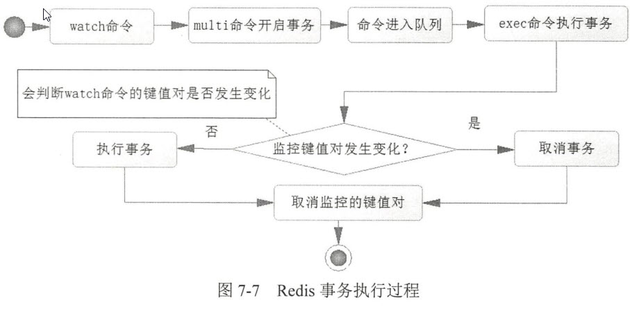

# 深入浅出Spring Boot 2.x #

# 第1章 Spring Boot来临 #

## 1.1 Spring的历史 ##

# 第3章 全注解下的Spring IoC #

Spring Boot并不建议使用XML，而是通过注解的描述生成的对象。

* 通过描述管理Bean，包括发布和获取Bean；
* 通过描述完成Bean之间的依赖关系

## 3.1 IoC容器简介 ##

BeanFactory

## 3.2 装配你的Bean ##

### 3.2.1 通过扫描装配你的Bean ###

## 3.3 依赖注入 ##

@Autowired，根据属性的类型（by type）找到对应的Bean进行注入。

### 3.3.1 注解@Autowired ###

注入的机制是根据类型（by type）。

#### getBean ####

* 根据类型（by type）
* 根据名字（by name）

### 3.3.2 消除歧义性——@Primary和@Quelifier ###

* @Primary 多个同样类型的Bean时，优先使用
* @Quelifier Quelifier的配置项value需要一个字符串去定义

### 3.3.3 带有参数的构造方法类的装配 ###

    public BusinessPerson(@Autowired @Qualifier("dog") Animal animal){
        this.animal = animal;
    }

## 3.4 生命周期 ##

1. Bean定义
2. Bean的初始化
3. Bean的生存期
4. Bean的销毁

* Spring通过我们的配置，如@ComponentScan定义的扫描路径去找到带有@Component的累，这个过程就是一个资源定位的过程
* 一旦找到了资源，那么它就开始解析，并且将定义的信息保存起来。注意，此时还没有初始化Bean，也就没有Bean的实例，它有的仅仅时Bean的定义。
* 然后就会把Bean定义发布到Spring IoC容器中。此时，IoC容器也只有Bean的定义，还是没有Bean的实例生成。

ComponentScan中还有一个配置项lazyInit，只可以配置Boolean值，且默认值为false，也就是默认不进行延迟初始化。

# TODO lazyInit #

## 3.5 使用属性文件 ##

	<dependency>
		<groupId>org.springframework.boot</groupId>
		<artifactId>spring-boot-configuration-processor</artifactId>
		<optional>true</optional>
	</dependency>

通过@Value注解，使用${...}占位符读取配置在属性文件的内容。

* value可以配置多个配置文件。使用classpath前缀，意味着去类文件路径下找到属性文件；
* ignoreResourceNotFound的默认值为false，也就是没有找到属性文件就会报错，否则不会报错

## 3.6 条件装配Bean ##

@Conditional注解，并且配置了类DatabaseConditional，那么这个类就必须实现Condition接口。对于Condition接口要求实现matches方法。

#### matches方法 ####

1. 读取其上下文
2. 判定是否已经配置了对应的数据库信息
3. 返回true，则会装配数据库连接池的Bean，否则是不装配

## 3.7 Bean的作用域 ##

* isSingleton
* isPrototype

Web容器：

1. 页面（page）
2. 请求（request）
3. 会话（session）
4. 应用（application）

|作用域类型|使用范围|作用域描述|
|--|--|--|
|**singleton**|所有Spring应用|默认值，IoC容器只存在单例|
|**prototype**|所有Spring应用|每当从IoC容器中取出一个Bean，则创建一个新的Bean|
|**session**|Spring Web 应用|HTTP会话|
|**application**|Spring Web 应用|Web工程生命周期|
|request|Spring Web 应用|Web工程单次请求（request）|
|globalSession|Spring Web 应用|在一个全新的HTTP Session中，一个Bean定义对应一个实例。实践中基本不使用|

## 3.8 使用@Profile ##

使用Profile机制在开发环境、测试环境、准生产环境和生产环境中进行切换。

	application-{profile}.properties

## 3.9 引入XML配置Bean ##

## 3.10 使用Spring EL ##

# 第4章 开始约定编程——Spring AOP #

## 4.1 约定编程 ##

### 4.1.1 约定 ###

Spring AOP的本质，提供一个类——ProxyBean

静态的（static）方法：

	public static Object getProxyBean(Object target, Interceptor interceptor)

* 要求参数target对象存在接口，而interceptor对象则是接口对象；
* 那么它将返回一个对象，把返回的对象记为proxy，可以使用target对象实现的接口类型对它进行强制转换。

	HelloService helloSerivce = new HelloServiceImpl();
	HelloService proxy = (HelloService) ProxyBean.getProxyBean(helloService, new MyInterceptor());

### 4.1.2 ProxyBean的实现 ###

在JDK中，提供了类Proxy的静态方法——newProxyInstance

	public static Object newProxyInstance(ClassLoader classloader, Class<?>[] interfaces, InvocationHandler invocationHandler) throws IllegalArgumentException

生成一个代理对象（proxy），它有3个参数：

* classLoader——类加载器；
* interfaces——绑定的接口，也就是把代理对象绑定到哪些接口下，可以是多个；
* invocationHandler——绑定代理对象逻辑实现。

1. ProxyBean实现了接口InvocationHandler，定义invoke方法。在getBean方法中，生成了一个代理方法，然后创建了一个ProxyBean实例保存对象（target）和拦截器（interceptor）
2. 生成了一个代理对象，而这个代理对象挂在target实现的接口之下，可以用target对象实现的接口对这个代理对象实现强制转换，把这个代理对象的逻辑挂在ProxyBean实例之下。
3. 目标对象（target）和代理对象（proxy）

### 4.1.3 总结 ###

## 4.2 AOP的概念 ##

注解`@AspectJ`

### 4.2.1 为什么使用AOP ###

AOP最为典型的应用实际就是数据库事务的管控。

### 4.2.2 AOP术语和流程 ###

* 连接点**（join point）**：对应的是具体被拦截的对象，因为Spring只能支持方法，所以被拦截的对象往往就是指特定的方法。
* 切点**（point cut）**：切面不单单应用于单个方法，也可能是多个类的不同方法。
* 通知**（advice）**：按照约定的流程下的方法，分为前置通知(before advice)、后置通知（after advice）、环绕通知（around advice）、事后返回通知（afterReturning advice）和异常通知（afterThrowing advice）
* 目标对象**（target）**：即被代理对象，例如，约定编程中的HelloSerivceImpl实例就是一个目标对象，被代理。
* 引入**（introduction）**：指引入新的类和其方法，增强现有Bean的功能。
* 织入**（weaving）**：通过动态代理技术，为原有服务对象生成代理对象，然后将与切点定义匹配的连接点拦截，并按照约定将各类通知织入约定流程的过程。
* 切面**（aspect）**：是一个可以定义切点、各类通知和引入和内容，Spring AOP将通过它的信息来增强Bean的功能或者将对应的方法织入流程。

## 4.3 AOP开发详解 ##

@AspectJ

### 4.3.1 确定连接点 ###

任何AOP编程

在什么地方需要AOP，需要确定连接点

### 4.3.2 开发切面 ###

1. Spring是以@Aspect作为切面生命的，当以@Aspect作为注解时，Spring就知道这是一个切面，通过各类注解来定义各类的通知。
2. @Before、@After、@AfterReturning和@AfterThrowing等注解。

### 4.3.3 切点定义 ###

切点的作用就是向Spring描述哪些类的哪些方法需要启用AOP编程。

使用注解@Pointcut来定义切点，标注再方法pointCut上，则在后面的通知注解种就可以使用方法名称来定义。

	@Pointcut("execution(* com.xjsaber.learn.spring.springboot.service.impl.UserServiceImpl.printUser(..))")

* execution表示在执行的方法，拦截里面的正则匹配的方法；
* 表示任意返回类型的方法；
* com.springboot.chapter4.aspect.service.impl.UserServiceImpl指定目标对象的全限定名称；
* printUser指定目标对象的方法；
* （..）表示任意参数进行匹配。

AspectJ关于Spring AOP切点的指示器

|项目类型|描述|
|--|--|
|arg()|限定连接点方法参数|
|@args()|通过连接点方法参数上的注解进行限定|
|execution()|用于陪陪是连接点的执行方法|
|this()|限制连接点匹配AOP代理Bean引用为指定的类型|
|target|目标对象（即被代理对象）|
|@target()|限制目标对象的配置了指定的注解|
|with|限制连接点匹配指定的类型|
|@within()|限制连接点带有匹配注解类型|
|@annotation()|限定带有指定注解的连接点|

	execution(* com.springboot.chapter4.*.*.*.*. printUser(..) && bean('userServiceImpl')) 表示中的&&代表“并且的”的意思，而bean种定义的字符串代表对Spring Bean名称的限定。

### 4.3.4 测试AOP ###

### 4.3.5 环绕通知 ###

环绕通知是一个取代原有目标对象方法的通知，当然它也提供了回调原有目标对象方法的能力。

ProceedingJoinPoint，有一个proceed方法，通过这个方法可以回调原有目标对象的方法。可以在

	jp.proceed();

这行代码加入断点进行调试。

环绕通知的参数（jp），是一个被Spring封装过的对象，带有原有目标对象的信息，通过proceed方法回调原有目标对象的方法。

在没有必要时，应尽量不要使用环绕通知，很强大，但很危险

### 4.3.6 引入 ###

@DeclareParents，引入新的类来增强服务，必须配置的属性value和defaultImpl

* value：指向你要增强功能的目标对象，增强UserServiceImpl对象，因此可以看到配置为com.springboot.chapter4.aspect.service.impl.UserServiceImpl+。
* defaultImpl：引入增强功能的类，这里配置为UserValidatorImpl，用来提供校验用户是否为空的功能。

### 4.3.7 通知获取参数 ###

	@Before("pointCut() && args(user)")
	public void beforeParam(JoinPoint point, User user) {
		Object[] args = point.getArgs();
		System.out.println("before ......");
	}

### 4.3.8 织入 ###

织入是一个生成动态代理对象并且将切面和目标对象方法编织成为约定流程的过程。

接口+实现类的模式（Spring推荐的方式）

但对于是否拥有接口则不是Spring AOP的强制要求，对于动态代理也有多种实现方式。

业界比较流行的有CGLIB、Javassist、ASM等。

Spring采用了JDK和CGLIB，对于JDK而言，它是要求被代理的目标对象必须拥有接口，而对于CGLIB则不做要求。

## 4.4 多个切面 ##

# 第5章 访问数据库 #

## 5.1 配置数据源 ##

在依赖于Spring Boot的spring-boot-starter-data-jpa后，它就会默认为你配置数据源。

### 5.1.1 启动默认数据源 ###

	<dependency>
		<groupId>org.springframework.boot</groupId>
		<aftifactId>spring-boot-starter-data-jpa</aftifactId>
	</dependency>
	<dependency>
		<groupId>com.h2databaset</groupId>
		<aftifactId>h2</aftifactId>
		<scope>runtime</scope>
	</dependency>

引入JPA的依赖，对JPA来说，在SpringBoot中是依赖Hibernate去实现的。

### 5.1.2 配置自定义数据源 ###

	<dependency>
		<groupId>mysql</groupId>
		<aftifactId>mysql-connector-java</aftifactId>
	</dependency>
	<dependency>
		<groupId>org.springframework.boot</groupId>
		<aftifactId>mysql-connector-java</aftifactId>	
	</dependency>

## 5.2 使用JdbcTemplate操作数据源 ##

# TODO #

对JdbcTemplate的映射关系是需要开发者自己实现RowMapper的接口的，可以完成数据库数据到POJO（Plain Ordinary Java Object）对象的映射了

## 5.3 使用JPA（Hibernate）操作数据 ##

JPA(Java Persistence API，Java持久化API)，是定义了对象关系映射（ORM）以及实体对象持久化的标准接口。

### 5.3.1 概述 ###

在Spring Boot中JPA是依靠Hibernate才得以实现的，Hibernate在3.2版本中已经对JPA实现了完全的支持。

JPA所维护的核心是实体（Entity Bean），而它是通过一个持久化上下文（Persistence Context）来使用的。持久化上下文包含已下3个部分：

* 对象关系映射（Object Relational Mapping，简称ORM，或O/RM，或O/R映射）描述，JPA支持注解或XML两种形式的描述，在Spring Boot中主要通过注解实现；
* 实体操作APi，通过规范可以实现实体的CRUD操作，来完成对象的持久化和查询；
* 查询语言，约定了面向对象的查询语言JPQL（Java Persistance Query Language）。

### 5.3.2 开发JPA ###

spring-boot-starter-data-jpa

* `@Entity`使用注解标明是一个实体类
* `@Table`配置的属性name指出它映射数据库的表，
* `@Id`标注属性为表的主键
* `@GeneratedValue`则是可以配置采用何种策略生成主键
	* GenerationType.IDENTITY，这是一种依赖于数据库递增的策略
* `@Column`进行标注，因为属性名称（userName）和数据库列名（user_name）不一致，而其他属性的名称和数据库列名保持一致，这样就能与数据库的表的字段一一对应起来。

## 5.4 整合MyBatis框架 ##

### 5.4.1 Mybatis简介 ###

MyBatis是支持定制化SQL、存储过程以及高级映射的优秀的持久层框架。MyBatis可以对配置和原生Map使用简单的XML和注解，将接口和Java的POJO（Plain Old Java Object，普通的Java对象）映射成数据库中的记录。

MyBatis的配置文件包含

1. 基础配置文件
2. 映射文件

### 5.4.2 MyBatis的配置 ###

MyBatis是一个基于SqlSessionFactory构建的框架。对于SqlSessionFactory而言，它的作用是生成SqlSession接口对象，这个接口对象是MyBatis操作的核心，而在MyBatis-Spring的结合中甚至可以“擦除”这个对象，使其在代码中“消失”。

因为SqlSession是一个功能性的代码。

因为SqlSessionFactory的作用是单一的，只是为了创建核心接口SqlSession

* properties(属性)：属性文件在实际应用中一般采用Spring进行配置，而不是MyBatis。
* settings(设置)：它的配置将改变MyBatis的底层行为，可以配置映射规则，如自动映射和驼峰映射、执行器（Executor）类型、缓存等内容。
* typeAliases(类型别名)：因为使用类全限定名会比较长，所以MyBatis会对常用的类提供默认的别名
* typeHandlers(类型处理器)：这是MyBatis的重要配置之一，在Mybatis写入和读取数据库的过程中对于不同类型的数据（对于Java是JavaType，对于数据库则是JdbcType）进行自定义转换，在大部分的情况
* objectFactory（对象工厂）：在Mybatis生成返回的POJO时调用的工厂类。一般使用MyBatis默认提供的对象工厂类（DefaultObjectFactory）就可泄了，而不需要任何配置。
* plugins（插件）：通过动态代理和责任链模式来完成，修改MyBatis底层的实现功能。
* environments（数据库环境）：可以配置数据库连接内容和事务
* databaseIdProvider（数据库厂商标识）：允许MyBatis配置多类型数据库支持。
* mapper（映射器）：是MyBatis最核心的组建，它提供SQL和POJO映射关系，是Mybatis开发的核心。

### 5.4.3 Spring Boot整合MyBatis ###

Mapper是一个接口，是不可以使用new为其生成对象实例的。

它们MapperFactoryBean和MapperScannerConfigure。MapperFactoryBean是针对一个接口配置，而MapperScannerConfigurer则是扫描装配，也就是提供扫描装配MyBatis的接口到Spring IoC容器中。

#### MapperFactoryBean ####

	@Autowired
	SqlSessionFactory sqlSessionFactory = null;
	// 定义一个MyBatis的Mapper的接口
	@Bean
	public MapperFactoryBean(MyBatisUserDao) initMyBatisUserDao() {
		MapperFactoryBean<MyBatisUserDao> bean = new MapperFactoryBean<>();
		bean.setMapperInterface(MyBatisUserDao.class);
		bean.setSqlSessionFactory(sqlSessionFactory);
		return bean;
	}

#### MapperScannerConfigure ####

### 5.4.4 MyBatis的其他配置 ###

MyBatis常用的配置

	# 定义Mapper的XML路径
	mybatis.mapper-location=......
	# 定义别名扫描的包，需要与@Alias联合使用
	mybatis.type-aliases-package=......
	# MyBatis配置文件，当你的配置比较复杂的时候，可以使用它
	mybatis.config-location=......
	# 配置MyBatis插件（拦截器）
	mybatis.configuration.interceptors=......
	# 具体类需要与@MappedJdbcTypes联合使用
	mybatis.type-handlers-package=......
	# 级联延迟加载属性配置
	mybatis.configuration.aggressive-lazy-loading=......
	# 执行器（Executor），可以配置SIMPLE，REUSE，BATCH，默认为SIMPLE
	mybatis.executor-type=......

# 第6章 聊聊数据库事务处理 #

在Spring中，数据库事务是通过AOP技术来提供服务的。在JDBC中存在着大量的 try...catch...finally...语句，也同时存在着大量的冗余代码，如那些打开和关闭数据库连接的代码以及事务回滚的代码。

在Spring数据库事务中可以使用编程式事务，也可以使用声明式事务。

## 6.1 JDBC的数据库事务 ##

## 6.2 Spring声明式事务的使用 ##

### 6.2.1 Spring声明式数据库事务约定 ###

### 6.2.3 Spring事务管理器 ###

### 6.2.4 测试数据库事务 ###

# 第7章 使用性能利器——Redis #

在默认的情况下，spring-boot-starter-data-redis（版本2.x）会依赖Lettuce的Redis客户端驱动，而在一般的项目中，会使用Jedis，所以在代码中使用了<exclusions>元素将其依赖排除了。

## 7.1 spring-data-redis项目简介 ##

### 7.1.1 spring-data-redis项目的设计 ###

* Lettuce
* Jedis

Spring提供了一个RedisConnectionFactory接口，通过生成一个RedisConnection接口对象，而RedisConnection接口对象是对Redis底层接口的封装。

### 7.1.2 RedisTemplate ###

RedisTemplate

1. 自动从RedisConnectionFactory工厂中获取连接
2. 执行对应的Redis命令
3. 关闭Redis的连接

Redis是一种基于字符串存储的NoSQL，而Java是基于对象的语言，对象是无法存储到Redis中的，不过Java提供了序列化机制，只要类实现了java.io.Serializable接口，就代表类的对象能够进行序列化，通过将类对象进行序列化就能够得到二进制字符串。

Spring提供了RedisSerializer接口

1. serialize，能把那些序列化的对象转化为二进制字符串；
2. deserialize，能够通过反序列化把二进制字符串转换为Java对象。

|属性|描述|备注|
|--|--|--|
|defaultSerializer|默认序列化器|如果没有设置，则使用JdkSerializationRedisSerializer|
|keySerializer|Redis键序列化器|如果没有设置，则使用默认序列化器|
|valueSerializer|Redis值序列化器|如果没有设置，则使用JdkSerializationRedisSerializer|
|hashKeySerializer|Redis散列结构field序列化器|如果没有设置，则使用默认序列化器|
|hashValueSerializer|Redis散列结构value序列化器|如果没有设置，则使用默认序列化器|
|stringSerializer|字符串序列化器|如果没有设置，则使用JdkSerializationRedisSerializer|

### 7.1.3 Spring对Redis数据类型操作的封装 ###

### 7.1.4 SessionCallback和RedisCallback接口 ###

让RedisTemplate进行回调，通过他们在同一条连接下进行多个redis指令

* SessionCallback 较高的封装
* RedisCallback 较底层

## 7.2 在SpringBoot中配置和使用Redis ##

### 7.2.1 在SpringBoot中配置Redis ###

自动生成`RedisConnectionFactory`、`RedisTemplate`、`StringRedisTemplate`等常用的Redis对象。

RedisTemplate会默认使用JdkSerializationRedisSerializer进行序列化键值，这样便能够存储到Redis服务器中。

### 7.2.2 操作Redis数据类型 ###

## 7.3 Redis的一些特殊用法 ##

### 7.3.1 使用Redis事务 ###

## 7.4 使用Spring缓存注解操作Redis ##

### 7.4.1 缓存管理器和缓存的启用 ###

Spring在使用缓存注解前，需要配置缓存管理器，缓存管理器将提供一些重要的信息，如缓存类型、超过时间等。

CacheManager

缓存管理器配置

	# SPRING CACHE(CacheProperties)
	spring.cache.cache-name = # 如果由底层的缓存管理器支持创建，以逗号分隔的列表来缓存名称
	spring.cache.caffeine.spec = # caffeine 缓存配置细节
	spring.cache

	

# 第8章 文档数据库——MongoDB #

## 8.1 配置MongoDB ##

|Bean类型|描述| 
|--|--|
|MongoClient|MongoDB客户端|
|MongoProperties|Spring Boot关于MongoDB的自动配置属性|
|MongoDataAutoConfiguration|Spring Boot关于MongoDB的自动配置类|
|SimpleMongoDbFactory|简单地MongoDB的工厂，由它生成的MongoDB的会话，可通过属性spring.data.mongodb.grid-fs-database的配置转变为GridFsMongoDbFactory|
|MongoTemplate|MongoDB关于Java实体的映射内容配置|
|MappingMongoConverter||
|CustomConversions|自定义类型转换器|
|MongoRepositoriesAutoConfiguration|MongoDB关于仓库的自动配置|
|GeoJsonConfiguration|MongoDB关于地理位置JSON配置|

## 8.2 使用MongoTemplate实例 ##

### 8.2.1 搭建开发环境 ###

### 8.2.2 使用MongoTemplate操作文档 ###

## 8.3 使用JPA ##

### 8.3.1 基本用法 ###

### 8.3.2 使用自定义查询 ###

# 第9章 初识Spring MVC #

展示给用户的视图(View)、控制器返回的数据模型（Model）、定位视图的视图解析器（ViewResolver）和处理器适配器（HandlerAdapter）

## 9.1 Spring MVC框架的设计 ##

## 9.2 Spring MVC流程 ##

## 9.3 定制Spring MVC的初始化 ##

## 9.4 Spring MVC实例 ##

### 9.4.1 开发控制器 ###

当方法被标注后，也可以定义部分URL，这样就能让请求的URL找到对应的路径。配置了扫描路径之后，Spring MVC扫描机制就可以将其扫描，并且装载为HandlerMapping，以备后面使用。
 
### 9.4.2 视图和视图渲染 ###

# 第10章 深入Spring MVC开发 #

## 10.1 处理器映射 ##

1. 启动阶段就会将注解`@RequestMapping`所配置的内容保存到处理器映射（HandlerMapping）机制中去
2. 等待请求的到来
3. 通过拦截请求信息和HandlerMapping进行匹配
4. 找到对应的处理器（它包含控制器的逻辑）
5. 将处理器及其拦截器保存到HandlerExecutionChain对象中
6. 返回给DispatcherServlet
7. DispathcerServlet就可以运行他们

## 10.2 获取控制器参数 ##

## 10.3 自定义参数转换规则 ##

## 10.4 数据验证 ##

1. 支持JSR-303注解验证，SpringBoot会引入关于Hibernate Validator机制来支持JSR-303验证规范。
2. 业务复杂，所以需要自定义验证规则。

## 10.5 数据模型 ##

## 10.6 视图和视图解析器 ##

## 10.7 文件上传 ##

## 10.8 拦截器 ##

## 10.9 国际化 ##

## 10.10 Spring MVC拾遗 ##

# 第11章 构建REST风格网站 #

# 第12章 安全——Spring Security #

# 第13章 学点Spring其他的技术 #

# 第14章 Spring5新框架——WebFlux #

# 第15章 实践一下——抢购商品 #

# 第16章 部署、测试和监控 #

# 第17章 分布式开发——Spring Cloud #

