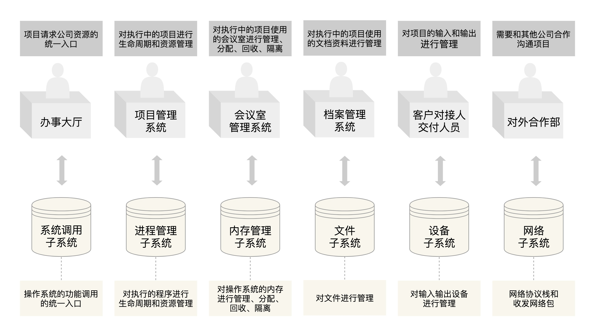

# 趣谈Linux操作系统 #

入门准备篇

## 开篇词 | 为什么要学习Linux操作系统 ##

## 01 | 入门测验：你究竟对Linux操作系统了解多少？ ##

1. A、B、C、D
2. 
3. B
4. B，C，D
5. D
6. B，D
7. A，C

## 02 | 学习路径：爬过这六个陡坡，你就能对Linux了如指掌 ##

在整个 Linux 的学习过程中，要爬的坡有六个，分别是：熟练使用 Linux 命令行、使用 Linux 进行程序设计、了解 Linux 内核机制、阅读 Linux 内核代码、实验定制 Linux 组件，以及最后落到生产实践上。

### 第一个坡：抛弃旧的思维习惯，熟练使用 Linux 命令行 ###

* 全面学习 Linux 命令：《鸟哥的 Linux 私房菜》
* 再深入一点：《Linux 系统管理技术手册》

### 第二个坡：通过系统调用或者 glibc，学会自己进行程序设计 ###

* 如果要进一步学习 Linux 程序设计：《UNIX 环境高级编程》

### 第三个坡：了解 Linux 内核机制，反复研习重点突破 ###

* 了解一下 Linux 内核机制，知道基本的原理和流程
* 辅助学习：《深入理解 LINUX 内核》

### 第四个坡：阅读 Linux 内核代码，聚焦核心逻辑和场景 ###

*一开始阅读代码不要纠结一城一池的得失，不要每一行都一定要搞清楚它是干嘛的，而要聚焦于核心逻辑和使用场景。*

* 《LINUX 内核源代码情景分析》

### 第五个坡：实验定制化 Linux 组件，已经没人能阻挡你成为内核开发工程师了 ###

### 最后一个坡：面向真实场景的开发，实践没有终点 ###

* 如果你是运维，仅仅熟悉上面基本的操作是不够的，生产环境会有大量的不可控因素，尤其是集群规模大的更是如此，大量的运维经验是实战来的，不能光靠读书。
* 如果你是开发，对内核进行少量修改容易，但是一旦面临真实的场景，需要考虑各种因素，并发与并行，锁与保护，扩展性和兼容性，都需要真实项目才能练出来。

### 总结时刻 ###

### 课堂练习 ###

核心原理篇：第一部分 Linux操作系统综述

## 03 | 你可以把Linux内核当成一家软件外包公司的老板 ##

### 电脑组装好就能直接用吗？ ###

### “双击 QQ”这个过程，都需要用到哪些硬件？ ###

* 输入设备：鼠标和键盘
* 输出设备：显示器

中断事件（Interrupt Event）

### 从点击 QQ 图标，看操作系统全貌 ###

文件系统需要一个系统进行统一管理，文件管理子系统（File Management Subsystem）

QQ 的二进制文件是静态的，称为程序（Program），而运行起来的 QQ，是不断进行的，称为进程（Process）。

系统调用（System Call）

进程管理子系统（Process Management Subsystem）
内存管理子系统（Memory Management Subsystem）

### 总结时刻 ###

### 课堂练习 ###

学习 Linux，看代码是必须的。你可以找到最新版本的 Linux 代码，在里面找找，这几个子系统的代码都在哪里。

## 04 | 快速上手几个Linux命令：每家公司都有自己的黑话 ##

### 用户与密码 ###

* passwd
* useradd

### 浏览文件 ###

* cd
* ls

### 安装软件 ###

rpm -qa | grep jdk，\| 是管道，用于连接两个程序，前面 rpm -qa 的输出就放进管道里面，然后作为 grep 的输入，grep 将在里面进行搜索带关键词 jdk 的行，并且输出出来。

more 是分页后只能往后翻页，翻到最后一页自动结束返回命令行，less 是往前往后都能翻页，需要输入 q 返回命令行，q 就是 quit。

export JAVA_HOME=/root/jdk-XXX_linux-x64
export PATH=$JAVA_HOME/bin:$PATH

vim 就像 Windows 里面的 notepad 一样，是我们第一个要学会的工具。

### 运行程序 ###

* Linux 执行程序最常用的一种方式，通过 shell 在交互命令行里面运行
* Linux 运行程序的第二种方式，后台运行
	* nohup——no hang up（不挂起）
	* nohup command >out.file 2>&1 &，“1”表示文件描述符 1，表示标准输出，“2”表示文件描述符 2，意思是标准错误输出，“2>&1”表示标准输出和错误输出合并了。合并到哪里去呢？到 out.file 里。
* 程序运行的第三种方式，以服务的方式运行，systemctl start mysql

关机和重启：
* shutdown -h now
* reboot

### 总结时刻 ### 

### 课堂练习 ###

现在你应该已经学会了安装 JDK 和 MySQL，你可以尝试搭建一个基于 Java+MySQL 的服务端应用，上手使用一下。

## 05 | 学会几个系统调用：咋们公司能解哪些类型的项目？ ##

### 立项服务与进程管理 ###

核心原理篇：第二部分 系统初始化（4讲）

## 06 | x86架构：有了开放的架构，才能打造开放的营商环境 ##

### 计算机的工作模式是什么样的？ ###

* CPU（运算单元、数据单元和控制单元）
	* 运算单元
	* 数据单元，数据单元包括 CPU 内部的缓存和寄存器组
	* 控制单元
		* 指令指针寄存器，里面存放的是下一条指令在内存中的地址。 当前指令分两部分，一部分是做什么操作（运算单元），另一部分是操作哪些数据（数据单元）。
* 总线，地址总线和数据总线
* 内存

**那 CPU 怎么执行这些程序，操作这些数据，产生一些结果，并写入回内存呢？**

总线上主要有两类数据，一个是地址数据，也就是我想拿内存中哪个位置的数据，这类总线叫**地址总线**（Address Bus）；另一类是真正的数据，这类总线叫**数据总线**（Data Bus）

* 地址总线的位数，决定了能访问的地址范围到底有多广。
* 数据总线的位数，决定了一次能拿多少个数据进来。例如只有两位，那 CPU 一次只能从内存拿两位数。

### x86 成为开放平台历史中的重要一笔 ###

开放、统一、兼容

### 从 8086 的原理说起 ###

* 数据单元，8086处理器内部有8个16位的通用寄存器，分别是 AX、BX、CX、DX、SP、BP、SI、DI。这些寄存器主要用于在计算过程中暂存数据。其中 AX、BX、CX、DX 可以分成两个 8 位的寄存器来使用，分别是 AH、AL、BH、BL、CH、CL、DH、DL，其中 H 就是 High（高位），L 就是 Low（低位）的意思。
* 控制单元，IP 寄存器就是指令指针寄存器（Instruction Pointer Register)，指向代码段中下一条指令的位置。CPU 会根据它来不断地将指令从内存的代码段中，加载到 CPU 的指令队列中，然后交给运算单元去执行。每个进程都分代码段和数据段，为了指向不同进程的地址空间，有四个 16 位的段寄存器，分别是 CS、DS、SS、ES。
	* CS就是代码段寄存器（Code Segment Register），，通过它可以找到代码在内存中的位置
	* DS就是数据段寄存器，通过它可以找到数据在内存中的位置。
	* SS就是栈寄存器（Stack Register），凡是与函数调用相关的操作，都与栈紧密相关。

CS 和 DS 都是 16 位的，起始地址都是 16 位的，IP 寄存器和通用寄存器都是 16 位的，偏移量也是 16 位的，但是 8086 的地址总线地址是 20 位。方法就是“起始地址 *16+ 偏移量”，也就是把 CS 和 DS 中的值左移 4 位，变成 20 位的，加上 16 位的偏移量，这样就可以得到最终 20 位的数据地址。

从这个计算方式可以算出，无论真正的内存多么大，对于只有 20 位地址总线的 8086 来讲，能够区分出的地址也就 2^20=1M，超过这个空间就访问不到了。这又是为啥呢？如果你想访问 1M+X 的地方，这个位置已经超过 20 位了，由于地址总线只有 20 位，在总线上超过 20 位的部分根本是发不出去的，所以发出去的还是 X，最后还是会访问 1M 内的 X 的位置。

那一个段最大能有多大呢？因为偏移量只能是 16 位的，所以一个段最大的大小是 2^16=64k。

对于 8086CPU，最多只能访问 1M 的内存空间，还要分成多个段，每个段最多 64K。

### 再来说 32 位处理器 ###

在 32 位处理器中，有 32 根地址总线，可以访问 2^32=4G 的内存.

首先，通用寄存器有扩展，可以将 8 个 16 位的扩展到 8 个 32 位的，但是依然可以保留 16 位的和 8 位的使用方式。其中，指向下一条指令的指令指针寄存器 IP，就会扩展成 32 位的，同样也兼容 16 位的。

而改动比较大，有点不兼容的就是段寄存器（Segment Register）。

因为原来的模式其实有点不伦不类，因为它没有把 16 位当成一个段的起始地址，也没有按 8 位或者 16 位扩展的形式，而是根据当时的硬件，弄了一个不上不下的 20 位的地址。这样每次都要左移四位，也就意味着段的起始地址不能是任何一个地方，只是能整除 16 的地方。

如果新的段寄存器都改成 32 位的，明明 4G 的内存全部都能访问到，还左移不左移四位呢？

那我们索性就重新定义一把吧。CS、SS、DS、ES 仍然是 16 位的，但是不再是段的起始地址。段的起始地址放在内存的某个地方。这个地方是一个表格，表格中的一项一项是段描述符（Segment Descriptor）。这里面才是真正的段的起始地址。而段寄存器里面保存的是在这个表格中的哪一项，称为选择子（Selector）。

将一个从段寄存器直接拿到的段起始地址，就变成了先间接地从段寄存器找到表格中的一项，再从表格中的一项中拿到段起始地址。这样段起始地址就会很灵活了。当然为了快速拿到段起始地址，段寄存器会从内存中拿到 CPU 的描述符高速缓存器中。

段寄存器（Segment Register），CS、SS、DS、ES 仍然是 16 位的表格中的一项一项是段描述符（Segment Descriptor），将一个从段寄存器直接拿到的段起始地址，就变成了先间接地从段寄存器找到表格中的一项，再从表格中的一项中拿到段起始地址。

在 32 位的系统架构下
* 前一种模式：实模式
* 后一种模式：保护模式

### 总结时刻 ###

主要基于 x86 架构进行讲解，只有了解了底层硬件的基本工作原理，将来才能理解操作系统的工作模式。

### 课堂练习 ###

mov, call, jmp, int, ret, add, or, xor, shl, shr, push, pop, inc, dec, sub, cmp。

## 07 | 从BIOS到bootloader：创业伊始，有活儿老板自己上 ##

两种模式：

* 实模式
* 保护模式

### BIOS时期 ###

ROM（Read Only Memory，只读存储器），上面固化了一些初始化程序，BIOS（Basic Input and Output System。基本输入输出系统）。

BIOS开始进行初始化的工作：

1. BIOS检查系统硬件情况
2. 建立中断向量表和中断服务程序

### bootloader 时期 ###

Grub2， 全称 Grand Unified Bootloader Version 2

### 从实模式切换到保护模式 ###

## 09 | 系统调用：公司成立好了就要开始接项目 ##

	cmake-3.17.0-Linux-x86_64.tar.gz

核心原理篇：第三部分 进程管理

## 10 | 进程：公司接这么多项目，如何管？ ##

### 写代码：用系统调用创建进程 ###

我们先来创建一个文件，里面用一个函数封装通用的创建进程的逻辑，名字叫 process.c。

### 进行编译：程序的二进制格式 ###

编译（Compile）

### 运行程序为进程 ###

在内核中，有这样一个数据结构，用来定义加载二进制文件的方法。

do_execve->do_execveat_common->exec_binprm->search_binary_handler。

### 进程树 ###

既然所有的进程都是从父进程 fork 过来的，那总归有一个祖宗进程，这就是咱们系统启动的 init 进程。

在解析 Linux 的启动过程的时候，1 号进程是 /sbin/init。如果在 centOS 7 里面，我们 ls 一下，可以看到，这个进程是被软链接到 systemd 的。

	/sbin/init -> ../lib/systemd/systemd

## 11 | 线程：如何让复杂的项目并行执行？ ##

### 为什么要有线程？ ###

**进程相当于一个项目，而线程就是为了完成项目需求，而建立的一个个开发任务。**

### 如何创建线程？ ###

一个运行中的线程可以调用 pthread_exit 退出线程。这个函数可以传入一个参数转换为 (void *) 类型。这是线程退出的返回值。

### 线程的数据 ###

线程访问的数据细分成三类。

**1. 线程栈上的本地数据**

**2. 在整个进程里共享的全局数据**

**3. 线程私有数据（Thread Specific Data）**
	
	int pthread_key_create(pthread_key_t *key, void (*destructor)(void*))

## 15 | 调度（上）：如何制定项目管理流程？ ##

task_struct 仅仅能够解决“**看到**”的问题，咱们还要解决如何制定流程，进行项目调度的问题，也就是“**做到**”的问题。

### 调度策略与调度类 ###

在 Linux 里面，进程大概可以分成两种。

1. 一种称为**实时进程**，也就是需要尽快执行返回结果的那种。
2. 另一种是**普通进程**，大部分的进程其实都是这种。

在 task_struct 中，有一个成员变量，我们叫**调度策略**。
	
	调度策略：
	unsigned int policy; 
	以下的几个定义：
	#define SCHED_NORMAL    0
	#define SCHED_FIFO    1
	#define SCHED_RR    2
	#define SCHED_BATCH    3
	#define SCHED_IDLE    5
	#define SCHED_DEADLINE    6

配合调度策略的，还有**优先级**。

	int prio, static_prio, normal_prio;
	unsigned int rt_priority;

优先级其实就是一个数值，

* 对于实时进程，优先级的范围是 0～99；
* 对于普通进程，优先级的范围是 100～139。
* 数值越小，优先级越高。从这里可以看出，所有的实时进程都比普通进程优先级要高。

### 实时调度策略 ###

	#define SCHED_FIFO    1
	#define SCHED_RR    2
	#define SCHED_DEADLINE    6

对于调度策略，其中 SCHED_FIFO、SCHED_RR、SCHED_DEADLINE 是实时进程的调度策略。

* SCHED_FIFO，高优先级的进程可以抢占低优先级的进程，而相同优先级的进程，我们遵循先来先得。
*  SCHED_RR 轮流调度算法，采用时间片，相同优先级的任务当用完时间片会被放到队列尾部，以保证公平性，而高优先级的任务也是可以抢占低优先级的任务。
* SCHED_DEADLINE，是按照任务的 deadline 进行调度的。当产生一个调度点的时候，DL 调度器总是选择其 deadline 距离当前时间点最近的那个任务，并调度它执行。

### 普通调度策略 ###

对于普通进程的调度策略有，SCHED_NORMAL、SCHED_BATCH、SCHED_IDLE。

	#define SCHED_NORMAL    0
	#define SCHED_BATCH    3
	#define SCHED_IDLE    5

* SCHED_NORMAL 是普通的进程
* SCHED_BATCH 是后台进程，这类项目可以默默执行，不要影响需要交互的进程，可以降低它的优先级。
* SCHED_IDLE 是特别空闲的时候才跑的进程

在 task_struct 里面，还有这样的成员变量：

	const struct sched_class *sched_class; //调度策略的执行逻辑，就封装在这里面，它是真正干活的那个。

sched_class 有几种实现：

* stop_sched_class 优先级最高的任务会使用这种策略，会中断所有其他线程，且不会被其他任务打断；
* dl_sched_class 就对应上面的 deadline 调度策略；
* rt_sched_class 就对应 RR 算法或者 FIFO 算法的调度策略，具体调度策略由进程的 task_struct->policy 指定；
* fair_sched_class 就是普通进程的调度策略；
* idle_sched_class 就是空闲进程的调度策略。

### 完全公平调度算法 ###

在 Linux 里面，实现了一个基于 CFS 的调度算法。CFS 全称 Completely Fair Scheduling，叫完全公平调度。

1.在 Linux 里面，实现了一个基于 CFS 的调度算法。CFS 全称 Completely Fair Scheduling，叫完全公平调度。
	* 记录下进程的运行时间。CPU 会提供一个时钟，过一段时间就触发一个时钟中断（Tick）。 

## 18 | 进程的创建：如何发起一个新项目？ ##

核心原理篇：第四部分 内存管理 (7讲)

## 20 | 内存管理（上）：为客户保密，规划进程内存空间布局 ##

计算机的“计算”两个字，其实说的就是两方面，

1. 进程和线程对于 CPU 的使用；
2. 对于内存的管理。

### 独享内存空间的原理 ###

**内存都被分成一块一块儿的，都编好了号。**

如果使用的是实实在在的地址，可能会引发冲突。

每个项目的物理地址对于进程不可见，谁也不能直接访问这个物理地址。操作系统会给进程分配一个虚拟地址。所有进程看到的这个地址都是一样的，里面的内存都是从 0 开始编号。

在程序里面，指令写入的地址是虚拟地址。

当程序要访问虚拟地址的时候，由内核的数据结构进行转换，转换成不同的物理地址，这样不同的进程运行的时候，写入的是不同的物理地址，这样就不会冲突了。

### 规划虚拟地址空间 ###

操作系统的内存管理，主要分为三个方面。

1. 物理内存的管理，相当于会议室管理员管理会议室。
2. 虚拟地址的管理，也即在项目组的视角，会议室的虚拟地址应该如何组织。
3. 虚拟地址和物理地址如何映射，也即会议室管理员如何管理映射表。

	#include <stdio.h>
	#include <stdlib.h>
	
	int max_length = 128;
	
	char * generate(int length){
	  int i;
	  char * buffer = (char*) malloc (length+1);
	  if (buffer == NULL)
	    return NULL;
	  for (i=0; i<length; i++){
	    buffer[i]=rand()%26+'a';
	  }
	  buffer[length]='\0';
	  return buffer;
	}
	
	int main(int argc, char *argv[])
	{
	  int num;
	  char * buffer;
	
	  printf ("Input the string length : ");
	  scanf ("%d", &num);
	
	  if(num > max_length){
	    num = max_length;
	  }
	
	  buffer = generate(num);
	
	  printf ("Random string is: %s\n",buffer);
	  free (buffer);
	
	  return 0;
	}

这个简单的程序在使用内存时的几种方式：

* 代码需要放在内存里面；
* 全局变量，例如 max_length；
* 常量字符串"Input the string length : "；
* 函数栈，例如局部变量 num 是作为参数传给 generate 函数的，这里面涉及了函数调用，局部变量，函数参数等都是保存在函数栈上面的；
* 堆，malloc 分配的内存在堆里面；
* 这里面涉及对 glibc 的调用，所以 glibc 的代码是以 so 文件的形式存在的，也需要放在内存里面。

malloc 会调用系统调用，进入内核，所以这个程序一旦运行起来，内核部分还需要分配内存：

* 内核的代码要在内存里面；
* 内核中也有全局变量；
* 每个进程都要有一个 task_struct；
* 每个进程还有一个内核栈；
* 在内核里面也有动态分配的内存；
* 虚拟地址到物理地址的映射表放在哪里？

用户态的进程使用虚拟地址，内核态的也基本都是使用虚拟地址，**虚拟地址到物理地址的映射表，这个感觉起来是内存管理模块的一部分，这个是“实”是“虚”呢？**

虚拟空间一切二，一部分用来放内核的东西，称为内核空间，一部分用来放进程的东西，称为用户空间。

1. 先是 Text Segment、Data Segment 和 BSS Segment。Text Segment 是存放二进制可执行代码的位置，Data Segment 存放静态常量，BSS Segment 存放未初始化的静态变量。在二进制执行文件里面，就有这三个部分。这里就是把二进制执行文件的三个部分加载到内存里面。
2. **堆（Heap）段**。堆是往高地址增长的，是用来动态分配内存的区域，*malloc 就是在这里面分配的*。
3. 接下来的区域是 **Memory Mapping Segment**。这块地址可以用来把文件映射进内存用的，如果二进制的执行文件依赖于某个动态链接库，就是在这个区域里面*将 so 文件映射到了内存中*。
4. 再下面就是**栈（Stack）地址段**。主线程的函数调用的函数栈就是用这里的。

一旦进入了内核，就换了一种视角。

但是到了内核里面，无论是从哪个进程进来的，看到的都是同一个内核空间，看到的都是同一个进程列表。虽然内核栈是各用各的，但是如果想知道的话，还是能够知道每个进程的内核栈在哪里的。所以，如果要访问一些公共的数据结构，需要进行锁保护。也就是说，不同的进程进入到内核后，进入的 30 号到 39 号会议室是同一批会议室。

内核的代码访问内核的数据结构，大部分的情况下都是使用虚拟地址的，虽然内核代码权限很大，但是能够使用的虚拟地址范围也只能在内核空间，也即内核代码访问内核数据结构。只能用 30 号到 39 号这些编号，不能用 0 到 29 号，因为这些是被进程空间占用的。而且，进程有很多个。你现在在内核，但是你不知道当前指的 0 号是哪个进程的 0 号。

在内核里面也会有内核的代码，同样有 Text Segment、Data Segment 和 BSS Segment，别忘了咱们讲内核启动的时候，内核代码也是 ELF 格式的。

### 总结时刻 ###

为什么要独享内存空间，并且站在老板的角度，设计了虚拟地址空间应该存放的数据。

一个内存管理系统至少应该做三件事情：

1. 虚拟内存空间的管理，每个进程看到的是独立的、互不干扰的虚拟地址空间；
2. 物理内存的管理，物理内存地址只有内存管理模块能够使用；
3. 内存映射，需要将虚拟内存和物理内存映射、关联起来。