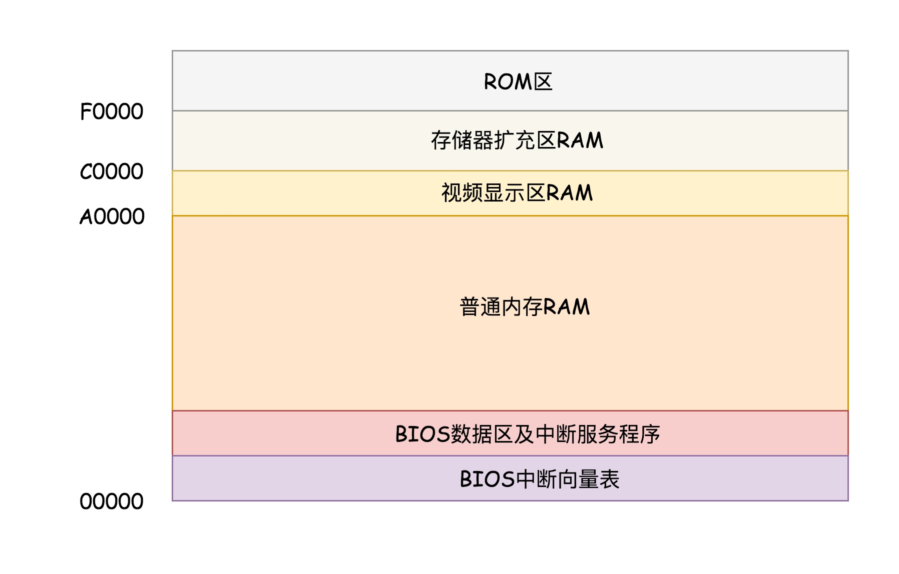

# 趣谈Linux操作系统 #

入门准备篇

## 开篇词 | 为什么要学习Linux操作系统 ##

## 01 | 入门测验：你究竟对Linux操作系统了解多少？ ##

1. A、B、C、D
2. 
3. B
4. B，C，D
5. D
6. B，D
7. A，C

## 02 | 学习路径：爬过这六个陡坡，你就能对Linux了如指掌 ##

在整个 Linux 的学习过程中，要爬的坡有六个，分别是：熟练使用 Linux 命令行、使用 Linux 进行程序设计、了解 Linux 内核机制、阅读 Linux 内核代码、实验定制 Linux 组件，以及最后落到生产实践上。

### 第一个坡：抛弃旧的思维习惯，熟练使用 Linux 命令行 ###

* 全面学习 Linux 命令：《鸟哥的 Linux 私房菜》
* 再深入一点：《Linux 系统管理技术手册》

### 第二个坡：通过系统调用或者 glibc，学会自己进行程序设计 ###

* 如果要进一步学习 Linux 程序设计：《UNIX 环境高级编程》

### 第三个坡：了解 Linux 内核机制，反复研习重点突破 ###

* 了解一下 Linux 内核机制，知道基本的原理和流程
* 辅助学习：《深入理解 LINUX 内核》

### 第四个坡：阅读 Linux 内核代码，聚焦核心逻辑和场景 ###

*一开始阅读代码不要纠结一城一池的得失，不要每一行都一定要搞清楚它是干嘛的，而要聚焦于核心逻辑和使用场景。*

* 《LINUX 内核源代码情景分析》

### 第五个坡：实验定制化 Linux 组件，已经没人能阻挡你成为内核开发工程师了 ###

### 最后一个坡：面向真实场景的开发，实践没有终点 ###

* 如果你是运维，仅仅熟悉上面基本的操作是不够的，生产环境会有大量的不可控因素，尤其是集群规模大的更是如此，大量的运维经验是实战来的，不能光靠读书。
* 如果你是开发，对内核进行少量修改容易，但是一旦面临真实的场景，需要考虑各种因素，并发与并行，锁与保护，扩展性和兼容性，都需要真实项目才能练出来。

### 总结时刻 ###

### 课堂练习 ###

核心原理篇：第一部分 Linux操作系统综述

## 03 | 你可以把Linux内核当成一家软件外包公司的老板 ##

### 电脑组装好就能直接用吗？ ###

### “双击 QQ”这个过程，都需要用到哪些硬件？ ###

* 输入设备：鼠标和键盘
* 输出设备：显示器

中断事件（Interrupt Event）

### 从点击 QQ 图标，看操作系统全貌 ###

文件系统需要一个系统进行统一管理，文件管理子系统（File Management Subsystem）

QQ 的二进制文件是静态的，称为程序（Program），而运行起来的 QQ，是不断进行的，称为进程（Process）。

系统调用（System Call）

进程管理子系统（Process Management Subsystem）
内存管理子系统（Memory Management Subsystem）

### 总结时刻 ###

### 课堂练习 ###

学习 Linux，看代码是必须的。你可以找到最新版本的 Linux 代码，在里面找找，这几个子系统的代码都在哪里。

## 04 | 快速上手几个Linux命令：每家公司都有自己的黑话 ##

### 用户与密码 ###

* passwd
* useradd

### 浏览文件 ###

* cd
* ls

### 安装软件 ###

rpm -qa | grep jdk，\| 是管道，用于连接两个程序，前面 rpm -qa 的输出就放进管道里面，然后作为 grep 的输入，grep 将在里面进行搜索带关键词 jdk 的行，并且输出出来。

more 是分页后只能往后翻页，翻到最后一页自动结束返回命令行，less 是往前往后都能翻页，需要输入 q 返回命令行，q 就是 quit。

export JAVA_HOME=/root/jdk-XXX_linux-x64
export PATH=$JAVA_HOME/bin:$PATH

vim 就像 Windows 里面的 notepad 一样，是我们第一个要学会的工具。

### 运行程序 ###

* Linux 执行程序最常用的一种方式，通过 shell 在交互命令行里面运行
* Linux 运行程序的第二种方式，后台运行
	* nohup——no hang up（不挂起）
	* nohup command >out.file 2>&1 &，“1”表示文件描述符 1，表示标准输出，“2”表示文件描述符 2，意思是标准错误输出，“2>&1”表示标准输出和错误输出合并了。合并到哪里去呢？到 out.file 里。
* 程序运行的第三种方式，以服务的方式运行，systemctl start mysql

关机和重启：
* shutdown -h now
* reboot

### 总结时刻 ### 

### 课堂练习 ###

现在你应该已经学会了安装 JDK 和 MySQL，你可以尝试搭建一个基于 Java+MySQL 的服务端应用，上手使用一下。

## 05 | 学会几个系统调用：咋们公司能解哪些类型的项目？ ##

### 立项服务与进程管理 ###

核心原理篇：第二部分 系统初始化（4讲）

## 06 | x86架构：有了开放的架构，才能打造开放的营商环境 ##

### 计算机的工作模式是什么样的？ ###

* CPU（运算单元、数据单元和控制单元）
	* 运算单元
	* 数据单元，数据单元包括 CPU 内部的缓存和寄存器组
	* 控制单元
		* 指令指针寄存器，里面存放的是下一条指令在内存中的地址。 当前指令分两部分，一部分是做什么操作（运算单元），另一部分是操作哪些数据（数据单元）。
* 总线，地址总线和数据总线
* 内存

### x86 成为开放平台历史中的重要一笔 ###

开放、统一、兼容

### 从 8086 的原理说起 ###

* 数据单元，8086处理器内部有8个16位的通用寄存器，分别是 AX、BX、CX、DX、SP、BP、SI、DI。这些寄存器主要用于在计算过程中暂存数据。其中 AX、BX、CX、DX 可以分成两个 8 位的寄存器来使用，分别是 AH、AL、BH、BL、CH、CL、DH、DL，其中 H 就是 High（高位），L 就是 Low（低位）的意思。
* 控制单元，IP 寄存器就是指令指针寄存器（Instruction Pointer Register)，指向代码段中下一条指令的位置。CPU 会根据它来不断地将指令从内存的代码段中，加载到 CPU 的指令队列中，然后交给运算单元去执行。每个进程都分代码段和数据段，为了指向不同进程的地址空间，有四个 16 位的段寄存器，分别是 CS、DS、SS、ES。
	* CS就是代码段寄存器（Code Segment Register）
	* DS就是数据段寄存器
	* SS就是栈寄存器（Stack Register）
	* 方法就是“起始地址 *16+ 偏移量”，也就是把 CS 和 DS 中的值左移 4 位，变成 20 位的，加上 16 位的偏移量，这样就可以得到最终 20 位的数据地址。

### 再来说 32 位处理器 ###

在 32 位处理器中，有 32 根地址总线，

段寄存器（Segment Register），CS、SS、DS、ES 仍然是 16 位的表格中的一项一项是段描述符（Segment Descriptor），将一个从段寄存器直接拿到的段起始地址，就变成了先间接地从段寄存器找到表格中的一项，再从表格中的一项中拿到段起始地址。

* 实模式
* 保护模式

### 总结时刻 ###

### 课堂练习 ###

mov, call, jmp, int, ret, add, or, xor, shl, shr, push, pop, inc, dec, sub, cmp。

## 07 | 从BIOS到bootloader：创业伊始，有活儿老板自己上 ##

两种模式：

* 实模式
* 保护模式

### BIOS时期 ###

ROM（Read Only Memory，只读存储器），上面固化了一些初始化程序，BIOS（Basic Input and Output System。基本输入输出系统）。

BIOS开始进行初始化的工作：

1. BIOS检查系统硬件情况
2. 建立中断向量表和中断服务程序

### bootloader 时期 ###

Grub2， 全称 Grand Unified Bootloader Version 2

### 从实模式切换到保护模式 ###

## 09 | 系统调用：公司成立好了就要开始接项目 ##

核心原理篇：第三部分 进程管理

## 10 | 进程：公司接这么多项目，如何管？ ##