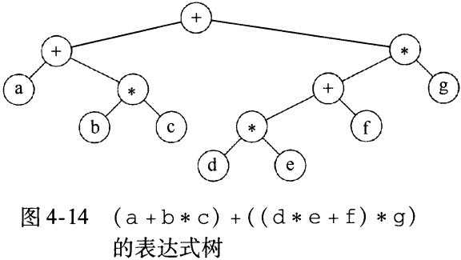

# 数据结构与算法分析 Java语言 #

第一部分 基础知识

# 第1章 导论 #

## 1.1 本书讨论内容 ##

## 1.2 数学知识复习 ##

## 1.3 递归简论 ##

## 1.4 实现泛型构件pre-Java5 ##

## 1.5 利用Java5泛型特性实现泛型构件 ##

# 第4章 树 #

二叉查找树

* 看到树时如合用于实现几个流行的操作系统中的问及那系统的。
* 看到树如合能够用来计算算术表达式的值。
* 指出如合利用树支持以O（log N）平均时间进行的各种搜索操作，以及如合细化以得到最坏情况时间界O（log N）。我们还将讨论当数据被存放在磁盘上时如合来实现这些操作。
* 讨论并使用TreeSet类和TreeMap类

## 4.1 预备知识 ##

树（tree）有几种方式定义。定义树的一种自然的方式是递归的方式。一棵树是一些节点的集合。这个集合可以是空集；若不是空集，则树由称作根（root）的节点r以及0个或多个非空的（子）树

### 4.1.1 树的实现 ###

	class TreeNode
	{
		Object element;
		TreeNode firstChild;
		TreeNode nextSibling;
	}

firstChild（第一个儿子）的链
nextSibling（下一兄弟）的链

### 4.1.2 树的遍历及应用 ###

递归方法listAll。

	private void listAll(int depth){
		printName(depth);
		if (isDirecotry())
			for each file c in this directory(for each child)
				c.listAll(depth + 1);
	}
	public void listAll() {
		listAll(0);
	}

先序遍历、后序遍历。

## 4.2 二叉树 ##

二叉树（binary tree）是一棵树，其中每个节点都不能有多于两个的儿子。

### 4.2.1 实现 ###

一个二叉树节点最多有两个子节点，所以保存直接链接到他们的链。树节点的声明在结构上类似于双链表的声明，在生命中，节点就是由element（元素）的信息加上其他节点的引用（left和right）组成的结构。

	class BinaryNode
	{
		Object element;
		BinaryNode left; //Left child
		BinaryNode right; Right child
	}

在画链表时使用矩形框画出二叉树，但是，树一般画成圆圈并用一些直线连接起来，因为它们实际上就是图（graph）

二叉树的主要用处之一是在编译器的设计领域。

### 4.2.2 例子：表达式树 ###

表达式树的树叶是操作数（operand），如常数或变量名，而其他的节点为操作符（operator）。

中序遍历
a+b*c+d*e+f*g
后序遍历
abc*+de*f*g++
先序遍历
++a*bc*+*defg

#### 构造表达式 ####

## 4.3 查找树ADT——二叉查找树 ##

4.4 AVL树

4.5 伸展树

4.6 再探树的遍历

## 4.7 B树 ##

## 4.8 标准库中的集合与映射 ##

