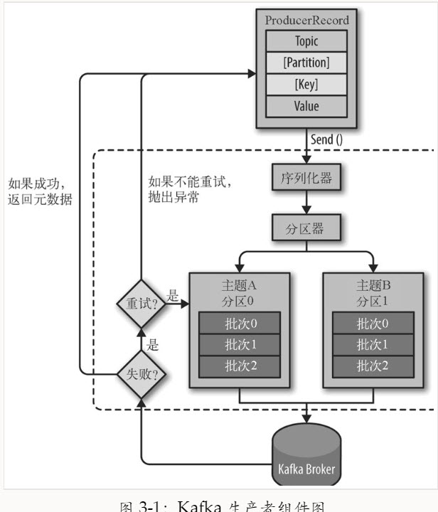

# Kafka权威指南 #

## 第1章 初识Kafka ##

### 1.1 发布与订阅消息系统 ###

发布与订阅系统一般会有一个broker，也就是发布消息的中心点。

#### 1.1.1 如何开始 ####

#### 1.1.2 独立的队列系统 ####

### 1.2 Kafka登场 ###

“分布式提交日志”或者“分布式流平台”

#### 1.2.1 消息和批次 ####

消息：Kafka的数据单元称为。
批次：一组消息，这些消息属于同一个主题和分区。

#### 1.2.2 模式 ####

消息模式（schema）有许多可用的类型

* 像JSON和XML这些简单的系统
* Apache Avro

#### 1.2.3 主题和分区 ####

Kafka的消息通过*主题*进行分类（主题类比数据库的表）。主题可以被分位若干个*分区*，一个分区就是一个提交日志。消息以追加的方式写入分区，然后以先进先出的顺序读取。

由于一个主题一般包含几个分区，因此无法在整个主题范围内保证消息的顺序，但可以保证消息在单个分区内的顺序。

分区可以分布在不同的服务器上，一个主题可以横跨多个服务器，以此来提供比单个服务器更强大的性能。

我们通常会使用**流**这个词来描述Kafka这类系统的数据。很多时候，人们把一个主题的数据看成一个流，不管它有多少个分区。流是一组从生产者移动到消费者的数。当我们讨论流式处理时，一般都是这样描述消息的。KafkaStreams、Apache Samaza和Storm这些框架以实时的方式处理消息，也就是所谓的流式处理。

#### 1.2.4 生产者和消费者 ####

Kafka的客户都安就是Kafka系统的用户，分为两种基本类型：生产者和消费者。还有些高级客户端API——用于数据集成的Kafka Connect API和用于流式处理的Kafka Streams。

**生产者**创建消息。在其他发部与订阅系统中，生产者可能被称为**发布者**或**写入者**。一个消息会被发布到一个特定的主题上。
	* 轮询：生产者在默认情况下把消息均衡地发布到主题地所有分区上，而并不关心特定消息会被写到哪个分区。
	* 随机
	* keyword：把消息直接写到指定的分区。通常是通过消息键和分区器来实现的。分区器为键生成一个散列值，并将其映射到指定的分区上。这样可以保证包含同一个键的消息都会被写到同一个分区上。生产者也可以使用自定义的分区器，根据不同的业务规则将消息映射到分区。
**消费者**读取消息。在其他发布与订阅系统中，消费者可能被称为**订阅者**或者**读者**。消费者订阅一个或多个主题，并按照消息生成的顺序读取它们。消费者通过检查消息的偏移量来区分已经读取过的消息。**偏移量**是另一种元数据，它是一个不断递增的整数值，在创建消息时，Kafka会把它添加到消息里。在给定的分区里，每个消息的偏移量都是唯一的。消费者把每个分区最后读取的消息偏移量保存在Zookeeper或Kafka上，如果消费者关闭或重启，它的读取状态不会丢失。

消费者时**消费者群组**的一部分，会有一个或多个消费者共同读取一个主题。群组保证每个分区只能被一个消费者使用。消费者与分区之间的映射通常被称为消费者对分区的**所有权关系**。

#### 1.2.5 broker和集群 ####

一个独立的Kafka服务器被称为**broker**。broker接收来自生产者的消息，未消息设置偏移量，并提交消息到磁盘保存。broker为消费者提供服务，对读取分区的请求作出响应，返回已经提交到磁盘上的消息。

broker是集群的组成部分。每个集群都有一个broker同事充当了集群控制器的角色（自动从集群的活跃成员中选举出来）。

### 1.3 为什么选择kafka ###

#### 1.3.1 多个生产者 ####

#### 1.3.2 多个消费者 ####

#### 1.3.3 基于磁盘的数据存储 ####

#### 1.3.4 伸缩性 ####

#### 1.3.5 高性能 ####

### 1.4 数据生态系统 ###

## 第2章 安装Kafka ##

### 2.1 要事先行 ###

#### 2.1.1 选择操作系统 ####

#### 2.1.2 安装Java ####

#### 2.1.3 安装Zookeeper ####

### 2.2 安装Kafka Broker ###

### 2.3 broker配置 ###

#### 2.3.1 常规配置 ####

**1. broker.id**

**2. port**

**3. zookeeper.connect**

#### 2.3.2 主题的默认配置 ####

### 2.4 硬件选择 ###

#### 2.4.1 磁盘吞吐量 ####

#### 2.4.2 磁盘容量 ####

#### 2.4.3 内存 ####

#### 2.4.4 网络 ####

#### 2.4.5 CPU ####

### 2.5 云端的Kafka ###

### 2.6 Kafka集群 ###

#### 2.6.1 需要多少个broker ####

一个Kafka集群需要多少个broker取决的因素。

1. 需要多少磁盘空间来保留数据
2. 集群处理请求的能力。

如果单个broker的网络接口在高峰时段可以达到80%的使用量，并且有两个消费者，那么消费者就无法保持峰值，除非有两个broker。如果集群启用了复制功能，则要把这个额外的消费者考虑在内。因磁盘吞吐量低和系统内存不足造成的性能问题，也可以通过扩展多个broker来解决。

#### 2.6.2 broker配置 ####

## 第3章 Kafka生产者——向Kafka写入数据 ##

### 3.1 生成者概览 ###

记录用户的活动（用于审计和分析）、记录度量指标、保存日志消息、记录智能家电的信息、与其他应用程序进行异步通信、缓冲即将写入到数据库的数据

创建一个ProducerRecord对象开始，ProducerRecord对象需要包含目标主题和要发送的内容。指定键和分区。在发送ProducerRecord对象时，生产者要先把键和值对象序列化成字节数组。

数据被传给分区器。如果之前在ProducerRecord对象里指定了分区，那么分区器就不会再做任何事情，直接把指定的分区返回。如果没有指定分区，那么分区器会根据ProducerRecord对象的键来选择一个分区。

### 3.2 创建Kafka生产者 ###

**bootstrap.servers**

指定broker的地址清单，地址的格式为host:port（建议提供两个broker的信息，一个宏机还能切换到另一个）

**key.serializer**

broker希望接收到的消息的键和值都是字节数组。生产者接口允许使用参数化类型，因此可以把Java对象作为键和值发送给broker。

key.serializer必须被设置为一个实现了org.apache.kafka.comcom.serialization.Serializer接口的类。

ByteArraySerializer（很少做）、StringSerializer和IntegerSerializer

**value.serializer**

1. 新建一个Properties对象
2. 打算把键值定义成字符串，所以使用内置的StringSerializer。
3. 创建一个新的生产者对象，并为键值设置恰当的类型，并且把Properties对象传给它

*发送并忘记（fire-and-forget）*

不关心是否正常到达

*同步发送*

send()方法发送消息，返回一个Future对象。调用get()方法进行等待。

*异步发送*

调用send()方法，并指定一个回调函数，服务器在返回响应时调用该函数。

刚开始使用单个消费者和单个线程。如果需要更高的吞吐量，可以在生产者数量不变的前提下增加线程数量。这样做还不够，则增加生产者数量。

### 3.3 发送消息到Kafka ###

1. 生产者的send()方法将ProducerRecord对象作为参数。先创建一个ProducerRecord对象
2. 发送ProducerRecord对象。消息先是被放进缓冲区，然后使用单独的线程发送到服务器端。send()方法会返回一个包含RecordMetadata的Future对象。
3. SerialazationException（说明序列化消息失败）、BufferExhaustedException或TimeoutException（说明缓冲区已满），又或者是InterupException（说明发送线程被中断）

#### 3.3.1 同步发送消息 ####

1. producer.send()方法先返回一个Future对象，然后调用Future对象的get()方法等待Kafka响应。
	* 如果服务器返回错误，get()方法会抛出异常
	* 没有错误，则会得到一个RecordMetadata对象，获取信息的偏移量
2. 

### 3.4 生产者的配置 ###

#### 1. acks ####

acks参数指定了必需要有多少个分区副本收到消息，生产者才会认为消息写入是成功的。这个参数对消息丢失的可能性有重要影响。

* acks = 0，生产者在成功写入消息之前不会等待任何来自服务器的响应。生产者不需要等待服务器的响应，
* acks = 1，只要集群的首领节点收到消息，生产者就会收到一个来自服务器的成功响应。
* acks = all，只有当所有参与复制的节点全部收到消息时，生产者才会收到一个来自服务器的成功响应。

#### 2. buffer.memory ####

设置生产者内存缓冲区的大小，生产者用它缓冲要发送到服务器的消息。如果应用服务器发送的消息的速度超过发送到服务器的速度，会导致生产者空间不足。

send()方法调用要么被阻塞，要么抛出异常，取决于如何设置block.on.buffer.full参数

#### 3. compression.type ####

snappy、gzip或lz4

#### 4. retries ####

决定了生产者可以重发消息的次数。如果达到这个次数，生产者会放弃重试并返回错误。默认情况下，生产者会在每次重试之间等待100ms。

#### 5. batch.size ####

当有多个消息需要被发送到同一个分区时，生产者会把它们放在同一个批次里。该参数指定了一个批次可以使用的内存大小，按照字节数计算（而不是消息个数）。

#### 6. linger.ms ####

KafkaProducer会在批次填满或linger.ms达到上限时间把批次发送出去。

#### 7. client.id ####

可以时任意的字符串。服务器会识别来源。

#### 8. max.in.flight.requests.per.connection ####

指定了生产者在收到服务器响应之前可以发送多少个消息。

把它设为1可以保证消息时按照发送的顺序写入服务器的。

#### 9. timeout.ms、request.timeout.ms和metadata.fetch.timeout.ms ####

* timeout：指定了broker等待同步副本返回消息的确认的时间，与asks的配置相匹配
* request.timeout.ms：生产者在发送数据时等待服务器返回响应的时间
* metadata.fetch.timeout.ms：指定了生产者在获取元数据（比如目标分区的首领是谁）时等待服务器返回响应的时间。

#### 10. max.block.ms ####

send()方法、partitionsFor()方法获取元数据时生产者的阻塞时间。

当生产者的发送缓冲区已满或者没有可用的元数据时，这些方法就会阻塞。在阻塞时间达到max.blokc.ms时，生产者会抛出超时异常。

#### 11. max.request.size ####

该参数用于控制生产者发送的请求大小（指能发送的单个消息的最大值，也可以指单个请求里所有消息总的大小）

生产者和消费者配置最好可以匹配，避免生产者发送的消息被broker拒绝。

#### 12. receive.buffer.bytes和send.buffer.bytes ####

这两个参数分别指定了TCP socket接收和发送数据包的缓冲区大小。如果被设为-1，就使用操作系统的默认值

如果生产者或消费者与broker处于不同的数据中心，那么可以适当增大这些值，因为跨数据中心的网络一般都有比较高的延迟和比较低的带宽。

### 3.5 序列化器 ###

创建一个生产者对象必须指定序列化器。

#### 3.5.1 自定义序列化器 ####

强烈建议使用通用的序列化框架

代码过于脆弱，考虑兼容性问题

#### 3.5.2 使用Avro序列化 ####

Avro数据通过与语言无关的schema来定义。schema通过JSON来描述，数据被序列化成二进制文件或JSON文件，不过一般会使用二进制文件。Avro在读写文件时需要用到schema，schema一般会内嵌在数据文件里。

当负责写消息的应用程序使用了新的schema，负责读消息的应用程序可以继续处理消息而无需做任何改动。（这个特性使得它特别适合用在像Kafka这样的消息系统上。）

	{
		"namespace": "customerManagement.avro",
		"type":"record",
		"name": "Customer",
		"fiels": [
			{"name": "id", "type": "int"},
			{"name": "name", "type": "string"},
			{"name": "faxNumber", "type": ["null", "string"], "default": "null"}
		]
	}

id和name是必需的，faxNumber是可选的，默认为null。

* 写入数据和读取数据的schema必须是相互兼容的
* 反序列化器需要用到于写入数据的schema，即使它可能与用于读取数据的schema不一样。Acro数据文件里就包含了用于写入数据的schema。

#### 3.5.3 在Kafka里使用Avro ####

[avro](https://blog.csdn.net/QYHuiiQ/article/details/88723584)

1. 使用KafkaAcroSerializer来序列化对象
2. schema.registry.url指向schema的存储位置
3. Customer是生成对象
4. 实例化一个ProducerRecord对象，并指定Customer为值的类型，然后再传给它一个Customer
5. 把Customer对象作为记录发送出去

### 3.6 分区 ###

ProducerRecord对象包含了目标主题、键和值。Kafka的消息是一个个键值对，ProducerRecord对象可以只包含目标主题和值，键可以设置为默认的null。

键有两个用途：可以作为消息的附加信息，也可以决定消息被写到主题的哪个分区

	ProducerRecord<Integer, String> record = new ProducerRecord<>("CustomerCountry", "Laboratory Equipment", "USA");

如果创建为null的消息，不指定键就可以了

	ProducerRecord<Integer, String> record = new ProducerRecord<>("Laboratory Equipment", "USA");

如果键值为null，并且使用了默认的分区器，那么记录会被随机发送到主题内各个可用的的分区上。分区器使用轮询（Round Robin）算法将消息均衡地分布到各个分区上。

如果键不为空，并且使用了默认的分区器，那么Kafka会对键进行散列，然后根据散列值把消息映射到特定的分区上。（同一个键总是被映射到同一个分区上，所以进行映射时，使用主题所有的分区，而不仅仅是可用的分区）

只有不改变主题分区数量的情况下，键和分区之间的映射才能保持不变。（在分区数量保持的情况下，可以保证用户045189的记录总是被写到分区34。一旦主题增加了新的分区——旧数据仍然留在分区34，但新的记录可能被写到其他分区上。如果要使用键来映射分区，那么最好在创建主题的时候把分区规划好，而且永远不要增加新的分区）

#### 实现自定义分区策略 ####

单独给Banana分配单独的分区，然后使用散列分区算法处理其他帐号

1. Partitioner接口包含了configure、partition和close这三个方法，通过config传入客户的名称

2. 只接受字符串作为key

### 3.7 旧版的生产者API ###

### 3.8 总结 ###

## 第4章 Kafka消费者——从Kafka读取数据 ##

### 4.1 KafkaConsumer概念 ###

#### 4.1.1 消费者和消费者群组 ####

Kafka消费者从属于消费者群组。一个群组里的消费者订阅的是同一个主题，每个消费者接收主题一部分分区的消息。

#### 4.1.2 消费者群组和分区再均衡 ####

### 4.2 创建Kafka消费者 ###

在读取消息之前，需要先创建一个KafkaConsumer对象。创建KafkaConsumer对象与创建KafkaProducer对象非常相似——一把想要传给消费者的属性放在Properties对象里。

bootstrap.servers、key.deserializer和value.deserializer

1. bootstrap.servers
2. key.deserializer
3. value.deserializer

### 4.3 订阅主题 ###

	consumer.subsribe(Collections.singletonList("customerCountries"));

### 4.4 轮询 ###

消息轮询是消费者API的核心，通过一个简单的轮询向服务器请求数据。一旦消费者订阅了主题，轮询就会处理所有的细节，包括群组协调、分区再均衡、发送心跳和获取数据。

### 4.5 消费者的配置 ###

**1. fetch.min.bytes**

指定了消费者从服务器获取记录的最小字节数。broker在收到消费者的数据请求时，如果可用的数据量

**2. fetch.max.wait.ms**

**3. max.partition.fetch.bytes**

**4. session.timetou.ms**

**5. auto.offset.reset**

**6. enable.auto.commit**

**7. partition.assignment.strtegy**

**8. client.id**

**9. max.poll.records**

10. receive.buffer.bytes和send.buffer.bytes

### 4.6 提交和偏移量 ###

#### 4.6.1 自动提交 ####

最简单的提交方式是让消费者自动提交偏移量。

#### 4.6.2 提交当前偏移量 ####

#### 4.6.3 异步提交 ####

### 4.12 旧版的消费者API ###

kafka.comsumer包的一部分，属于Kafka核心模块，分别被称作SimpleConsumer和高级消费者

### 4.13 总结 ###

