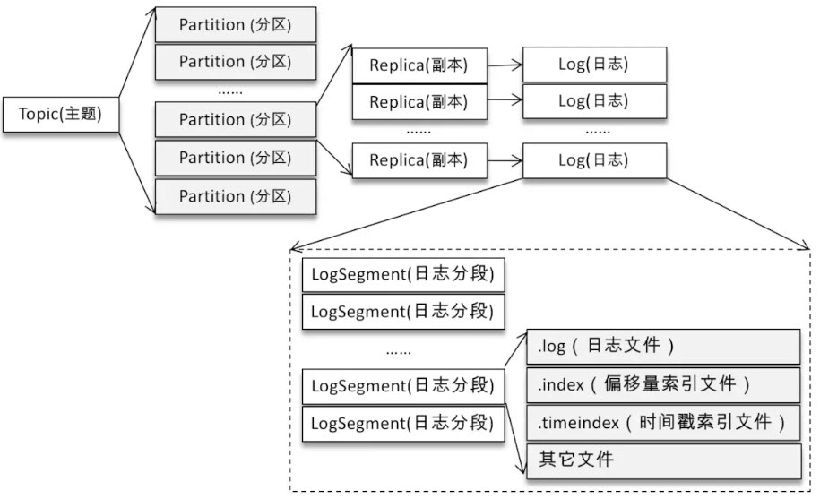

# 图解Kafka之核心原理 #

## 开篇日志存储 ##

### 日志文件目录布局 ###

Kafka中的消息是以主题为基本单位进行归类的，各个主体在逻辑上相互独立。每个主体又可以分为一个或多个分区，分区的数量可以在主题创建的时候指定，也可以在之后修改。

如果分区规则设置得合理，那么所有的消息可以均匀地分布到不同地分区中，可以实现水平扩展。不考虑多副本的，一个分区对应一个日志（Log）。为了防止Log过大，Kafka又引入了日志分段（LogSegment）的概念，将Log切分为多个LogSegment（相当于一个巨型文件被平均分配为多个相对较小的文件）

Log和LogSegment也不是纯粹物理意义上的概念，Log在物理上只以文件夹的形式存储，而每个Log】Segment对应于磁盘上的一个日志文件和两个索引文件，以及可能的其他文件（比如以“.txnindex”为后缀的事务索引文件）。

## 日志格式的演变 ##

## 日志索引 ##