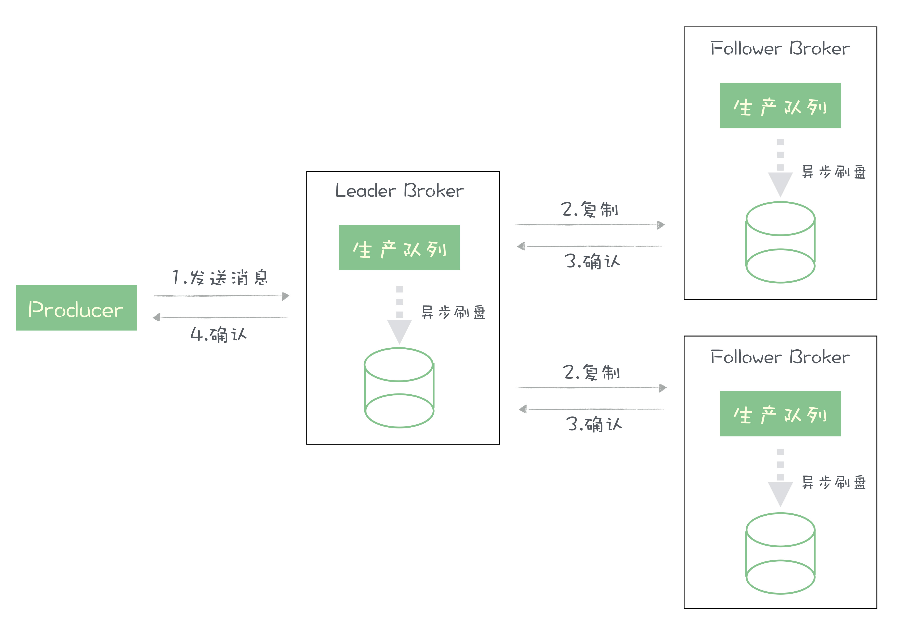

# 消息队列高手课 #

课前必读

## 开篇词|优秀的程序员，你的技术栈中不能只有“增删改查” ##

JMQ

### 底层技术知识，给你深入解决业务问题的能力 ###

在使用消息队列的过程中，你会遇到很多问题，比如选择哪款消息队列更适合你的业务系统？如何保证系统的高可靠、高可用和高性能？如何保证消息不重复、不丢失？如何做到水平扩展？

*从职业发展，保持市场竞争力的角度来看，掌握一些底层技术，深耕个人技术栈的深度，实现从“用轮子”到“造轮子”的技术提升，也是一个非常明智的选择。*

ActiveMQ ->  RocketMQ、Kafka -> Pulsar

* 成为消息队列领域的“技术高手”；
* 掌握从源码分析、解决问题的方法；
* 将你的综合技术能力提升到一个新的高度，具备成为开源软件项目开发者的能力。

### 课程设置 ###

* 基础篇，以讲解消息队列的使用方法和最佳实践为主，包括消息队列基础知识、技术选型、高级功能等，给出消息队列应用过程中常见问题的解决策略。
* 进阶篇，在这个模块的前半部分，每篇会围绕一个知识点来深入探讨，比如像异步模型、高性能的底层网络通信等，其中每一个知识点不仅是中间件开发人员必须掌握的；后半部分我会带你分析一些开源消息队列的源代码，每篇选择一个开源的消息队列，针对一个功能特性，来一起分析它的源码是如何实现的，理解这个功能特性的实现原理，同时带你学习源代码中优秀的设计思想和一些好的编程技巧。学会从源码分析、解决问题的方法，掌握这些可复用到其他领域的底层技术。
* 案例篇：
	1. 一起用消息队列和流计算框架来实现一个流计算任务；
	2. 一起来实现一个最简单的 RPC 框架 

### 写在最后 ###

其中每一个知识点不仅是中间件开发人员必须掌握的，而且是各大厂面试题中的常考内容。

## 预习|怎样更好地学习这门课？ ##

**需求和困难**

系统之间有通信需求开始呢，就产生了消息队列，它也是最古老的中间件之一。它的应用场景非常广泛，分布式系统中的很多进程间通信问题，都可以用消息队列来解决。可以说消息队列是所有后端程序员的必备技能。但是，想要系统、深入地学习消息队列，却并不容易。

### 哪些人适合学消息队列？ ###

*后端开发者*：开发微服务，实时计算，还是机器学习程序，都需要解决进程间通信的问题。

*渴望技术提升的开发者*：消息队列所涉及的*高性能通信、海量数据存储、高并发*这些底层的技术比较全面，并且功能简洁、结构清晰，容易入门但又同时具有足够的深度，非常适合用来深入分析和学习底层技术，帮助你实现从用“轮子”到造“轮子”的技术提升。

### 学习消息队列，有哪些门槛？ ###

至少熟练掌握一门编程语言，掌握所有程序员都需要具备的一些基础技术知识和能力，例如：

#### Basic ####

* 熟练使用各种常用集合，比如：数组、链表、字典等；
* 掌握 Linux 系统的基础知识，会使用常用的命令；
* 具备多线程、并发控制编程能力；
* 编写过读写文件、通过网络收发数据的程序；
* 能看懂最基本的 UML 图，包括类图、时序图等；
* 了解最常用的几种设计模式和算法。

#### Other ####

1. 英文的阅读能力

2. 掌握 Java 语言和其生态系统

3. 积极的学习态度

### 由浅入深学习消息队列 ###

**设计思路、实现原理和使用的底层技术**

1. 解消息的基本概念：比如主题、订阅、分区等。
2. 以深入到源码中去，进而加深你对消息队列的理解，了解其中必备的底层技术，比如高性能的网络传输、内存管理和锁的使用；同时也要深入学习消息队列一些高级特性的实现原理，比如如何实现事务消息、消息队列如何支撑海量 IoT 设备同时在线。
3. 落到代码层面上去操作执行。你可以选择用消息队列去实现你的业务系统，也可以使用实现消息队列的底层技术，去实现其他的中间件系统。

### 一份知识图谱 ###

“消息队列生态全景图”，涵盖了消息队列产品、标准和协议、应用场景、编程语言以及实现技术

* 以这些开源消息队列产品为例子对具体的知识点进行讲解，也会顺便讲解每个产品它的特点。
* 消息队列相关的协议和标准有 JMS、AMQP、MQTT 和 OpenMessaging。
* 对于实现消息队列中涉及的重要的实现技术，像网络通信、序列化反序列化、分布式事务、内存管理等，这部分内容是这门课程中的精粹，需要你重点学习。

### 学习资源推荐 ###

	RocketMQ 官方文档： https://rocketmq.apache.org/docs/quick-start/RocketMQ 
	中国开发者中心：http://rocketmq.cloud/zh-cn/ （感谢专栏用户 @0xFFFFFFFF 同学推荐）
	Kafka 官方文档： http://kafka.apache.org/documentation/
	RabbitMQ 官方文档： https://www.rabbitmq.com/documentation.html

	Stack Overflow：https://stackoverflow.com/

基础篇

## 01 | 为什么需要消息队列 ##

### 哪些问题适合使用消息队列来解决？ ###

#### 1. 异步处理 ####

秒杀系统需要解决的核心问题是，如何利用有限的服务器资源，尽可能多地处理短时间内的海量请求。处理一个秒杀请求包含了很多步骤，例如：

1. 风险控制；
2. 库存锁定；
3. 生成订单；
4. 短信通知；
5. 更新统计数据。

-----

* 未做优化：App 将请求发送给网关，依次调用上述 5 个流程，然后将结果返回给 APP。
* 优化：对于这 5 个步骤来说，能否决定秒杀成功，实际上只有风险控制和库存锁定这 2 个步骤。只要用户的秒杀请求通过风险控制，并在服务端完成库存锁定，就可以给用户返回秒杀结果了；所以当服务端完成前面 2 个步骤，确定本次请求的秒杀结果后，就可以马上给用户返回响应，然后把请求的数据放入消息队列中，由消息队列异步地进行后续的操作。

**消息队列被用于实现服务的异步处理。**这样做的好处是：

1. 可以更快地返回结果；
2. 减少等待，自然实现了步骤之间的并发，提升系统总体的性能。

#### 2.  流量控制 ####

如何避免过多的请求压垮我们的秒杀系统？

需要设计一套足够健壮的架构来将后端的服务保护起来。**我们的设计思路是，使用消息队列隔离网关和后端服务，以达到流量控制和保护后端服务的目的**。

加入消息队列后，整个秒杀流程变为：

1. 网关在收到请求后，将请求放入请求消息队列；
2. 后端服务从请求消息队列中获取 APP 请求，完成后续秒杀处理过程，然后返回结果。

这种设计的优点是：能根据下游的处理能力自动调节流量，达到“削峰填谷”的作用。但这样做同样是有代价的：

* 增加了系统调用链环节，导致总体的响应时延变长。
* 上下游系统都要将同步调用改为异步消息，增加了系统的复杂度。

#### 3. 服务解耦 ####

引入消息队列后，订单服务在订单变化时发送一条消息到消息队列的一个主题 Order 中，所有下游系统都订阅主题 Order，这样每个下游系统都可以获得一份实时完整的订单数据。

无论增加、减少下游系统或是下游系统需求如何变化，订单服务都无需做任何更改，实现了订单服务与下游服务的解耦。

### 小结 ###

消息队列最常被使用的三种场景：异步处理、流量控制和服务解耦。消息队列的适用范围不仅仅局限于这些场景，还有包括：

* 作为发布 / 订阅系统实现一个微服务级系统间的观察者模式；
* 连接流计算任务和数据；
* 用于将消息广播给大量接收者。

在单体应用里面需要用队列解决的问题，在分布式系统中大多都可以用消息队列来解决。

息队列也有它自身的一些问题和局限性，包括：

* 引入消息队列带来的延迟问题；
* 增加了系统的复杂度；
* 可能产生数据不一致的问题。

### 思考题 ###

在你工作或学习涉及到的系统中，哪些问题可以通过引入消息队列来解决？对于系统中已经使用消息队列，可以对应到这一讲中提到的哪个场景？如果没有可以对应的场景，那这个消息队列在系统中起到的是什么作用？解决了什么问题？是否又带来了什么新的问题？欢迎在留言区写下你的想法。

### 精选留言 ###

#### 1 ####

个人的体会，消息队列的本质是将同步处理转成异步处理，异步会带来相应的好处，但也有弊端。
Pros:
1. 可在模块、服务、接口等不同粒度上实现解耦
2. 订阅/消费模式也可在数据粒度上解耦
3. 可提高系统的并发能力，集中力量办大事(同步部分)，碎片时间做小事(异步部分)
4. 可提高系统可用性，因为缓冲了系统负载

Cons:
1. 降低了数据一致性，如要保持强一致性，需要高代价的补偿(如分布式事务、对账)
2. 有数据丢失风险，如宕机重启，如要保证队列数据可用，需要额外机制保证(如双活容灾)

总体来说，消息队列的适用场景还是很多的，如秒杀、发邮件、发短信、高并发订单等，不适合的场景如银行转账、电信开户、第三方支付等。关键还是要意识到消息队列的优劣点，然后分析场景是否适用则会水到渠成。

#### 2 ####

**Q**

beiler
还有个问题，如果消息量特别大的时候，消息是适合存在到redis中还是适合存到rabbitmq中？必定您在文中提到一个词，小仓库，如果货量大了怎么办？

**A**

作者回复: 首先redis肯定是不适合存消息的，虽然redis性能很好，但那是和主流的数据库比，一般大概能到几万tps左右；而现代的消息队列都能很轻松的做到几十万tps级别的性能。

消息量特别大的时候，需要考虑使用有消息堆积能力的MQ，因为一旦消费慢，大量消息就会堆积到MQ中，这种情况不太适合用RabbitMQ，可以考虑RocketMQ、Kafka和Pulsar。

#### 3 ####

**Q**

是否可以利用共享内存、RDMA加速消息队列的性能，老师在这块有没有实践经验？

**A**

作者回复: 如果你说的共享内存指的是PageCache，很多消息队列都会用到，RDMA据我所知常见的几种消息队列应该都还没有使用，像Kafka它在消费的时候，直接使用Zero Copy，数据直接从PageCache写到NIC的缓冲区中，都不需要进入应用内存空间。

另外，现代的消息队列瓶颈并不在本机内存数据交换这块，主要还是受限于网卡带宽或者磁盘的IO，像JMQ、Kafka这些消息队列，都可以打满万兆网卡或者把磁盘的读写速度拉满。

#### 4 ####

**Q**

现在用的消息队列主要是做数据异步传输用的，之前也做过多个系统之间的解耦。看到用消息队列做秒杀系统，忽然想到之前只想过用redis去做，利用redis去做了流量的把控。不过细想想，这种情况下的redis和文章中的令牌桶很像……

**A**

作者回复: 是的，令牌桶可以用消息队列实现，也可以用Redis实现，你也可以写一个简单的令牌桶服务，原理是一样的。

#### 5 ####

**Q**

令牌桶给了我很大的启发，我们可以在策略中心设置令牌桶，然后通过令牌桶控制整个job的产出和数量。这样就不会经常有几百万个job了，缓存的压力也会大幅度减小。但是有一个很诡异的问题，就以秒杀系统为例（我们的系统要比秒杀复杂点），我发现这种异步系统如果需要统计任务数量的时候经常会计数不准，尽管在计数的时候我选择了原子操作，但是计数还是会出现不准的现象。这个让我很苦恼，而且往往是运行很久的任务会出现不准，往往只有在任务结束的时候发现任务不准，这个问题很难查，请问老师有什么好建议吗

**A**

作者回复: 如果计数只是为了控制流量，没必要那么精确。

如果计数是业务需求必须要求准确，简单一点的话，可以使用Redis的INCR命令来计数，这个是可以保证原子性的。Redis性能要是不能满足要求，也可以用Kafka+flink集群来解决。这两种方案都是可以保证完全准确计数的。

另外，计数不准的问题，并不一定是计数模块本身的问题，还要查一下是不是系统的其它部分有bug，导致重复计数或者漏计。

#### 6 ####

生产项目中用到了kafka，
1 异部的处理交易：提高用户请求的响应速度，同时也提升了用户的体验感。
2 削峰 ：保护服务器的一种方式，用户的请求放到kafka中，交易服务根据自己服务器的消费能力来消费交易数据。
3 项目的解耦：交易服务和后续的服务之间是通过Kafka进行交付，当一个服务为多个服务提供数据的时候，可以通过MQ进行交换来解耦服务间的耦合。

#### 7 ####

**Q**

我懵的地方就是用队列 将同步改成了异步 那么原来同步的request 和response是一对 那么改成异步后 怎么通知用户 难道还用原来的那个response ？ 还是当秒杀成功后 根据用户的id 查询到信息 比如手机号码 然后发短信给他 或者是向用户推消息什么的 

**A**

作者回复: 对于网关某一个处理前端请求线程来说，大致的流程是：

0.收到Request
1.发消息
2.阻塞等待，直到超时或者收到后端的秒杀结果；
3.返回Response

#### 8 ####

看了下评论，我就简单补充一下实际用过的场景：
1.数据同步：包括业务服务之间的业务数据同步（主要是状态）、DB间的数据同步等等
2.异步通知：包括发送IM消息、异步日志、异步短信/邮件（尤其是批量数据）或注册/开启任务等等
3.信息收集：主要用于数据统计、监控、搜索引擎等等
4.服务解耦：主要用于重构和新设计时，对频繁变动的接口服务进行解耦（通常是被需求给逼的）
5.分布式事务消息：尤其是对数据一致性有要求的异步处理场景
6.主动性防御：秒杀、限流

#### 9 ####

**Q**

老师，关于第二点的流控有点疑问：网关将request信息放入mq中，然后后端服务去mq中消费这个请求，我通常晓得的mq储存文本消息，那这样的场景下，后端处理完秒杀以后，是如何得到response响应客户端的请求呢？

**A**

作者回复: 这个取决于网关是如何实现的。大致的思路是，网关会把用户的request缓存起来，然后发消息，至于发的消息内容不一定就是这个原封不动的request对象，只要把Request中必要的信息发给后端就可以了。

后端服务可以用RPC通知网关秒杀结果，网关收到结果后找到对应的Request来构建Response返回即可。

#### 10 ####

**Q**

APP⇆网关--生产-->消息队列--消费-->秒杀服务，有几点疑惑，老师有空帮忙解答下哦
1、海量的请求都放在消息队列中，消息队列的整体容量如何衡量了？消息队列不可能能存放无限的消息，消息队列满应该也会有拒绝策略，比如线程池的任务队列，任务队列满，并且超过最大的线程池数，四种的拒绝策略。
2、APP响应超时，即网关超过一定的时间没有返回，消息还在任务队列中，还是会被秒杀服务处理，这样的话，返回给APP秒杀失败，但是秒杀服务已经消费了消息？难道是在网关做补偿么？如果连接已经断开，将秒杀服务对此消息的处理做回滚操作么？
3、网关和秒杀服务是通过消息队列进行通信，那响应消息也通过队列进行返回么？队列中会有APP对应的地址比如IP之类的？那这样的话，APP的海量连接都同时连接着网关，不是会有问题么？
4、消息队列应该也会做多备的策略？比如队列消息的服务挂了，那些消息全部不见，这样不是也会存在问题么？

**A**

作者回复: A1：实际上，只要有足够的磁盘容量，消息队列确实可以存放无限的消息。像秒杀请求这种数据，峰值并发高，但总数据量并不是很大，所以，堆积在消息队列中完全没问题。

A2：都按照秒杀失败处理即可。

A3：响应一般采用RPC来实现。超时或者返回秒杀结果之前，网关和APP确实要保持连接，这是HTTP协议决定的。至于网关能不能承受海量的APP连接，这个应该不用担心，网关的作用就是用来抗海量连接的，它也会有各种方法来解决这个问题。

4、是的，大部分生产系统中的消息队列要配置成集群，确保可用性和数据可靠性，这个后面的课程我们会讲。

## 02 | 该如何选择消息队列 ##

### 选择消息队列产品的基本标准 ###

1. 开源
2. 近年来比较流行并且有一定社区活跃度的产品
3. 与周边生态系统会有一个比较好的集成和兼容

作为一款及格的消息队列产品，必须具备的几个特性包括：

* 消息的可靠传递：确保不丢消息；
* Cluster：支持集群，确保不会因为某个节点宕机导致服务不可用，当然也不能丢消息；
* 性能：具备足够好的性能，能满足绝大多数场景的性能要求。 

### 可供选择的消息队列产品 ###

#### 1. RabbitMQ ####

**优点**

1. 相当轻量级的消息队列
2. 使用最广泛的开源消息队列
3. 支持非常灵活的路由配置，在生产者（Producer）和队列（Queue）之间增加了一个 Exchange 模块，你可以理解为交换机。根据配置的路由规则将生产者发出的消息分发到不同的队列中。
4. 客户端支持的语言多

**缺点**

1. RabbitMQ 对消息堆积的支持并不好，在它的设计理念里面，消息队列是一个管道，大量的消息积压是一种不正常的情况，应当尽量去避免。当大量消息积压的时候，会导致 RabbitMQ 的性能急剧下降。
2. 性能差
3. RabbitMQ 使用的编程语言 Erlang

#### 2. RocketMQ  ####

**优点**

1. 如果你的应用场景很在意响应时延，那应该选择使用 RocketMQ。
2. 性能比 RabbitMQ 要高一个数量级，每秒钟大概能处理几十万条消息。
3. RocketMQ 有非常活跃的中文社区
4. RocketMQ 使用 Java 语言开发 

**缺点**

1. 与周边生态系统的集成和兼容程度要略逊一筹
2. 多语言上支持略差

#### 3. Kafka ####

**优点**

1. Kafka 与周边生态系统的兼容性是最好的没有之一，尤其在大数据和流计算领域，几乎所有的相关开源软件系统都会优先支持 Kafka。
2. 超高的性能，但与 RocketMQ 并没有量级上的差异
3. 

**缺点**

1. Kafka 的时延反而会比较高，Kafka 不太适合在线业务场景

### 第二梯队的消息队列 ###

#### ZeroMQ ####

ZeroMQ 并不能称之为一个消息队列，而是一个基于消息队列的多线程网络库，如果你的需求是将消息队列的功能集成到你的系统进程中，可以考虑使用 ZeroMQ。

#### Pulsar ####

**优点**

1. 采用存储和计算分离的设计

**缺点**

1. 流行度和成熟度相对没有那么高

### 总结 ###

1. 消息队列并不是你将要构建系统的主角之一，你对消息队列功能和性能都没有很高的要求，只需要一个开箱即用易于维护的产品，我建议你使用 RabbitMQ。
2. 如果你的系统使用消息队列主要场景是处理在线业务，比如在交易系统中用消息队列传递订单，那 RocketMQ 的低延迟和金融级的稳定性是你需要的。
3. 如果你需要处理海量的消息，像收集日志、监控信息或是前端的埋点这类数据，或是你的应用场景大量使用了大数据、流计算相关的开源产品，那 Kafka 是最适合你的消息队列。

### 思考题 ###

本节课的思考题也是围绕着消息队列的技术选型来设置的。你开发过的或是正在开发的系统，对消息队列的需求是什么样的？现在选择的消息队列是哪款产品？在学完了本节课后，你觉得当前选择的消息队列是否是最佳的选择？理由是什么？欢迎在留言区与我分享讨论。

### 精选留言 ###

#### 1 ####

**Q**

请问一下老师rocketMQ是怎么做到低延时的？

**A**

作者回复: 主要是设计上的选择问题，Kafka中到处都是“批量和异步”设计，它更关注的是整体的吞吐量，而RocketMQ的设计选择更多的是尽量及时处理请求。

比如发消息，同样是用户调用了send()方法，RockMQ它会直接把这个消息发出去，而Kafka会把这个消息放到本地缓存里面，然后择机异步批量发送。

所以，RocketMQ它的时延更小一些，而Kafka的吞吐量更高。

#### 2 ####

**Q**

一套架构中是否可能存在多套中间件？在线的生产业务使用rockmq，运维/监控方面使用kafka。

**A**

作者回复: 当然可以，架构无所谓好坏，关键是适合。用多套MQ好处是发挥各自的长处，代价是维护成本比较高。具体是不是适合，还是要架构师根据各种实际情况来权衡。

#### 3 ####

**Q**

老师 exchange是rabbitmq独有的么？exchange好像属于amqp协议，看了看amqp似乎说到了。

**A**

作者回复: exchange确实是AMQP协议中定义的，RabbitMQ是AMQP的一个实现。

#### 4 ####

**Q**

老师， 能稍微讲下emq跟nsq 的优缺点跟性能吗？

**A**

作者回复: emq是专注于MQTT场景的一个消息队列，如果你的使用场景是连接海量的IoT设备，可以考虑。

nsq使用Go语言开发，如果团队的技术栈是基于Go语言搭建的，nsq是一个很好的选择。

这两个消息队列我都没有深入的使用和测试过，所以没办法跟你分享它们的优缺点和性能。

## 03 | 消息模型：主题和队列有什么区别？ ##

每种消息队列都有自己的一套消息模型，像队列（Queue）、主题（Topic）或是分区（Partition）这些名词概念，在每个消息队列模型中都会涉及一些，含义还不太一样。

### 主题和队列有什么区别？ ###

队列是先进先出（FIFO, First-In-First-Out）的线性表（Linear List）。在具体应用中通常用链表或者数组来实现。队列只允许在后端（称为 rear）进行插入操作，在前端（称为 front）进行删除操作。

1. 第一个是先进先出，这里面隐含着的一个要求是，在消息入队出队过程中，需要保证这些消息严格有序
2. 

## 04 | 如何利用事务消息实现分布式事务？ ##

## 05 | 如何确保消息不会丢失？ ##

### 检测消息丢失的方法 ###

#### 我们可以利用消息队列的有序性来验证是否有消息丢失。 ####

### 确保消息可靠传递 ###

* 生产阶段：在这个阶段，从消息在Producer创建出来，经过网络传输发送到Broker端
* 存储阶段：在这个阶段，消息在Broker端存储，如果是集群，消息会在这个阶段被复制到其他的副本中。
* 消费阶段：在这个阶段，Consumer从Broker上拉去消息，经过网络传输发送到Consumer。

#### 1. 生产阶段 ####

**你在编写发送消息代码时，需要注意，正确处理返回值或者捕获异常，就可以保证这个阶段的消息不会丢失。**

#### 2. 存储阶段 ####

**如果对消息的可靠要求非常高，可以通过配置Broker参数来避免因为宏机丢消息**。

#### 3. 消费阶段 ####

不要在接收到消息后就立即发送消费确认

## 06 | 如何处理消费过程中的重复消息？ ##

### 消息重复的情况必然存在 ###

* At most once:至多一次。允许丢数据
* At least once：至少一次。不允许丢数据
* Exactly once：恰好一次

## 07 | 消息积压了该如何处理？ ##

### 优化性能来避免消息积压 ###

主流节点

在消息的收发两端，我们的业务代码怎么和消息队列配合，达到一个最佳的性能。

#### 1. 发送端优化 ####

如果说，你的代码发送消息的性能上不去，你需要优先检查一下，是不是发消息之前的业务逻辑耗时太多导致的。

#### 2. 消费端性能优化 ####

### 消息积压了该如何处理？ ###

内置了监控的功能，只需要通过监控数据。如果是单位时间发送的消息增多。唯一的方法是通过扩容消费端的实例来提升总体消费水平。

如果段时间没有足够的服务器资源进行扩容 -> 将系统降级，通过关闭一些重要的业务，减少发送方发送的数据量，最低限度让系统正常运转。

监控发现，无论是发送消息的速度还是消费消息的速度和原来都没什么变化，需要检查一下你的消费端，是不是消费失败导致的一条消息反复消费这种情况比较多。

### 小结 ###

1. 是如何在消息队列的收发两端优化系统性能，提前预防消积压。
2. 当系统发生消息积压了之后，该如何处理。

优化消息收发性能，预防消息积压的方法有两种：

1. 增加批量
2. 增加开发

在发送端两种方法都可以使用，在消费端需要注意的是，增加并发需要同步扩容分区数量。

## 08 | 答疑解惑（一）：网关如何接收服务端的秒杀结果？ ##

# 进阶篇 #

## 09 | 学习开源代码该如何入手？ ##

### 通过文档来了解开源项目 ###

最佳的方式就是先看它的文档。

以kafka为例子，如果完全不了解这个项目：

1. 首先去查看[QuickStart](http://kafka.apache.org/documentation/#quickstart)，快速吧环境搭起来
	* 对这个项目有个感性的认识
	* 后续深入学习的时候“跑”一些例子
2. 看一下它的[Introduction](http://kafka.apache.org/documentation/#introduction)，了解项目用到的基本概念或者名词，比如Topic、Producer、Consumer、Partition
3. 有些开源项目会单独有一个 Basic Concepts 文档来讲这些基础概念
4. 看一下它的使用场景、功能特性以及相关的生态系统的介绍。在 Kafka 中功能相关的内容在[Use cases](http://kafka.apache.org/documentation/#uses)和[EcoSystem](https://cwiki.apache.org/confluence/display/KAFKA/Ecosystem)两篇文章中，有些项目中会有类似名为 Features 的文档介绍功能和特性。
5. 对这个项目的整体应该会有一个比较全面的了解了，比如说：
	* 这个项目是干什么的？
	* 能解决哪些问题？
	* 适合在哪些场景使用？
	* 有哪些功能？
	* 如何使用？
6. 接下来就可以去深入学习它的实现原理了，它背后的这篇论文就是整个项目的灵魂，对于 Kafka 来说，它的灵魂是这篇博文：[The Log: What every software engineer should know about real-time data’s unifying abstraction](https://engineering.linkedin.com/distributed-systems/log-what-every-software-engineer-should-know-about-real-time-datas-unifying)，对应的中文译稿在这里：《[日志：每个软件工程师都应该知道的有关实时数据的统一抽象](https://www.kancloud.cn/kancloud/log-real-time-datas-unifying/58708)》。

### 用以点带面的方式来阅读源码 ###

**带着问题去读源码，最好是带着问题的答案去读源码。**

* RocketMQ的消息是怎么写到文件里的？
* Kafka的Coordinator是怎么维护消息位置的？

确定问题后，先不要着急看源代码，而是应该先找一下是否有对应的实现文档，一般来说，核心功能都会有专门的文档来说明它的实现原理，比如在 Kafka 的文档中，[DESIGN](http://kafka.apache.org/documentation/#design)和[IMPLEMENTATION](http://kafka.apache.org/documentation/#implementation)两个章节中，介绍了 Kafka 很多功能的实现原理和细节。一些更细节的非核心的功能不一定有专门的文档来说明，但是我们可以去找一找是否有对应的 Improvement Proposal。（Kafka 的所有 Improvement Proposals 在[这里](https://cwiki.apache.org/confluence/display/KAFKA/Kafka+Improvement+Proposals)。）

Improvement Proposal——它是描述一个新功能的文档，一般开源项目需要增加一个新的功能或者特性的时候，都会创建一个 Improvement Proposal，一般标题都是"xIP- 新功能名称"，其中 IP 就是 Improvement Proposal 的缩写，x 一般就是这个开源项目的名称的首字母，比如 Kafka 中 Improvement Proposal 的标题就都是以 KIP 来开头。

每个 Improvement Proposal 都是有固定格式的，一般要说明为什么需要增加这个功能，会对系统产生那些影响和改变，还有我们最关心的设计和实现原理的简述。

读完讲解的文档再去看源代码，不只是带着问题去读，而是带着答案去读源码，不仅仅是更容易理解源代码，还可以把更多的精力放在一些实现细节上，这样阅读源码的效果会更好。

### 小结 ###

学习它的代码，最佳的切入点是去读它的官方文档，这些文档里面，最重要的灵魂就是项目背后的那篇论文，它一般是这个开源项目的理论基础。

最佳的方式带着问题去阅读，最好是带着问题的答案去读，这样难度低、周期短、收获快。不要想着一定要从总体上去全面掌握一个项目的所有项目源代码。

### 思考题 ###

带着问题和答案去读源码”的方法，去读一点源码。然后，最重要的是，把主要的流程用流程图或者时序图画出来，把重点的算法、原理用文字写出来。

## 10 | 如何使用异步设计提升系统性能？ ##

对于开发者来说，异步是一种程序设计的思想，使用异步模式设计的程序可以显著减少线程等待，从而在高吞吐量的场景中，极大提升系统的整体性能，显著降低时延。像消息队列这种需要超高吞吐量和超低时延的中间件系统，在其核心流程中，一定会大量采用异步的设计思想。

### 异步设计如何提升系统性能？ ###

#### 1. 同步实现的性能瓶颈 ####

采用同步实现的方式，整个服务器的所有线程大部分时间都没有在工作，而是在等待。

#### 2. 采用异步实现解决等待问题 ####

* OnDebit()
* OnAllDone()

整个异步实现的语义相当于：

1. 异步从 accountFrom 的账户中减去相应的钱数，然后调用 OnDebit 方法；
2. 在 OnDebit 方法中，异步把减去的钱数加到 accountTo 的账户中，然后执行 OnAllDone 方法；
3. 在 OnAllDone 方法中，调用 OnComplete 方法。

区别只是在线程模型由同步顺序调用改为了异步调用和回调。

### 简单实用的异步框架：CompletableFuture ###

Java 中比较常用的异步框架有 Java8 内置的[CompletableFuture](https://docs.oracle.com/javase/8/docs/api/java/util/concurrent/CompletableFuture.html)和 ReactiveX 的[RxJava](https://github.com/ReactiveX/RxJava)，我个人比较喜欢简单实用易于理解的 CompletableFuture，但是 RxJava 的功能更加强大。

### 小结 ###

当我们要执行一项比较耗时的操作时，不去等待操作结束，而是给这个操作一个命令：“当操作完成后，接下来去执行什么。”

使用异步编程模型，虽然并不能加快程序本身的速度，但可以减少或者避免线程等待，只用很少的线程就可以达到超高的吞吐能力。

使用异步模型，代码可读性和可维护性会下降

异步性能虽好，但一定不要滥用，只有类似在像消息队列这种业务逻辑简单并且需要超高吞吐量的场景下，或者必须长时间等待资源的地方，才考虑使用异步模型。如果系统的业务逻辑比较复杂，在性能足够满足业务需求的情况下，采用符合人类自然的思路且易于开发和维护的同步模型是更加明智的。

### 思考题 ###

#### 1. 没有攷虑失败如果第一次失败，第二次成功 ####

#### 2. OnComplete()方法是在什么线程中运行的 ####

主线程

## 11 | 如何实现高性能的异步网络传输？ ##

### 理想的异步网络框架应该是什么样的？ ###

## 12 | 序列化与反序列化：如何通过网络传输结构化的数据？ ##

## 14 | 内存管理：如何避免内存溢出和频繁的垃圾回收？ ##

### 自动内存管理机制的实现原理 ###

内存管理，主要包括申请内存和内存回收两个部分

申请内存：

1. 计算要创建对象所需要占用的内存大小；
2. 在内存中找一块儿连续并且是空闲的内存空间，标记为已占用；
3. 把申请的内存地址绑定到对象的引用上，这时候对象就可以使用了

内存回收：

1. 先是找出所有可以回收的对象
2. 将对应的内存标记为空闲
3. 整理内存碎片

具体算法采用是“标记-清除”算法或是它的变种算法，分为标记和清除两个阶段：

* 标记阶段：GC Root开始
* 清除结点

*垃圾回收完成后，还需要进行内存碎片整理，将不连续的空闲内存移动到一起，以便空出足够的连续内存空间供后续使用。*

### 为什么在高并发下程序会卡死？ ###

### 高并发下的内存管理技巧 ###

垃圾回收是不可控的，而且是无法避免的。可以通过一些方法来降低垃圾回收的频率，减少进程暂停的时长。

## 加餐 | JMQ的Broker是如何异步处理消息的？ ##

*设计和实现*消息队列的高手，具体分为基础篇、进阶篇和案例篇。

* 基础篇：讲解消息队列的原理和一些使用方法，让大家学会使用消息队列。
* 进阶篇：讲解实现消息队列必备的技术知识，通过分析源码讲解消息队列的实现原理。=》能够掌握到设计、实现消息队列所必备的知识和技术（设计所有高性能、高可靠的分布式系统基础）
* 案例篇：为什么我们要开发一个 RPC 框架，而不是一个消息队列=》能做到真正理解原理，掌握知识和技术，并且能融会贯通，灵活地去使用。

### JMQ的Broker是如何异步处理消息的？ ###

设计流程时，是如何来将异步的设计落地的。

消息生产的流程需要完成的功能：

1. 生产者发送一批消息给Broker的主节点；
2. Broker收到消息之后，会对消息做一系列的解析、检查等处理；
3. 把消息复制给所有的Broker从节点，并且需要把消息写入到磁盘中；
4. 主节点收到大多数从节点的复制成功确认后，给生产者回响应告知消息发送成功。

#### 重要的优化： ####

* 使用异步设计，把刷盘和复制这两部分比较慢的操作从流程中分离出去异步执行；
* 使用了一个写缓存Jounal Cache将一个写磁盘的操作，转换成了一个写内存的操作，来提升数据写入的性能
* 流程处理使用No-Lock（避免了线程因为等待锁导致的阻塞）
* 回复响应等待资源的操作，异步放在其他线程，避免在主线程中执行

一个接收请求写入数据并回响应的流程，涉及的技术包括：*异步的设计、缓存设计、锁的正确使用、线程协调、序列化和内存管理*。需要对这些技术有深入的理解，并合理地使用，才能在确保逻辑正确、数据准确的前提下，做到极致的性能。

*掌握的程度*

* 不止可以轻松地讲JVM内存结构，也知道怎么用jstat、jmap、jstack这些工具来查看虚拟机的状态
* 还需要了解到实际应用场景，如分析一个内存溢出的问题程序和源代码，并改正。
* 学以致用

### 两大爷的思考题 ###

### 思考题 ###

23 | RocketMQ

24 | ZooKeeper

## 33 | 动手实现一个简单的RPC框架（三）：客户端 ##

序列化和网络传输部分

在PRC框架中，最关键的就是理解“桩”的实现原理，桩是RPC框架在客户端的服务代理，它的远程服务具有相同的方法签名，或者说是实现了相同的接口，客户端在调用RPC框架提供的服务时，实际调用的就是“桩”提供的方法，在桩的实现方法中，它会发请求到服务端获取调用结果并返回给调用方。

在RPC框架的客户端中，最关键的部分，也就是如何来生成和实现这个桩。

### 如何来动态地生成桩 ###

异